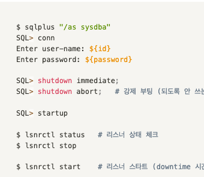

### 오라클 정리중

- [알아두면 좋은 명령어](https://m.blog.naver.com/deersoul6662/221466474481)

- [start/down 명령어](https://docs.oracle.com/en/database/oracle/oracle-database/18/xeinl/starting-and-stopping-oracle-database.html)

- UNION ALL 할때 한 실수들
  - VARCHAR 인지 NVARCHAR 인지 확인해야됨 -> UNISTR(칼럼) 으로 맞추자
  - SORT 가 있으면 안된다
  ```sql

  ```


- docker-compose 로 만드는 19c
  - [참고영여기사](https://arno-schots.medium.com/building-and-running-oracle-database-19-3-0-ee-docker-containers-8147b5a00a51)
  - [docker-image생성-GITHUB](https://github.com/steveswinsburg/oracle19c-docker)
  - [dockcer-compose 파일셋팅](https://growupcoding.tistory.com/27)


  ```shell
  mkdir ~/dev/db -p && cd db
  git clone https://github.com/oracle/docker-images
  cd docker-images/OracleDatabase/SingleInstance/dockerfiles
  explorer.exe .

  #   ~/dev/db/docker-images/OracleDatabase/SingleInstance/dockerfiles
  ./buildContainerImage.sh -v 19.3.0 -e


  mkdir -p ~/dev/compose/oradata/ora19_data
  chmod -Rf 777 ~/dev/compose/oradata/ora19_data
  touch ~/dev/compose/or19env
  ##
  ##  ORACLE_PWD=oracle
  ##  ORACLE_SID=orclcdb
  ##
  touch ~/dev/compose/docker-compose.ora19c.yml
  ```


  ```yaml
    version: '1.0'
    services:
        ora19c:
            container_name: oracle-19c
            env_file:
                - ora19env
            image: oracle/database:19.3.0-ee
            ports:
                - 1521:1521
                - 5500:5500
            volumes:
                - ./oradata/ora19_data:/opt/oracle/oradata
                - ./install_db:/app/oracle/install_db
            privileged: true
  ```

### Oracle 설치 꿀팁
- [종합적인 꿀Tips](https://positivemh.tistory.com/485)
- [ORA-01034](https://m.blog.naver.com/PostView.naver?isHttpsRedirect=true&blogId=hymne&logNo=221448750630)


### H2 docker
- https://hub.docker.com/r/oscarfonts/h2/
- https://velog.io/@seungju0000/docker-compose%EB%A5%BC-%EC%9D%B4%EC%9A%A9%ED%95%98%EC%97%AC-spring-boot-h2-%EC%97%B0%EA%B2%B0%ED%95%98%EA%B8%B0feat.redis

```shell
docker pull oscarfonts/h2
docker run -d -p 1521:1521 -p 81:81 -v /path/to/local/data_dir:/opt/h2-data -e H2_OPTIONS=-ifNotExists --name=MyH2Instance oscarfonts/h2
```
```yml
version: "1"
services:
    h2-db:
        container_name: h2-db
        image: oscarfonts/h2
        volumes:
            - ./h2/:/opt/h2-data
        environment:
            H2_OPTIONS: -ifNotExists
        ports:
            - "41521:1521"
            - "48081:81"
```


### Oracle RAC
- 깃허브 : https://github.com/oracle/docker-images/blob/main/OracleDatabase/RAC/OracleRealApplicationClusters/README.md
- 공식지원은 21c : https://blogs.oracle.com/maa/post/oracle-rac-on-docker-now-with-full-production-support
- 오라클 문서 : https://docs.oracle.com/en/database/oracle/oracle-database/21/racdk/oracle-rac-on-docker.html#GUID-1B30E4F3-1EC9-4000-8007-4A1B2A03FE1E


### 오라클 DB


```shell
sqlplus "/as sysdba"

conn
shutdown immediate; ## 이걸로 하고 기다린다.
shwdown abort; ## 이건 강제 종료

startup


lsnrctl status
lsnrctl stop

lsnrctl start
```