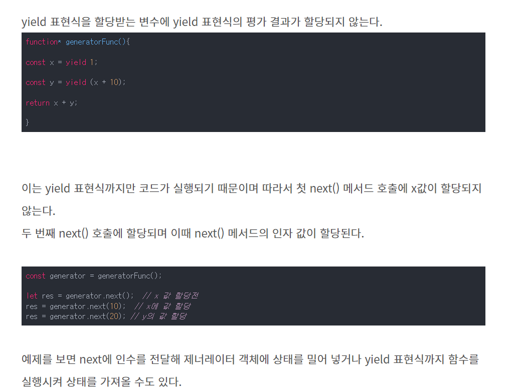

### Async / Await

=> Iterator + Generator + Promise 의 합작품

- 기본적으로 Iterable / Iterator 를 알아야됨.
- `Iterable` 은 규약으로 특정 규칙 [Symbol.Iterator] 를 `구성한 객체`를 뜻하는데
- `Iterator` 는 [Symbol.Iterator]의 값[ `함수`] 를 의미하며 이 함수는
  -> next() ( 해당 함수의 return 값은 { value: object, done:true/false } ) 를 가진 객체[이터레이터 객체라고도 함] 를 리턴한다..

- 여기서 재미있는건  [Symbol.Iterator]() 이 next() 함수를 가지고 있는 객체라는건데...
- 클로저를 이용해서 reduce 비슷한 효과도 누릴수 있고 재귀형태의 로직도 넣을 수 있음.
	- 예시 : https://inpa.tistory.com/entry/JS-%F0%9F%93%9A-%EC%9D%B4%ED%84%B0%EB%9F%AC%EB%B8%94-%EC%9D%B4%ED%84%B0%EB%A0%88%EC%9D%B4%ED%84%B0-%F0%9F%92%AF%EC%99%84%EB%B2%BD-%EC%9D%B4%ED%95%B4
	- 예시2 : https://ui.toast.com/weekly-pick/ko_20151021


- 여기에 전용 루프문 [ `for .. of` ] 를 이용하면
- 자동으로 `이터레이터 객체`의 next를 실행시킬 수 있게 되는데 이게 핵심이다.
```
// 참고링크 : https://bbaktaeho-95.tistory.com/79 
const arr = [1, 2, 3, 4, 5, 6, 7];

// for of
for (const item of arr) {
  console.log(item);
}

// for of 동작 과정
const iter = arr[Symbol.iterator]();
let cur;
while (!(cur = iter.next()).done) {
  const item = cur.value;
  console.log(item);
}
```

- 여기에 그럼 제너레이터의 의미는 좀더 간편하게 이터레이터 객체를 리턴해주는 건데,
  상당히 간편하고 광범위하게 쓸 수 있는 표현방법을 제공한다.

```javascript
function* generator(){
  // sommeting 1
		yield 123;
	// sommeting 2
		yield 1234;
	return "done";
}
```

- 이라는 코드가 있다면 일단 그냥 사용성으로만 보면
`something1` 을 한후 yield를 만나서 { next() => return { value:123,  done : false  } } 의 `이터레이터 객체` 를 리턴하는데...
`return` 의 경우 { next() => return { value:"done" , done : true  } } 을 리턴한다고 보면 된다.
그리고 `throw` 로 가진다.

- 좀더 확정성을 넓혀 보면, 
  안의 코드에 따라서 말그대로 원하는 값만큼 계속 반속할수 있는 `이터레이터 객체` -> 그에 따른 value를 만들어 낼수 있고
	generator()에서 나온 객체를 next() 할때 값을 계산해서 리턴해주는 장점이 있다. ( lazily evaluated 를 할수 있다는 것 ) 
  그리고 next() 를 실행시킬때.. 쓴 parameter 를 넘겨줄수도 있는데 다음과 같은 장난짓 코드도 가능하다. ( 출처 : https://ui.toast.com/weekly-pick/ko_20151021 )
```javascript
   function* fibonacci() {
        var fn1 = 1;
        var fn2 = 1;
        while (true) {  
            var current = fn2;
            fn2 = fn1;
            fn1 = fn1 + current;

            var reset = yield current;
            console.log('----> reset', reset);
            if (reset) {
                fn1 = 1;
                fn2 = 1;
            }
        }
    }

    var sequence = fibonacci();
    console.log(sequence.next().value);     // 1
    console.log(sequence.next().value);     // 1
    console.log(sequence.next().value);     // 2
    console.log(sequence.next().value);     // 3
    console.log(sequence.next().value);     // 5
    console.log(sequence.next().value);     // 8
    console.log(sequence.next(true).value); // reset = true -> yield 1
    console.log(sequence.next().value);     // 1
    console.log(sequence.next().value);     // 2
    console.log(sequence.next().value);     // 3

```

(https://chinggin.tistory.com/605)

- 그럼 대망의 `Async / Await` 는 이 위 요소의 짬뽕이라고 보면 되는데..
   - 참고링크 : https://medium.com/@la.place/async-await%EB%8A%94-%EC%96%B4%EB%96%BB%EA%B2%8C-%EA%B5%AC%ED%98%84%ED%95%98%EB%8A%94%EA%B0%80-fa08a3157647
   - 참고링크 : https://medium.com/sjk5766/async-await-%EC%9B%90%EB%A6%AC-cc643f18526d


### 마이크로테스트 큐

https://ko.javascript.info/microtask-queue
https://velog.io/@yejineee/%EC%9D%B4%EB%B2%A4%ED%8A%B8-%EB%A3%A8%ED%94%84%EC%99%80-%ED%83%9C%EC%8A%A4%ED%81%AC-%ED%81%90-%EB%A7%88%EC%9D%B4%ED%81%AC%EB%A1%9C-%ED%83%9C%EC%8A%A4%ED%81%AC-%EB%A7%A4%ED%81%AC%EB%A1%9C-%ED%83%9C%EC%8A%A4%ED%81%AC-g6f0joxx