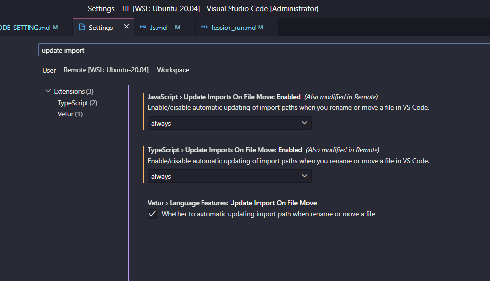
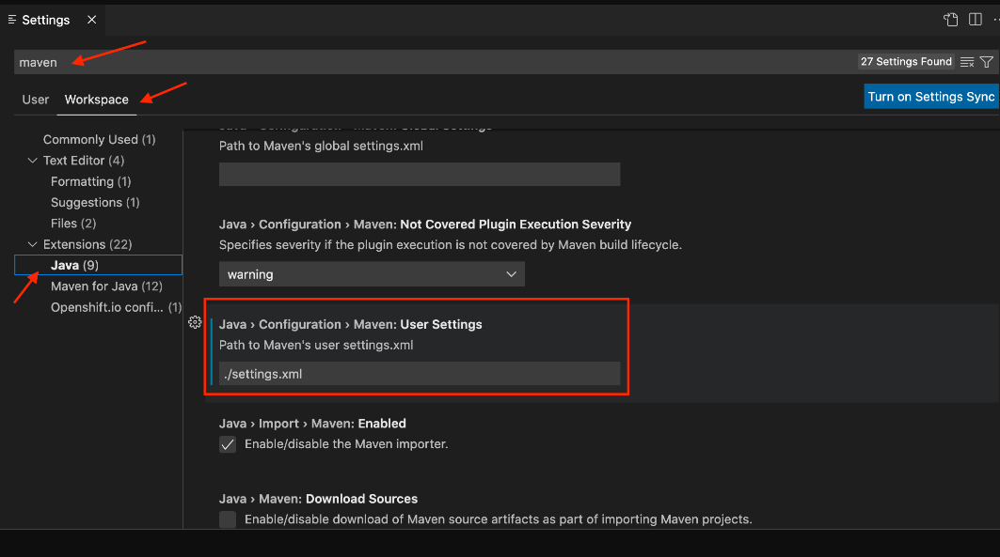

### java run config
```json
// vscode run config에 잘안된거
        {
            "type": "java",
            "name": "bytecode with option",
            "request": "launch",
            "mainClass": "my.sskim.App",
            "projectName": "bytecode",
            "vmArgs": "-javaagent /home/ecsuser/study/daily_record/study/java/javabasic/bytecode2/target/bytecode2-1.0-SNAPSHOT.jar"
        }
// 잘된거 - 옵션사용법을 잘 확인하자
        {
            "type": "java",
            "name": "bytecode with option",
            "request": "launch",
            "mainClass": "my.sskim.App",
            "projectName": "bytecode",
            "vmArgs": "-javaagent:/home/ecsuser/study/daily_record/study/java/javabasic/bytecode2/target/bytecode2-1.0-SNAPSHOT.jar"
        }
```

### Makrdown 이미지 복사

- window - wsl2를 사용하는 환경이었는데 makrdown 에 이미지 넣기 어려워서 어려 extendsion 을 찾아봄
- 비슷한 문제 질문 - [링크](https://github.com/mushanshitiancai/vscode-paste-image/issues/56)
  - [windosw-wsl2 도 되는 애](https://marketplace.visualstudio.com/items?itemName=dzylikecode.md-paste-enhanced) : Extendsion 이것저것 깔았는데 애가 최고
  - [애도 나중에 더 보자](https://github.com/telesoho/vscode-markdown-paste-image)
  - [이건 공식같은데 wsl2 에서 잘안되던데](https://marketplace.visualstudio.com/items?itemName=dendron.dendron-paste-image)


### Markdown 목차 자동생성
  - //@import "[TOC]" {cmd="toc" depthFrom=1 depthTo=6 orderedList=false} 라는걸 입력하면 되는데
  - 해당 플러그인이 필요 : [Markdown Preview Enhanced](https://marketplace.visualstudio.com/items?itemName=shd101wyy.markdown-preview-enhanced)


### vscode annotation processor enable
  - [해결책 유튜브](https://www.youtube.com/watch?v=cN9FNVtJeR8) : [google auto-value](https://mvnrepository.com/artifact/com.google.auto.value/auto-value) / [google auto-annotations](https://mvnrepository.com/artifact/com.google.auto.value/auto-value-annotations)
   ```xml
  <!-- https://mvnrepository.com/artifact/com.google.auto.value/auto-value -->
  <dependency>
      <groupId>com.google.auto.value</groupId>
      <artifactId>auto-value</artifactId>
      <version>1.9</version>
      <scope>provided</scope>
  </dependency>


  <!-- https://mvnrepository.com/artifact/com.google.auto.value/auto-value-annotations -->
  <dependency>
      <groupId>com.google.auto.value</groupId>
      <artifactId>auto-value-annotations</artifactId>
      <version>1.9</version>
  </dependency>

  ```


### static Import 셋팅
- [참고링크](https://bingbingpa.github.io/vscode-static-import/) 
```json

"java.completion.favoriteStaticMembers": [
    "org.junit.Assert.*",
    "org.junit.Assume.*",
    "org.junit.jupiter.api.Assertions.*",
    "org.junit.jupiter.api.Assumptions.*",
    "org.junit.jupiter.api.DynamicContainer.*",
    "org.junit.jupiter.api.DynamicTest.*",
    "org.mockito.Mockito.*",
    "org.mockito.ArgumentMatchers.*",
    "org.mockito.Answers.*",
    "org.springframework.test.web.servlet.request.MockMvcRequestBuilders.*",
    "org.springframework.test.web.servlet.result.MockMvcResultMatchers.*"
]

```

### Code Snippet 만들기
-- [vscode code-snippet 만들기](https://snippet-generator.app/?description=inputstyle&tabtrigger=my-input-style&snippet=++input%3Afocus+%7B%0A++++outline%3A+none%3B%0A++%7D%0A++.inputBox+%7B%0A++++background%3A+white%3B%0A++++height%3A+50px%3B%0A++++line-height%3A+50px%3B%0A++++border-radius%3A+5px%3B%0A++%7D%0A++.inputBox+input+%7B%0A++++border-style%3A+none%3B%0A++++font-size%3A+0.9rem%3B%0A++%7D%0A++.addContainer+%7B%0A++++float+%3A+right%3B%0A++++background+%3A+linear-gradient%28to+right%2C+%236478FB%2C+%238763F8%29%3B%0A++++display%3A+block%3B%0A++++width+%3A+3rem%3B%0A++++border-radius%3A+0+5px+5px+0%3B%0A++%7D%0A++.addBtn+%7B%0A++++color%3A+white%3B%0A++++vertical-align%3A+middle%3B%0A++%7D&mode=vscode)


### mvn-> tomcat7 debug

- 좀더 읽어볼 기사 : https://blogs.mulesoft.com/dev-guides/debugging-your-tomcat-webapp-with-eclipse/
- 링크 : https://github.com/microsoft/vscode-java-debug/issues/120
- 링크 : https://github.com/microsoft/vscode-java-debug/wiki/How-to-attach-debug-maven-console-applications
- 링크 : https://velog.io/@baer2000/STS-%EB%B2%84%EB%A6%AC%EA%B3%A0-vscode%EB%A1%9C-Spring-%EB%94%94%EB%B2%84%EA%B9%85-%ED%99%98%EA%B2%BD-%EA%B5%AC%EC%B6%95%ED%95%98%EA%B8%B0

- tasks.json 작성
```json
{
	"version": "2.0.0",
	"tasks": [
			{
					"label": "run-tomcat",
					"type": "shell",
					// "command": "MAVEN_OPTS=\"$MAVEN_OPTS -agentlib:jdwp=transport=dt_socket,address=5005,server=y,suspend=y\" mvn tomcat7:run",
					"command": "MAVEN_DEBUG_OPTS=\"$MAVEN_OPTS -Xdebug -Xrunjdwp:transport=dt_socket,address=5005,server=y,suspend=y\" mvn tomcat7:run",
					"group": "build",
					"isBackground": true,
					"problemMatcher": [{
							"pattern": [{
									"regexp": "\\b\\B",
									"file": 1,
									"location": 2,
									"message": 3
							}],
							"background": {
									"activeOnStart": true,
									"beginsPattern": "^.*Listening for",
									"endsPattern": "^.*transport dt_socket at address.*"
							}
					}]
			},
			{
					"label": "stop-tomcat",
					"type": "shell",
					"command": "echo ${input:terminate}}",
					"problemMatcher": []
			}
	],
	"inputs": [
			{
					"id": "terminate",
					"type": "command",
					"command": "workbench.action.tasks.terminate",
					"args": "run-tomcat"
			}
	]
}
```

- launch.json 에 작성
```json
		{
			"type": "java", // 디버깅의 타입을 정의.
			"name": "Debug Tomcat Sever", // 디버깅 설정 목록에서 표시할 이름.
			"request": "attach", // 디버깅의 요청 형식을 정의. 'launch' 또는 'attach'.
			"hostName": "localhost", // 원격 디버거(여기선 메이븐)의 호스트 네임.
			"port": 5005, // 원격 디버거의 포트.
			"preLaunchTask": "run-tomcat", // 디버깅 세션이 실행되기 전에 수행될 task.
			"postDebugTask": "stop-tomcat", // 디버깅 세션 종료 후 수행될 task.
			"projectName": "ers"
		}

```


### comunity server connector
```xml
<!-- 중략 -->
<Engine name="Catalina" defaultHost="localhost">
  <!-- 중략 -->
  <Host name="localhost"  appBase="webapps" unpackWARs="true" autoDeploy="true">
    <Context docBase="./ers-1.0.0" path="/" reloadable="true"></Context>
  </Host>
<!-- 중략 -->
</Engine>
```

### maven / tomcat

- https://github.com/microsoft/vscode-java-debug/blob/main/Configuration.md#attach-to-embedded-maven-tomcat-server
- https://github.com/microsoft/vscode-java-debug/issues/303
- https://velog.io/@baer2000/STS-%EB%B2%84%EB%A6%AC%EA%B3%A0-vscode%EB%A1%9C-Spring-%EB%94%94%EB%B2%84%EA%B9%85-%ED%99%98%EA%B2%BD-%EA%B5%AC%EC%B6%95%ED%95%98%EA%B8%B0


### js update import

- [참고링크1](https://stackoverflow.com/questions/43542247/can-vs-code-automatically-update-javascript-and-typescript-import-paths-on-file)
- [참고링크2](https://github.com/microsoft/vscode/issues/66937#issuecomment-475087628)
- [jsconfig.json 설정](https://github.com/microsoft/vscode/issues/66937#issuecomment-475087628)
```json
{
    "compilerOptions": {
        "module": "commonjs",
        "target": "es2016",
        "jsx": "preserve"
    },
    "exclude": [
        "node_modules",
        "**/node_modules/*"
    ]
}
```

## mvn - custom setting.xml 적용하기

- [스택오버플로우 링크](https://stackoverflow.com/questions/70405078/vscode-with-custom-settings-xml-maven-file-per-project-in-a-workspace)
    
- 이렇게 하라는데..