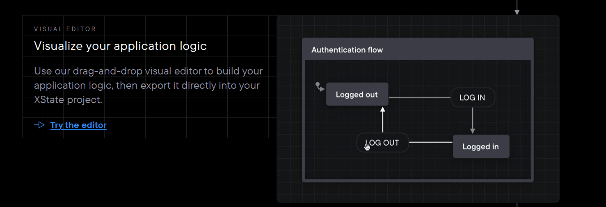
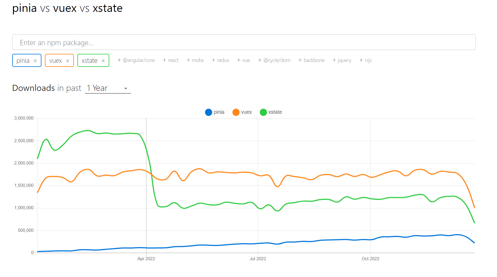

### Xstate

- [유한기계상태](https://en.wikipedia.org/wiki/Finite-state_machine) 를 구현한 `[Xstate](https://xstate.js.org/)`를 이용하여
  component의 이벤트, 속성값을 제어함.

- 특징적으로 A -> B 로의 상태 전환을 이벤트(Xstate의 용어로는 transition)로 제어하며, 특정 상태는 유한한 이벤트를 가지는 형태로 구성
- 다이어그램으로 위 흐름도를 표현해 component의 로직을 시각화하는게 특징으로 보임.

- [Vue에 관련된 상태관리 툴 트렌드](https://npmtrends.com/pinia-vs-vuex-vs-xstate)

- 관련 깃헙 / 코드
  https://github.com/wobsoriano/pinia-xstate
	https://codesandbox.io/s/xstate-vue-3-template-vrkk9
  https://stately.ai/registry/new?source=landing-page

- 참고할만한 유튜브 / 읽을거리
	https://www.reddit.com/r/vuejs/comments/sp9gt0/finite_state_machines_in_vue_3_sarah_dayan/
	https://fe-developers.kakaoent.com/2022/220922-make-cart-with-xstate/

### 반응성 이해

- https://itchallenger.tistory.com/730
- TODO : 정리 필요