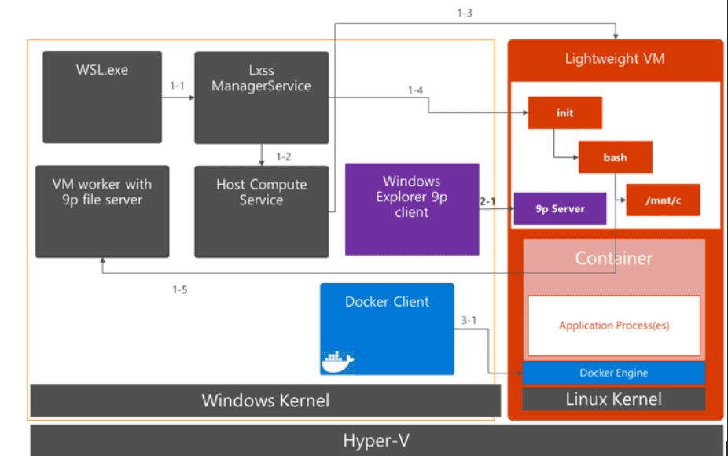
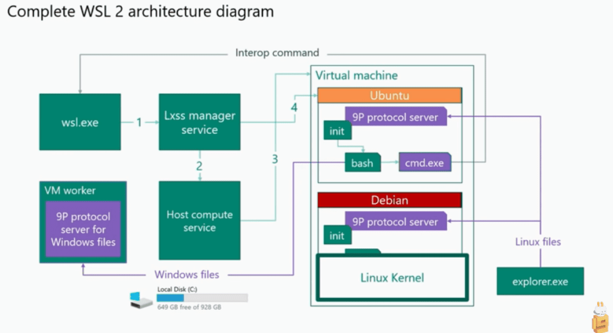
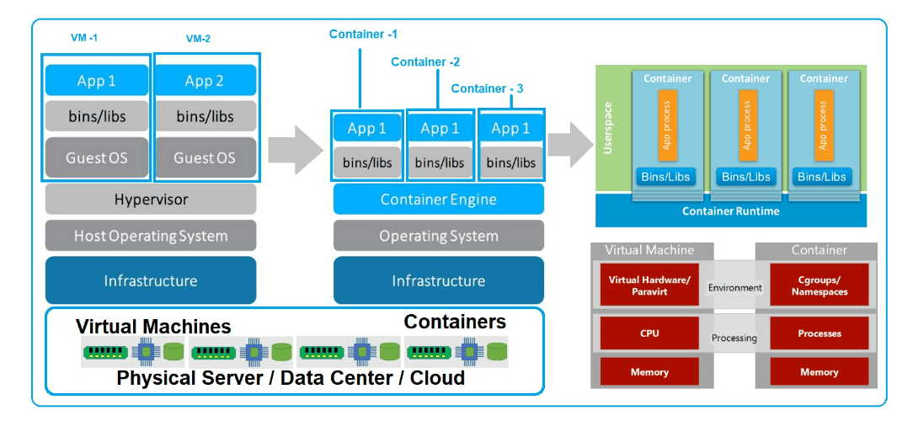

## 더 읽어볼 자료

- Awesome-WSL : https://github.com/sirredbeard/Awesome-WSL
- Awesome-command-line :https://git.herrbischoff.com/awesome-command-line-apps/about/
- 공식자습서 : https://learn.microsoft.com/ko-kr/windows/wsl/setup/environment?source=recommendations


https://forums.docker.com/t/is-there-a-pictorial-diagram-of-how-wsl-2-docker-docker-desktop-are-related/100071


https://www.reddit.com/r/bashonubuntuonwindows/comments/bna3hq/the_complete_diagram_of_the_wsl2_architecture_as/


https://dzone.com/articles/docker-containers-and-kubernetes-an-architectural

- https://blog.devgenius.io/dockerizing-the-typescript-react-app-with-nodejs-vs-nginx-with-wsl2-alpine-linux-on-windows-10-8dddd447f43a

### oh-my-zsh 셋팅

```shell
sudo apt update
sudo apt-get install zsh
sh -c "$(curl -fsSL https://raw.githubusercontent.com/ohmyzsh/ohmyzsh/master/tools/install.sh)"
vi ~/.zshrc
####
ZSH_THEME="agnoster"
####
mkdir -p  ~/shell/fonts
git clone https://github.com/powerline/fonts.git ~/shell/fonts
cd ~/shell/fonts && sh ./install.sh

### 폰트 : Ubuntu Mono derivative Powerline Regular 로 변경
```


### Window fonts 공유

- [참고링크](http://pinedance.github.io/blog/2021/02/08/WSL-fonts)
```shell

sudo touch /etc/fonts/local.conf

sudo vim /etc/fonts/local.conf

~~~~~~~~~~~~~~~~~~~~~~~~~~~~~~

<?xml version="1.0"?>
<!DOCTYPE fontconfig SYSTEM "fonts.dtd">
<fontconfig>
    <dir>/mnt/c/Windows/Fonts</dir>
</fontconfig>

~~~~~~~~~~~~~~~~~~~~~~~~~~~~~~
```


### WSL Make 파일 명렁어 추가
```shell
apt-get install gcc make
```

### WSL 자바환경 셋팅하기
```shell
sudo apt update
sudo apt install openjdk-11-jdk
# java -version
# which java
sudo apt -y install maven

################
# ~/.zshrc
############

### java PATH ###
export JAVA_HOME=/usr/lib/jvm/java-11-openjdk-amd64
export PATH=$PATH:$JAVA_HOME/bin
export PATH=$PATH:/opt/gradle/gradle-7.5.1/bin

export M2_HOME=/usr/local/apache-maven/apache-maven-3.8.4
export M2=$M2_HOME/bin
export PATH=$M2:$PATH


```


### WSL Python3 깔기
- [ms 공식문서 참고](https://learn.microsoft.com/ko-kr/windows/python/web-frameworks)

```shell
sudo apt update && sudo apt upgrade
sudo apt upgrade python3
# 파이썬 패키지 관리
sudo apt install python3-pip
# 파이썬 가상환경
sudo apt install python3-venv
```


### WSL 에 Node 환경셋팅하기

- [ms 공식문서참고](https://learn.microsoft.com/ko-kr/windows/dev-environment/javascript/nodejs-on-wsl)
  
```shell
sudo apt-get install curl
curl -o- https://raw.githubusercontent.com/nvm-sh/nvm/master/install.sh | bash

# 아래 내용 ~/.zshrc 에 자동추가
#export NVM_DIR="$HOME/.nvm"
#[ -s "$NVM_DIR/nvm.sh" ] && \. "$NVM_DIR/nvm.sh"  # This loads nvm
#[ -s "$NVM_DIR/bash_completion" ] && \. "$NVM_DIR/bash_completion"  # This loads nvm bash_completion

## 명령확인
command -v nv

### 설치된 node 확인
nvm ls
### 안정된 노드 버젼 설치
nvm install --lts # 설치당신튼 18.12
# yarn 설치
npm install --global yarn
```

### WSL 에서 Eclispe  설치

```shell
################ 다운로드 설치 ###############
wget https://ftp.yz.yamagata-u.ac.jp/pub/eclipse/technology/epp/downloads/release/2022-09/R/eclipse-jee-2022-09-R-linux-gtk-x86_64.tar.gz

tar xvzf eclipse-jee-2022-09-R-linux-gtk-x86_64.tar.gz

#### 실행용 alias
alias ecsr='~/util/eclipse/eclipse'
#

#### 아래 에러 발생시 로 의존성 파일 설치 - ubuntu v20.4
sudo apt install libswt-gtk-4-jni
###
# cat /home/ecsuser/util/eclipse/configuration/1666225081445.log
###
# eclipse.buildId=4.25.0.I20220831-1800
# java.version=17.0.4.1
# java.vendor=Eclipse Adoptium
# BootLoader constants: OS=linux, ARCH=x86_64, WS=gtk, NL=en
# Framework arguments:  -product org.eclipse.epp.package.jee.product
# Command-line arguments:  -os linux -ws gtk -arch x86_64 -product org.eclipse.epp.package.jee.product
# !ENTRY org.eclipse.osgi 4 0 2022-10-20 09:18:02.520
# !MESSAGE Application error
# !STACK 1
# java.lang.UnsatisfiedLinkError: Could not load SWT library. Reasons:
#         no swt-pi4-gtk-4954r7 in java.library.path: /usr/java/packages/lib:/usr/lib64:/lib64:/lib:/usr/lib
#         no swt-pi4-gtk in java.library.path: /usr/java/packages/lib:/usr/lib64:/lib64:/lib:/usr/lib
#         no swt-pi4 in java.library.path: /usr/java/packages/lib:/usr/lib64:/lib64:/lib:/usr/lib
#         Can't load library: /home/ecsuser/.swt/lib/linux/x86_64/libswt-pi4-gtk-4954r7.so
##

```

### Jmeter 설치
```shell
mkdir -p ~/util/jmeter && cd ~/util/jmeter
wget https://dlcdn.apache.org//jmeter/binaries/apache-jmeter-5.5.tgz
tar xzvf apache-jmeter-5.5.tgz
vim ~/.zshrc
### alisa add
alias jmeter='~/util/jmeter/apache-jmeter-5.5/bin/jmeter.sh'
####
source ~/.zshrc
```

### Apache Util
```shell
sudo apt-get install apache2-utils
```
- [ab](https://httpd.apache.org/docs/2.4/programs/ab.html) : Apache-bench
  ```shell
  # -n : 전체 요청의 갯수
  # -c : concurrency
  ab -n 100 -c 10 localhost:8080/study/2
  ```

### 포트포워팅
- [스크립트 실행 오류시 참고](https://samsons.tistory.com/16)


### 유용한 유틸

- 참고사이트 : https://scalereal.com/devops/2020/05/15/10-cli-tools-for-developers-productivity.html

- autojump
  ```shell
  git clone https://github.com/wting/autojump.git
  cd autojump
  python3 ./install.py  #or ./uninstall.py
  ```
- [tldr pages](https://tldr.sh/) : 명령어 간단한 예제 보여주는 명령어
  ```shell
  npm install -g tldr
  ```
- [jq](https://stedolan.github.io/jq/) : json 결과 예쁘게 보여주기
- [httpip](https://httpie.io/) : curl 비슷한건데 http 콜을 편하게 보여줄 수 있음
  ```shell
  apt install httpie 
  ```
- [pbcopy 처럼 쓰기](https://superuser.com/questions/288320/whats-like-osxs-pbcopy-for-linux)
  ```shell
  # alias 등록
  alias pbcopy=clipcopy
  alias pbpaste=clippaste
  
  #########################
  # 사용법
  #########################
  echo 'go to my clipboard' | pbcopy
  pbpaste # 'go to my clipboard'
  ```  


### jvm 지우기
- [관련링크](https://askubuntu.com/questions/335457/how-to-uninstall-openjdk)

```shell
#script to remove any openjdk package and purge it, regardless of the version

for i in $(dpkg -l | grep openjdk | awk '{print $2}'); do
    echo removing "$i"
    sudo apt remove "$i"
    echo purging "$i"
    sudo apt purge "$i"
    echo -------
done
```
