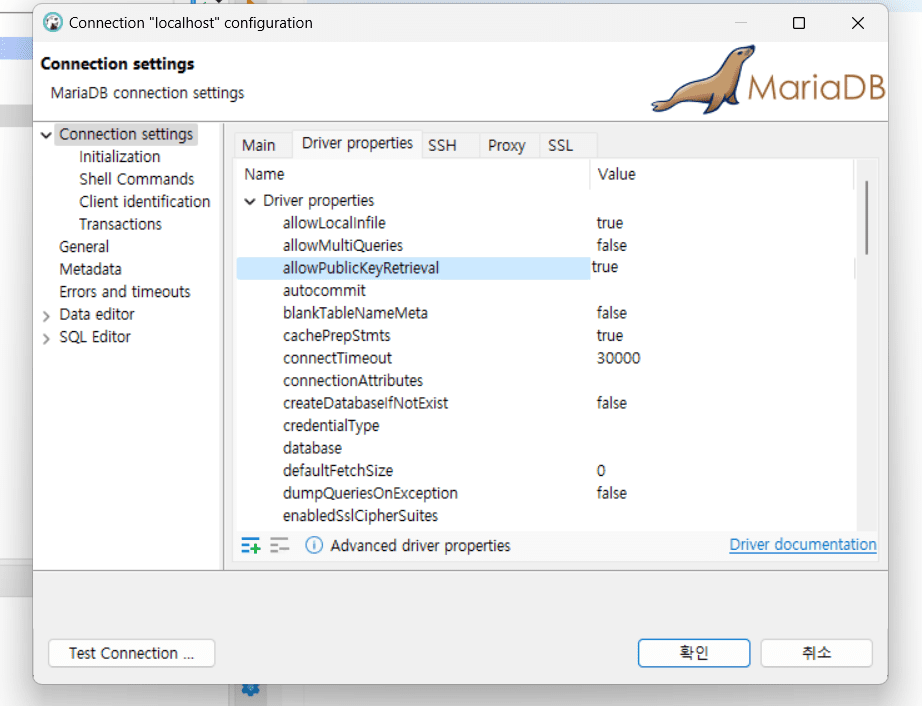

### docker desktop 사용안하고 docker 깕
- https://nickjanetakis.com/blog/install-docker-in-wsl-2-without-docker-desktop


## 사설레포지토리 만들기

- http://www.kwangsiklee.com/2017/08/%EC%82%AC%EB%82%B4-docker-%EC%A0%80%EC%9E%A5%EC%86%8Cregistry-%EA%B5%AC%EC%B6%95%ED%95%98%EA%B8%B0/
- https://xn--os5ba3q.com/132
- https://5equal0.tistory.com/entry/Docker-Registry-%EC%82%AC%EC%84%A4-%EC%9B%90%EA%B2%A9-%EB%A0%88%EC%A7%80%EC%8A%A4%ED%8A%B8%EB%A6%AC-%EB%A7%8C%EB%93%A4%EA%B8%B0
- https://m.blog.naver.com/complusblog/221000797682

- https://ikcoo.tistory.com/59
- https://kdeon.tistory.com/52
- https://smoh.tistory.com/221


## mysql 
- https://hub.docker.com/_/mysql/
- https://velog.io/@ssssujini99/Docker-docker-compose-%ED%8C%8C%EC%9D%BC-%EC%9E%91%EC%84%B1%ED%95%98%EA%B8%B0-%EC%BB%A8%ED%85%8C%EC%9D%B4%EB%84%88-%EB%9D%84%EC%9A%B0%EA%B8%B0
- https://learn.microsoft.com/ko-kr/visualstudio/docker/tutorials/tutorial-multi-container-app-mysql
- https://youngwonhan-family.tistory.com/entry/Docker-MySql-8-%EA%B0%9C%EB%B0%9C%ED%99%98%EA%B2%BD-docker-compose%EB%A1%9C-%EA%B0%84%EB%8B%A8%ED%95%98%EA%B2%8C-%EA%B5%AC%EC%84%B1%ED%95%98%EA%B8%B0

```shell
docker pull mysql
docker run --name mysql-container -e MYSQL_ROOT_PASSWORD=<password> -d -p 3306:3306 mysql:latest
```
```yaml
version: "1"
services:
  db:   
    image: mysql:latest # 컨테이너에서 사용하는 base image 지정
    restart: always # 컨테이너 다운 시 재시작하라는 명령어
    volumes: # -v 옵션과 동일
      - ./mysql/mysqldata:/var/lib/mysql
			- ./mysql/mysql-files:/var/lib/mysql-files
    environment: # 컨테이너 안의 환경변수 설정
      - MYSQL_USER=ers
			- MYSQL_PASSWORD=Ecstel1!
			- MYSQL_ROOT_PASSWORD=Ecstel1!
      - MYSQL_DATABASE=mydb
			- TZ=Asia/Seoul
		command: # 명령어 실행
      - --character-set-server=utf8mb4
      - --collation-server=utf8mb4_unicode_ci
    ports: # -p 옵션과 동일
      - "3306:3306"
```
```sql
CREATE USER 'ers'@'%' IDENTIFIED BY 'Ecstel1!';
GRANT ALL PRIVILEGES ON *.* TO 'ers'@'%';
flush privileges;
```




### Found orphan containers for this project

- 한 폴더에 여러개의 docker-compose가 있었을때 발생한 문제
- yml 파일이나 실행시 별도의 옵션을 주지 않으면 상위 디렉토리 이름하에 
  컨테이너가 형성되는데 이때 발생한 에러

- 발생한 이유 / 정확한 해결법은 더 찾아봐야됨
- 해결은 명령어에 `-p` 옵션을 주어서 해결
```shell
oracle-up :
	docker-compose -p orcale -f docker-compose.ora19c.yml up -d
oracle-down :
	docker-compose -f docker-compose.ora19c.yml down
oracle-shell :
	docker exec -it oracle-19c /bin/bash

mysql-up :
	docker-compose -p mysql -f docker-compose.mysql.yml up -d
mysql-down :
	docker-compose -f docker-compose.mysql.yml down
mysql-shell :
	docker exec -it mysql-db /bin/bash
```

- 참고링크1 : https://www.zodaland.com/tip/10
- 참고링크2 : https://docs.docker.com/compose/reference/#use--p-to-specify-a-project-name 