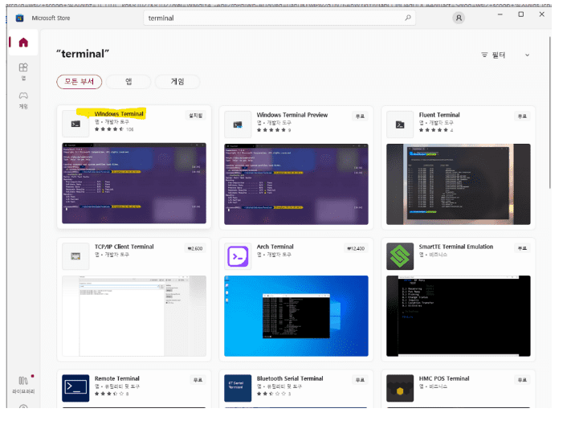
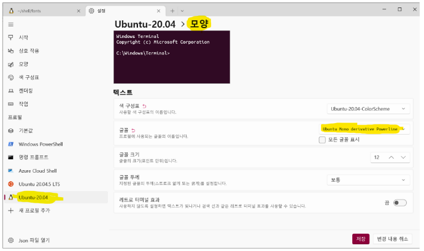

# WSL + Docker로 개발환경 구성하기.
- [WSL + Docker로 개발환경 구성하기.](#wsl--docker로-개발환경-구성하기)
		- [사내 Wiki](#사내-wiki)
	- [준비물](#준비물)
	- [WSL 기본셋팅](#wsl-기본셋팅)
		- [터미널 셋팅](#터미널-셋팅)
		- [WSL 자바환경 셋팅하기](#wsl-자바환경-셋팅하기)
		- [WSL 에 Node 환경셋팅하기](#wsl-에-node-환경셋팅하기)
		- [docker-compose 로 만드는 19c](#docker-compose-로-만드는-19c)
		- [현재환경 Export / Import](#현재환경-export--import)
		- [WSL 에서 Eclispe  설치](#wsl-에서-eclispe--설치)
	- [부록](#부록)
		- [포트포워팅](#포트포워팅)
		- [SSH Config](#ssh-config)
		- [유용한 유틸](#유용한-유틸)
		- [트러블 슈팅](#트러블-슈팅)
		- [고정IP 셋팅](#고정ip-셋팅)

### 사내 Wiki
- [풀스택을 위한 도커와 최신 서버 기술](http://pms.ecstel.co.kr/projects/ecs-solution/wiki/%ED%92%80%EC%8A%A4%ED%83%9D%EC%9D%84_%EC%9C%84%ED%95%9C_%EB%8F%84%EC%BB%A4%EC%99%80_%EC%B5%9C%EC%8B%A0_%EC%84%9C%EB%B2%84_%EA%B8%B0%EC%88%A0)

## 준비물
	1. 현재문서
	2. Docker Desktop : [링크](https://www.docker.com/products/docker-desktop/)
	3. Oracle19c.zip : [링크](https://www.oracle.com/kr/database/technologies/oracle19c-windows-downloads.html)
	4. docker-compose.tar

## WSL 기본셋팅
- [공식자습서](https://learn.microsoft.com/ko-kr/windows/wsl/setup/environment?source=recommendations)
- window10 일경우 [확인링크](https://www.lesstif.com/software-architect/wsl-2-windows-subsystem-for-linux-2-89555812.html)
  - [ `WinKey` + `R` ] > `winver` 으로 윈도우 버젼이 Windows 10 2004 이상 인지 확인.

```shell
## window10 18363.104 버젼이하일 경우
## wsl 활성화 명령어
dism.exe /online /enable-feature /featurename:Microsoft-Windows-Subsystem-Linux /all /norestart
## wsl2 VM platform 옵션을 활성화
dism.exe /online /enable-feature /featurename:VirtualMachinePlatform /all /norestart
# 위 작업 이후 재시작
######################
## window11 이상부터는 가볍게
## window powerShell 
wsl --list --online
## wsl --install -d "원하는배포판"
wsl --install
##  설치된 Linux들 wsl 버젼확인
wsl -l -v
## 개별 종료
wsl --terminate Ubuntu
## 기본배포판 삭제
wslconfig.exe /u Ubuntu
```

### 터미널 셋팅
- window 터미널 설치




```shell
## TODO  git, cURL, make, wget 설치 
sudo apt update && sudo apt-get update 
apt-get install git curl wget gcc make

## zsh + oh my zsh 설치
apt-get install zsh
cd ~ && sh -c "$(curl -fsSL https://raw.githubusercontent.com/ohmyzsh/ohmyzsh/master/tools/install.sh)"

vi ~/.zshrc
####
ZSH_THEME="agnoster"
####


mkdir -p  ~/shell/fonts
git clone https://github.com/powerline/fonts.git ~/shell/fonts
cd ~/shell/fonts && sh ./install.sh
### 폰트 : Ubuntu Mono derivative Powerline Regular 로 변경
```



- 원하는 테마 셋팅 및 참고링크 
  - [https://jsqna.com/linux-install-zsh/](https://jsqna.com/linux-install-zsh/)
  - [https://velog.io/@saemsol/Oh-My-Zsh](https://velog.io/@saemsol/Oh-My-Zsh)
  - [https://mulder21c.github.io/2021/01/28/setting-up-wsl-2-dev-env-and-zsh-on-windws-10/](https://mulder21c.github.io/2021/01/28/setting-up-wsl-2-dev-env-and-zsh-on-windws-10/)
  - [https://ranggasama.medium.com/personalize-wsl2-with-zsh-and-oh-my-zsh-2c1ab265c83e](https://ranggasama.medium.com/personalize-wsl2-with-zsh-and-oh-my-zsh-2c1ab265c83e)
  - 추천 플러그인
  ```shell
  # zsh-autosuggestions  
  # https://github.com/zsh-users/zsh-autosuggestions/blob/master/INSTALL.md
  git clone https://github.com/zsh-users/zsh-autosuggestions ${ZSH_CUSTOM:-~/.oh-my-zsh/custom}/plugins/zsh-autosuggestions

  # zsh-syntax-highlighting
  # https://github.com/zsh-users/zsh-syntax-highlighting/blob/master/INSTALL.md
  git clone https://github.com/zsh-users/zsh-syntax-highlighting.git ${ZSH_CUSTOM:-~/.oh-my-zsh/custom}/plugins/zsh-syntax-highlighting

  # ~/.zshrc
  plugins=(git zsh-autosuggestions zsh-syntax-highlighting)
  ```


### WSL 자바환경 셋팅하기
- [참고링크](https://wslhub.com/wsl-firststep/devsetup/openjdk/) 
```shell
################################################
# jvm, maven, gradle
################################################

#sudo apt update
sudo apt install openjdk-11-jdk
# java -version
# which java

sudo apt -y install maven

# gradle
# https://linuxize.com/post/how-to-install-gradle-on-ubuntu-20-04/
sudo mkdir -p /opt/gradle 
sudo wget https://services.gradle.org/distributions/gradle-7.5.1-all.zip
sudo unzip -d /opt/gradle gradle-7.5.1-all.zip

################################################
# ~/.zshrc
################################################

### java PATH ###
export JAVA_HOME=/usr/lib/jvm/java-11-openjdk-amd64
export PATH=$PATH:$JAVA_HOME/bin
export M2_HOME=/usr/local/apache-maven/apache-maven-3.8.4
export M2=$M2_HOME/bin
export PATH=$M2:$PATH
export PATH=$PATH:/opt/gradle/gradle-7.5.1/bin

################################################
# mvn 빌드시 에러가 생기면 아래로 설치
# https://www.baeldung.com/install-maven-on-windows-linux-mac
################################################
sudo  mkdir -p /usr/local/apache-maven/apache-maven-3.8.4
cd /usr/local/apache-maven/apache-maven-3.8.4
sudo wget https://dlcdn.apache.org/maven/maven-3/3.8.6/source/apache-maven-3.8.6-src.tar.gz
sudo tar -xvf apache-maven-3.8.6-src.tar.gz -C /usr/local/apache-maven/apache-maven-3.8.4
```


### WSL 에 Node 환경셋팅하기

- [ms 공식문서참고](https://learn.microsoft.com/ko-kr/windows/dev-environment/javascript/nodejs-on-wsl)
  
```shell
curl -o- https://raw.githubusercontent.com/nvm-sh/nvm/master/install.sh | bash

##  아래 내용 ~/.zshrc 에 자동추가
## export NVM_DIR="$HOME/.nvm"
## [ -s "$NVM_DIR/nvm.sh" ] && \. "$NVM_DIR/nvm.sh"  # This loads nvm
## [ -s "$NVM_DIR/bash_completion" ] && \. "$NVM_DIR/bash_completion"  # This loads nvm bash_completion


### 명령확인
command -v nvm

### 설치된 node 확인
nvm ls
### 안정된 노드 버젼 설치
nvm install --lts # 설치당시는 18.12
# yarn 설치
npm install --global yarn
## https://stackoverflow.com/questions/72921215/getting-glibc-2-28-not-found

## 저같은 경우에는 추가 설정
export NODE_PATH=/home/ecsuser/.nvm/versions/node/v18.12.0
export PATH=$NODE_PATH/bin:$PATH

```

### docker-compose 로 만드는 19c
  - 전제조건 : Docker Desktop 설치 / 준비물 4번 tar
  - [참고영여기사](https://arno-schots.medium.com/building-and-running-oracle-database-19-3-0-ee-docker-containers-8147b5a00a51)
  - [참고 한글링크](https://growupcoding.tistory.com/27)

  ```shell
  mkdir ~/dev/db -p && cd ~/dev/db
  git clone https://github.com/oracle/docker-images
  cd docker-images/OracleDatabase/SingleInstance/dockerfiles
  explorer.exe .
  
  #   ~/dev/db/docker-images/OracleDatabase/SingleInstance/dockerfiles
  #### Usage: buildDockerImage.sh -v [version] [-e | -s | -x] [-i] [-o] [Docker build option]
  #### Builds a Docker Image for Oracle Database.
  #### Parameters:
  ####   -v: version to build
  ####       Choose one of: 11.2.0.2  12.1.0.2  12.2.0.1  18.3.0  18.4.0  19.3.0
  ####   -e: creates image based on 'Enterprise Edition'
  ####   -s: creates image based on 'Standard Edition 2'
  ####   -x: creates image based on 'Express Edition'
  ####   -i: ignores the MD5 checksums
  ####   -o: passes on Docker build option
  #### * select one edition only: -e, -s, or -x
  #### LICENSE UPL 1.0
  #### Copyright (c) 2014-2019 Oracle and/or its affiliates. All rights reserved.
  ./buildContainerImage.sh -v 19.3.0 -e

  mkdir -p ~/dev/compose/oradata/ora19_data
  chmod -Rf 777 ~/dev/compose/oradata/ora19_data
  touch ~/dev/compose/or19env
  ##
  ##  ORACLE_PWD=oracle
  ##  ORACLE_SID=orclcdb
  ##
  touch ~/dev/compose/docker-compose.ora19c.yml  
  ```
  ```yaml
    version: '1.0'
    services:
        ora19c:
            container_name: oracle-19c
            env_file:
                - ora19env
            image: oracle/database:19.3.0-ee
            ports:
                - 1521:1521
                - 5500:5500
            volumes:
                - ./oradata/ora19_data:/opt/oracle/oradata
                - ./install_db:/app/oracle/install_db
            privileged: true            
  ```
  ```shell
  make oracle-up
  ```


### 현재환경 Export / Import
- [window 공식 wsl 관련 명령어](https://learn.microsoft.com/en-us/windows/wsl/basic-commands)

```shell
# powerShell
wsl --export <Distribution Name> <FileName>
wsl --import <Distribution Name> <InstallLocation> <FileName>
```

### WSL 에서 Eclispe  설치
```shell
################ 다운로드 설치 ###############
wget https://ftp.yz.yamagata-u.ac.jp/pub/eclipse/technology/epp/downloads/release/2022-09/R/eclipse-jee-2022-09-R-linux-gtk-x86_64.tar.gz

tar xvzf eclipse-jee-2022-09-R-linux-gtk-x86_64.tar.gz

#### 실행용 alias
alias ecsr='~/util/eclipse/eclipse'

#### 아래 에러 발생시 로 의존성 파일 설치 - ubuntu v20.4
sudo apt install libswt-gtk-4-jni
###
# cat /home/ecsuser/util/eclipse/configuration/1666225081445.log
###
# eclipse.buildId=4.25.0.I20220831-1800
# java.version=17.0.4.1
# java.vendor=Eclipse Adoptium
# BootLoader constants: OS=linux, ARCH=x86_64, WS=gtk, NL=en
# Framework arguments:  -product org.eclipse.epp.package.jee.product
# Command-line arguments:  -os linux -ws gtk -arch x86_64 -product org.eclipse.epp.package.jee.product
# !ENTRY org.eclipse.osgi 4 0 2022-10-20 09:18:02.520
# !MESSAGE Application error
# !STACK 1
# java.lang.UnsatisfiedLinkError: Could not load SWT library. Reasons:
#         no swt-pi4-gtk-4954r7 in java.library.path: /usr/java/packages/lib:/usr/lib64:/lib64:/lib:/usr/lib
#         no swt-pi4-gtk in java.library.path: /usr/java/packages/lib:/usr/lib64:/lib64:/lib:/usr/lib
#         no swt-pi4 in java.library.path: /usr/java/packages/lib:/usr/lib64:/lib64:/lib:/usr/lib
#         Can't load library: /home/ecsuser/.swt/lib/linux/x86_64/libswt-pi4-gtk-4954r7.so
##

```


## 부록
### 포트포워팅
- [스크립트 실행 오류시 참고](https://samsons.tistory.com/16)
```shell
$remoteport = bash.exe -c "ifconfig eth0 | grep 'inet '"
$found = $remoteport -match '\d{1,3}\.\d{1,3}\.\d{1,3}\.\d{1,3}';

if( $found ){
  $remoteport = $matches[0];
} else{
  echo "The Script Exited, the ip address of WSL 2 cannot be found";
  exit;
}

#[Ports]

#All the ports you want to forward separated by coma
$ports=@(80,443,8080,8081,8091,5432,15432,10000,3000,5000);


#[Static ip]
#You can change the addr to your ip config to listen to a specific address
$addr='0.0.0.0';
$ports_a = $ports -join ",";


#Remove Firewall Exception Rules
iex "Remove-NetFireWallRule -DisplayName 'WSL 2 Firewall Unlock' ";

#adding Exception Rules for inbound and outbound Rules
iex "New-NetFireWallRule -DisplayName 'WSL 2 Firewall Unlock' -Direction Outbound -LocalPort $ports_a -Action Allow -Protocol TCP";
iex "New-NetFireWallRule -DisplayName 'WSL 2 Firewall Unlock' -Direction Inbound -LocalPort $ports_a -Action Allow -Protocol TCP";

for( $i = 0; $i -lt $ports.length; $i++ ){
  $port = $ports[$i];
  iex "netsh interface portproxy delete v4tov4 listenport=$port listenaddress=$addr";
  iex "netsh interface portproxy add v4tov4 listenport=$port listenaddress=$addr connectport=$port connectaddress=$remoteport";
}
```

### SSH Config

- ssh config 시 쉽게 key 복사하는 법 [링크](https://www.cyberciti.biz/faq/how-to-set-up-ssh-keys-on-rhel-8/)

```shell
### 키생성 ## ssh-keygen
ssh-keygen -t rsa -f ~/.ssh/my_vm_key
### 복사 ## ssh-copy-id 
ssh-copy-id -i ~/.ssh/my_vm_key root@10.0.55.221
### ssh-config 설정
touch ~/.ssh/config && vim ~/.ssh/config
##########################
Host myTest
    HostName 10.0.55.221
    User root
    IdentityFile ~/.ssh/my_vm_key
```


### 유용한 유틸

- 참고사이트 : https://scalereal.com/devops/2020/05/15/10-cli-tools-for-developers-productivity.html

- autojump
  ```shell
  git clone https://github.com/wting/autojump.git
  cd autojump
  python3 ./install.py  #or ./uninstall.py
  ```
- [tldr pages](https://tldr.sh/) : 명령어 간단한 예제 보여주는 명령어
  ```shell
  npm install -g tldr
  ```
- [jq](https://stedolan.github.io/jq/) : json 결과 예쁘게 보여주기
- [httpip](https://httpie.io/) : curl 비슷한건데 http 콜을 편하게 보여줄 수 있음
  ```shell
  apt install httpie 
  ```
- [pbcopy 처럼 쓰기](https://superuser.com/questions/288320/whats-like-osxs-pbcopy-for-linux)
  ```shell
  # alias 등록
  alias pbcopy=clipcopy
  alias pbpaste=clippaste

  #########################
  # 사용법
  #########################
  echo 'go to my clipboard' | pbcopy
  pbpaste # 'go to my clipboard'
  ```  
  ### 트러블 슈팅
  - [window 공식문서](https://learn.microsoft.com/en-us/windows/wsl/troubleshooting?source=recommendations)

  ### 고정IP 셋팅
  - 네트워크 픽스 : https://github.com/pawelgnatowski/WSL2-Network-Fix
  - 한글문서 : https://netmarble.engineering/wsl2-static-ip-scheduler-settings/
  - https://gist.github.com/wllmsash/1636b86eed45e4024fb9b7ecd25378ce