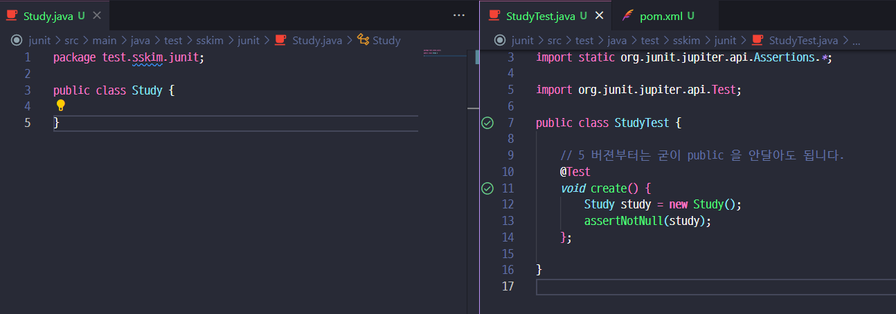

## 다루는 내용
- Junit5 / Mockito

## JUnit5

### 개요
- 대체제 : TestNG, Spock, ...
- 4와 다르게 세부모듈로 나눠짐. [ Jupiter / Vintage / JUnit Platform ]
    - Platform:  테스트를 실행해주는 런처 제공. TestEngine API 제공.
    - Jupiter: TestEngine API 구현체로 JUnit 5를 제공.
    - Vintage: JUnit 4와 3을 지원하는 TestEngine 구현
    - [공식가이드](https://junit.org/junit5/docs/current/user-guide/)

### Junit5 기초

- springboot 2.2.1 버젼 이상은 JUnit5 가 기본
- 5버젼부터는 @Test 를 붙이는 메소드에 굳이 public 을 붙이지 않아도 됨.
    ```xml
    <dependency>
        <groupId>org.junit.jupiter</groupId>
        <artifactId>junit-jupiter-engine</artifactId>
        <version>5.5.2</version>
        <scope>test</scope>
    </dependency>
    ```
    

    ```java

    public class StudyTest {

        // 5 버젼부터는 굳이 public 을 안달아도 됩니다.
        @Test
        void create() {
            Study study = new Study();
            assertNotNull(study);
            System.out.println("create");
        };

        @Test
        void create1() {
            System.out.println("create1");
        };

        @Test
        @Disabled
        void crash() {
            System.out.println("crash");
        }


        //All은 private 안되며 void 이외를 리턴하면 안됨, 반드시 static 형이어야함.
        @BeforeAll
        static void beforeAll() {
            System.out.println("beforeAll");
        }

        @AfterAll
        static void afterAll() {
            System.out.println("afterAll");
        }

        // Each 는 굳이 static 일필요는 없음음 
        @BeforeEach
        void beforeEach() {
            System.out.println("beforeEach");
        }

        @AfterEach
        void afterEach() {
            System.out.println("afterEach");
        }
    }


    // 결과
    // beforeAll
    // beforeEach
    // create
    // afterEach
    // beforeEach
    // create1
    // afterEach
    // afterAll
    ```

- @DisplayNameGeneration / @DisplayName
  - 기본적으로 메소드 이름으로 테스트 이름이 적혀짐
  
  - @DisplayNameGeneration : class, metho에 달수 있으며, 전략에 해당하는 구현체를 넣어주어야함.
  - @DisplayName : 원하는 문자 모든지 넣어도 됨.
  

### Assertion
- 실제 테스트에서 검증하고자 하는 내용

```java
// 기대값 먼저, 실제 나오는 값, 메세지- 람다로도 가능함.
// 람다로 만들면 실패했을때만 메세지 연산을 함.
// all 로 묶으면 묶인 거를 독립적-병렬적? 으로 실행 가능함.
// 이렇게 하면 2,3번이 한번에 틀린걸 알 수 있음음
assertAll(
    () -> { assertNotNull(study);} 
    // 기대값 먼저, 실제 나오는 값, 메세지
    ,() -> { assertEquals(StudyStatus.DRAFT, study.getStatus(), 
        () -> "스터디를 처음 만들면 Status 는 DRAFT"); 
    }
    ,() -> { assertTrue( study.getLimit() >= 1 ,
         () -> "스터디 최대인원은 1명 이상이다. "); 
    }
);

// assertThrows 로 ex 도 받을 수 있음.
IllegalArgumentException ex = assertThrows(IllegalArgumentException.class, ()-> new Study(-10) ); 
assertEquals("limit 는 0보다 커야된다.", ex.getMessage());

// assertTimeout
// 그런데 이렇게 해두면 실제 100ms 까지 기다림...
assertTimeout(Duration.ofMillis(10),() -> {
    new Study(0);
    Thread.sleep(100);
});
// 원하는 시간만 기다리고 싶으면
// 하지만 테스트 코드가 별도의 쓰레드에서 돌아가서
// TODO ThreadLocal << 더 알아보기
assertTimeoutPreemptively(~~~) 을 쓰면 된다.

```
- 기타 참고할만한 라이브러리
    - [AssertJ](https://joel-costigliola.github.io/assertj/)
    - [Hamcrest](https://hamcrest.org/JavaHamcrest/)
    - [Truth](https://truth.dev/)
    - 스프링 부트 test 에는 기본적으로 AssertJ, Hamcrest 가 들어가 있음
    

### 조건별 테스트

- assume~~ 을 쓰면 되는데..
    ```java
        @Test
        @DisplayName("조건별 테스트")
        void conditionalTest() {
            // import static org.junit.jupiter.api.Assumptions.*;
            System.out.println(System.getenv("TEST_ENV"));
            assumeTrue("LOCAL".equalsIgnoreCase(System.getenv("TEST_ENV")));
        }
    ```
    $$
    - 실제값은 null 이고 에러가 나야되는데 사실은 여기서 멈춘거고
    - 조건을 통과해야지 나머지 assert 꺼를 성공/실패 할 수 있게 된다.

- Annotation 으로 도 가능함
  - @Enabledxxx / @Disabledxxxx
  ```java
	@EnabledOnOs({OS.LINUX,OS.MAC})
    ...
  ```
  