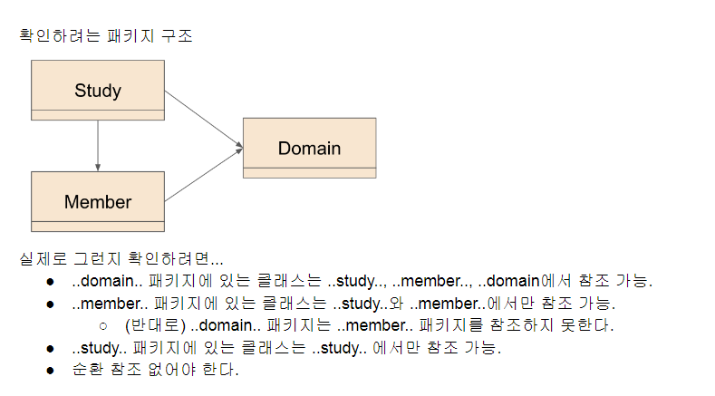
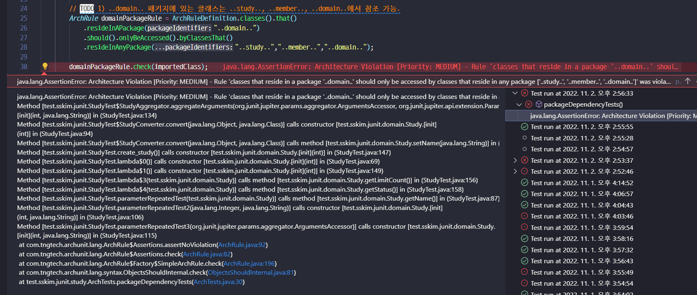
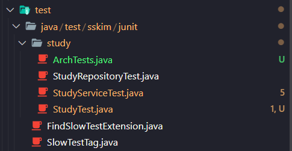
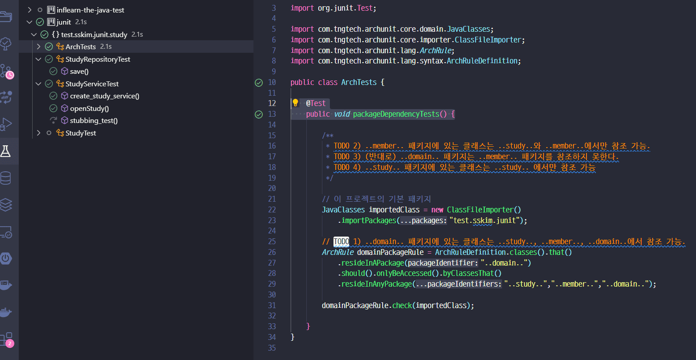
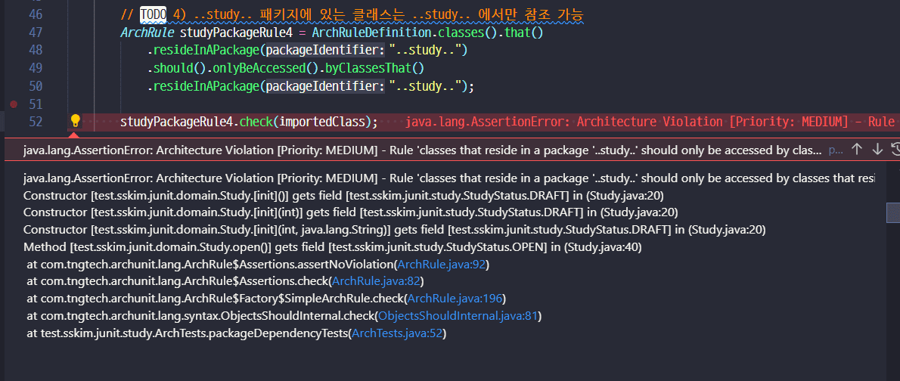
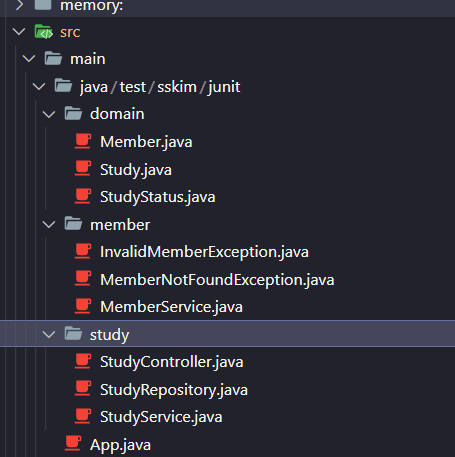
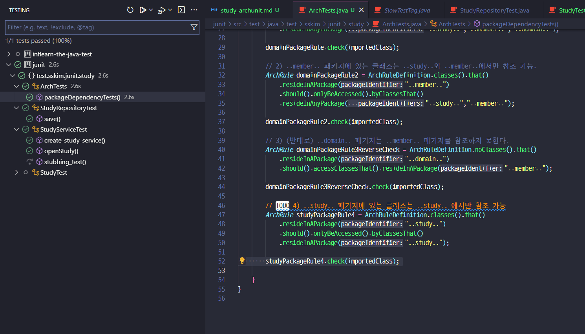
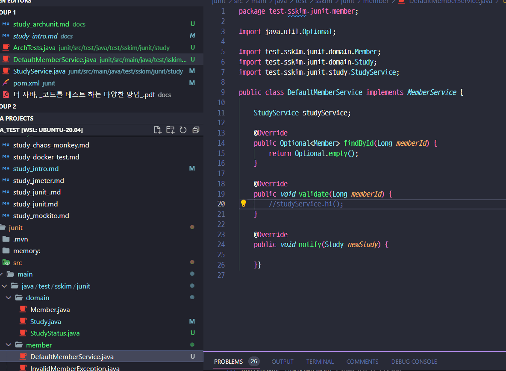
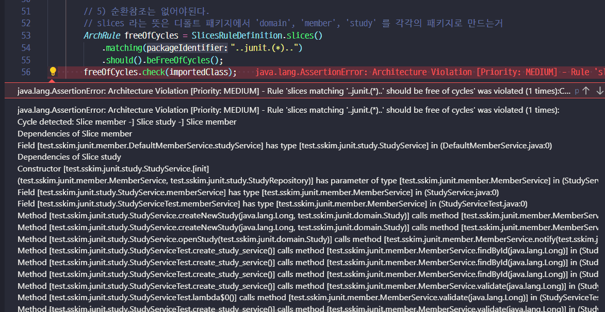
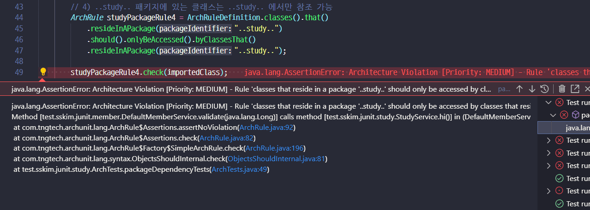

## ArchUnit

- 공식문서 : https://www.archunit.org/
  - 애플리케이션의 아키텍처를 테스트 할 수 있는 오픈 소스 라이브러리로, 패키지, 클래스, 레이어, 슬라이스 간의 의존성을 확인할 수 있는 기능을 제공한다.

- 아키텍처 테스트 유즈 케이스
  - A 라는 패키지가 B (또는 C, D) 패키지에서만 사용 되고 있는지 확인 가능.
  - *Serivce라는 이름의 클래스들이 *Controller 또는 *Service라는 이름의 클래스에서만
참조하고 있는지 확인.
  - *Service라는 이름의 클래스들이 ..service.. 라는 패키지에 들어있는지 확인.
  - A라는 애노테이션을 선언한 메소드만 특정 패키지 또는 특정 애노테이션을 가진 클래스를 호출하고 있는지 확인.
  - 특정한 스타일의 아키텍처를 따르고 있는지 확인.
- 참고
  - https://blogs.oracle.com/javamagazine/unit-test-your-architecture-with-archunit
  - https://www.archunit.org/userguide/html/000_Index.html
  - [Moduliths](https://github.com/moduliths/moduliths)


### 준비물
```xml
<!-- pom.xml -->
<dependency>
    <groupId>com.tngtech.archunit</groupId>
    <artifactId>archunit-junit5-engine</artifactId>
    <version>0.12.0</version>
    <scope>test</scope>
</dependency>
```

### 적용법
```java
@Test
public void Services_should_only_be_accessed_by_Controllers() {
    
    // 1. 특정 패키지에 해당하는 클래스-바이트코드를 읽어온다.
    JavaClasses importedClasses = new 
        ClassFileImporter().importPackages("com.mycompany.myapp");

    // 2. 확인할 규칙을 정의
    ArchRule myRule = classes()
        .that().resideInAPackage("..service..")
        .should().onlyBeAccessed().byAnyPackage("..controller..", "..service..");

    // 3. 읽어들인 클래스가 규칙을 따르고 있는지 확인
    myRule.check(importedClasses);
}
```
- JUnit 5 확장팩 제공
  - `@AnalyzeClasses` : 클래스를 읽어들여서 확인할 패키지 설정
  - `@ArchTest` : 확인할 규칙 정의


### 예제1 : 패키지 의존성 확인


- 1번 문제 예제
```java
@Test
public void packageDependencyTests() {
    // 이 프로젝트의 기본 패키지
    JavaClasses importedClass = new ClassFileImporter().importPackages("test.sskim.junit"); 
        
    // 1) ..domain.. 패키지에 있는 클래스는 ..study.., ..member.., ..domain..에서 참조 가능.
    ArchRule domainPackageRule = ArchRuleDefinition.classes().that()
        .resideInAPackage("..domain..")
        .should().onlyBeAccessed().byClassesThat()
        .resideInAnyPackage("..study..","..member..","..domain..");
    
    domainPackageRule.check(importedClass);
}
```

- 왜그랬는지 보니까 전에 만들던 테스트 때문에 그렇다.. 그래서 이걸 위치를 옮겨줌.


    - GOOD!!

- 2번 문제 예제
```java
// 2) ..member.. 패키지에 있는 클래스는 ..study..와 ..member..에서만 참조 가능.
ArchRule domainPackageRule2 = ArchRuleDefinition.classes().that()
    .resideInAPackage("..member..")
    .should().onlyBeAccessed().byClassesThat()
    .resideInAnyPackage("..study..","..member..");

domainPackageRule2.check(importedClass);
```
- 3번 문제 예제
```java
// 3) (반대로) ..domain.. 패키지는 ..member.. 패키지를 참조하지 못한다.
// noClasses() 를 주의
ArchRule domainPackageRule3ReverseCheck = ArchRuleDefinition.noClasses().that()
    .resideInAPackage("..domain..")
    .should().accessClassesThat().resideInAPackage("..member..");

domainPackageRule3ReverseCheck.check(importedClass);
```

- 4번 문제
```java
// TODO 4) ..study.. 패키지에 있는 클래스는 ..study.. 에서만 참조 가능
ArchRule studyPackageRule4 = ArchRuleDefinition.noClasses().that()
    .resideOutsideOfPackage("..study..")
    .should().accessClassesThat()
    .resideInAPackage("..study..");
// 로 하거나
ArchRule studyPackageRule4 = ArchRuleDefinition.classes().that()
    .resideInAPackage("..study..")
    .should().onlyBeAccessed().byClassesThat()
    .resideInAPackage("..study..");
// 하거나 인데

// 실제 검증해보면
studyPackageRule4.check(importedClass);
```
  
  - Enum이 문제였다...
  
  - 그래서 위처럼 고치고
  
  - GOOD!!!

- 일부러 순환참조 하게 코드를 만들어보자

  - 주석 된 채로 두면 5번에 걸림
  
  - 주석 살리면 4번에 걸림
  


### 예제2 : JUnit5와 연동해서 간추리기