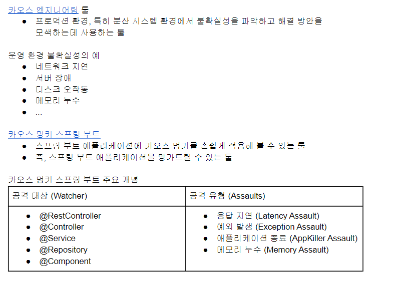
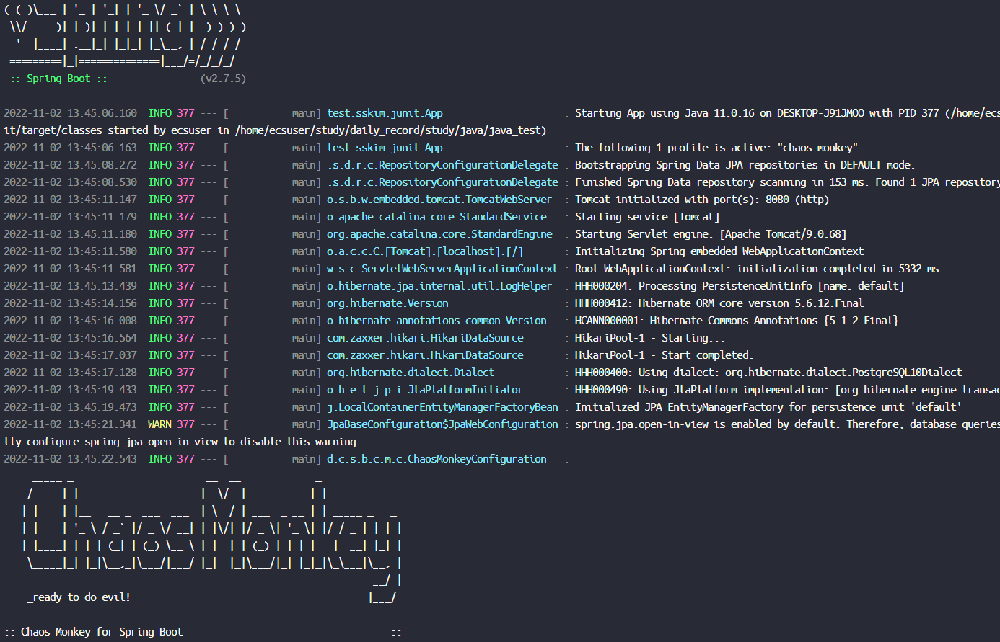
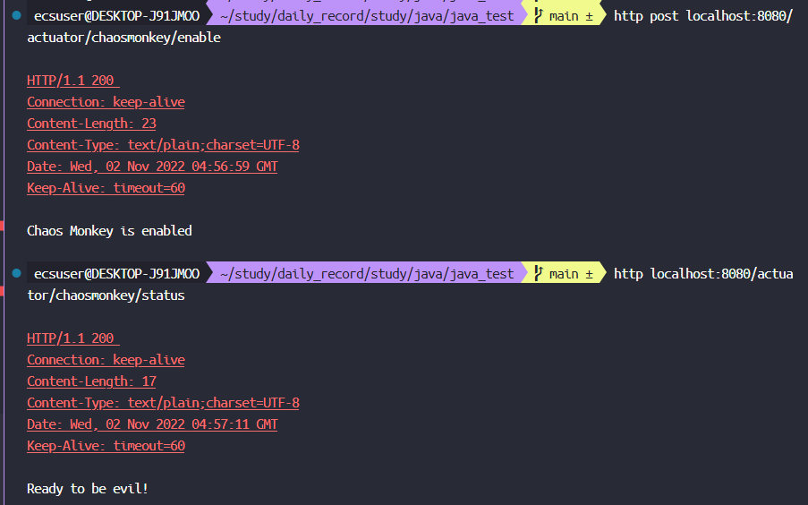
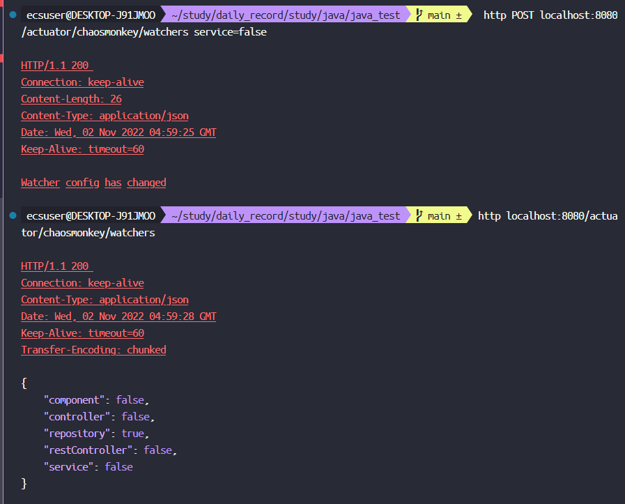
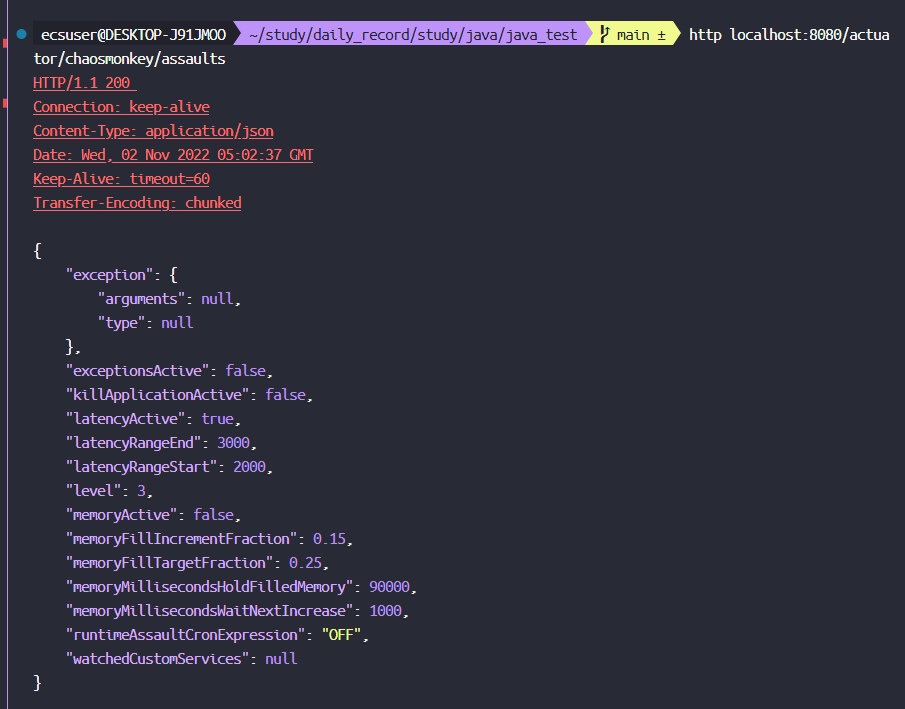
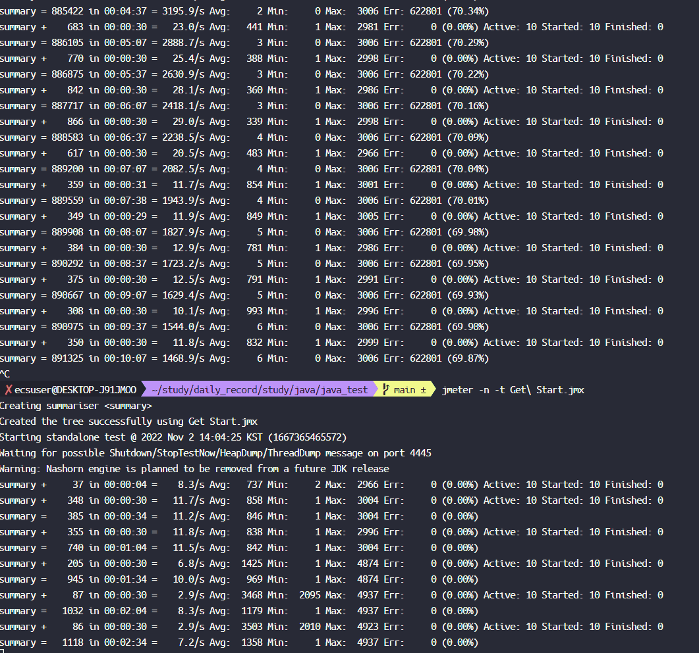
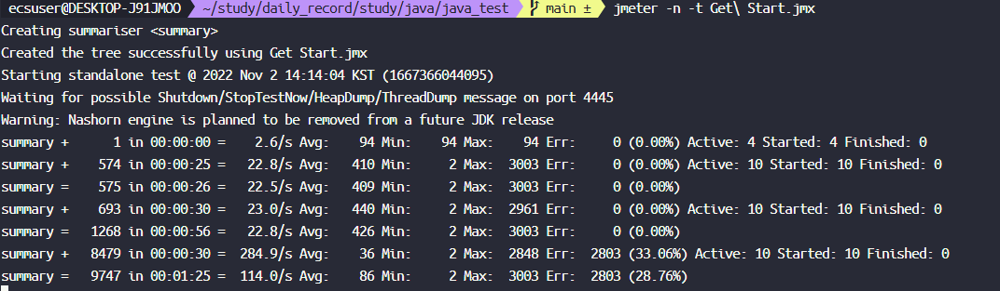

## Chaos Monkey

- [카오스 엔지니어링 살펴보기](http://channy.creation.net/blog/1173)
  : 프로덕션, 분산시스템환경에서 불확실성 파악, 해결책 모색하는 툴
  - 예) 네트워크지연, 서버장애, 디스크 오작동, 메모리 누수 등
  - 넷플릭스에서 만듬
  - [카오스 멍키 스프링부트-CM4SB](https://codecentric.github.io/chaos-monkey-spring-boot/)
- 수업자료 내용


### 준비물

```xml
<dependency>
  <groupId>de.codecentric</groupId>
  <artifactId>chaos-monkey-spring-boot</artifactId>
  <version>2.1.1</version>
</dependency>
<dependency>
  <groupId>org.springframework.boot</groupId>
  <artifactId>spring-boot-starter-actuator</artifactId>
</dependency>
```
- TODO : `spring-boot-starter-actuator` 역할 알아보기
- 적용법은 여러개 가 있지만 `properties` 로 줘보자
```properties
# src/main/resources/application.properties

# chaos-monkey active
spring.profiles.active=chaos-monkey
# springboot-actuator active 
management.endpoint.chaosmonkey.enabled=true
management.endpoints.web.exposure.include=health,info,chaosmonkey

```


### CM4SB 를 이용한 응답지연 / 에러 발생

- 지연측정을 위해서 JMeter를 Cli로 돌려 놓는다.
```shell
jmeter -n -t Get\ Start.jmx
```
```properties
#1. Repository Watcher 활성화 perporties 에 적용
chaos.monkey.watcher.repository=true
```

```shell
#2. 카오스 멍키 활성화
http post localhost:8080/actuator/chaosmonkey/enable
#3. 카오스 멍키 활성화 확인
http localhost:8080/actuator/chaosmonkey/status
```


```shell
#4. 카오스 멍키 와처 확인
http localhost:8080/actuator/chaosmonkey/watchers
# 끄는거는 활성화때 먹히는데 올리는건 안된다.
# 끄는법
# http POST localhost:8080/actuator/chaosmonkey/watchers service=false
```


```shell
#5. 카오스 멍키 지연 공격 설정
# level=3 은 3번 요청 받을때 마다 공격을 해라. 
# 아래 명령어는 3번 마다 2~5초 지연을 하게 해라

http POST localhost:8080/actuator/chaosmonkey/assaults level=3 latencyRangeStart=2000 latencyRangeEnd=5000 latencyActive=true


#6. 확인
http localhost:8080/actuator/chaosmonkey/assaults
```


  응답지연이 늘어남.

- 에외도 만들어보자 [참고링크](https://codecentric.github.io/chaos-monkey-spring-boot/2.1.1/#_examples
)
```shell
# 레이턴시는 끄고 에러로 셋팅
http POST localhost:8080/actuator/chaosmonkey/assaults level=3 latencyActive=false exceptionsActive=true exception.type=java.lang.RuntimeException 
```

  에러발생 성공!

### 더 참고할 자료
- properties 에 구체적으로 설정 가능함.
- 참고링크 : https://codecentric.github.io/chaos-monkey-spring-boot/2.1.1/#_customize_watcher

