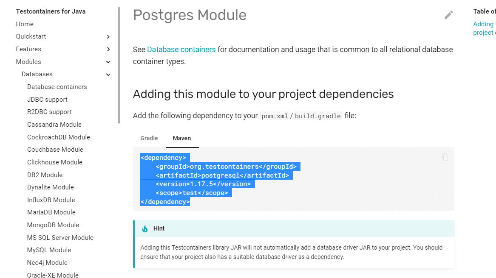
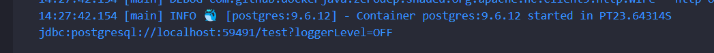
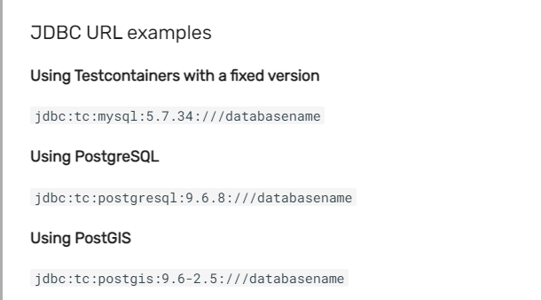
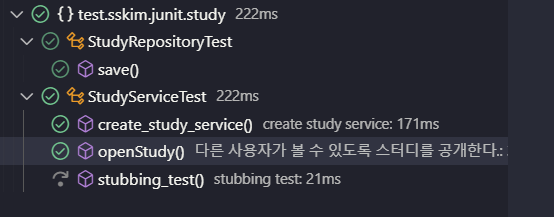
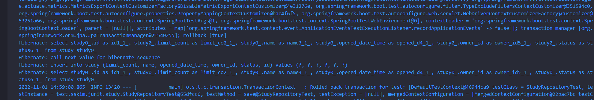
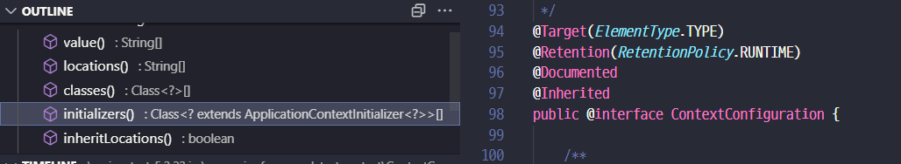
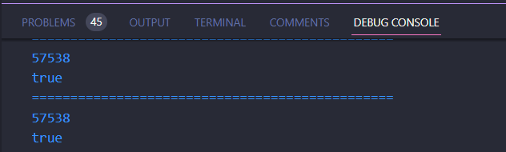
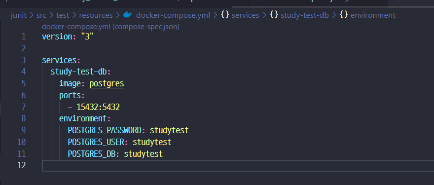
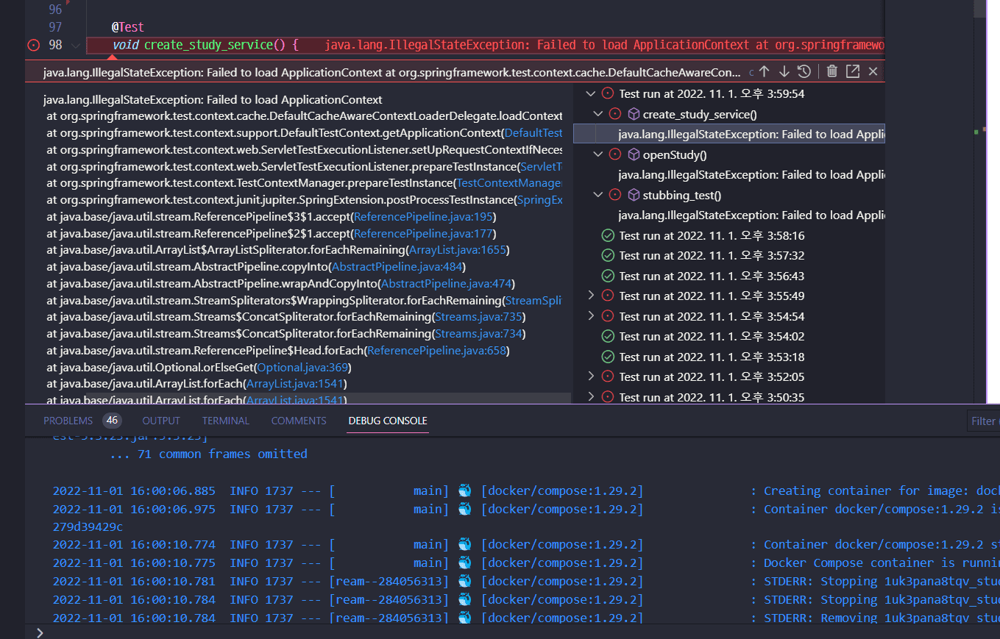
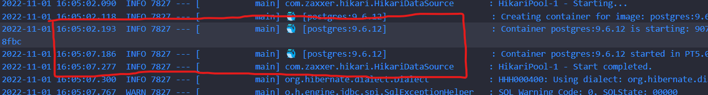

## Docker - Container Test

### 준비물
- https://www.testcontainers.org/
- git-tag `docker-test` 참고
  - `git push origin refs/tags/docker-test --verbose` 명령어는 외우자
```java
@SpringBootTest
@ActiveProfiles("test")
public class StudyServiceTest {

	@Mock
	MemberService memberService;

    // repository 실제객체로 변경
	@Autowired
	StudyRepository repository;
	...

}

// 그외 자잘하게 dto, service 코드 등이 바뀜
```
```properties
#src/resources/application.properties
spring.jpa.hibernate.ddl-auto=update

spring.datasource.url=jdbc:postgresql://localhost:5432/study
spring.datasource.username=study
spring.datasource.password=study

#test/resources/application.properties
spring.datasource.url=jdbc:h2:memory:/studydb
spring.datasource.username=sa
spring.datasource.password=password
spring.datasource.driver-class-name=org.h2.Driver

spring.jpa.database-platform=org.hibernate.dialect.H2Dialect
spring.jpa.hibernate.ddl-auto=create-drop
```
```xml
<!-- pom.xml -->
<dependency>
	<groupId>org.projectlombok</groupId>
	<artifactId>lombok</artifactId>
</dependency>
<dependency>
	<groupId>org.postgresql</groupId>
	<artifactId>postgresql</artifactId>
</dependency>

<dependency>
	<groupId>com.h2database</groupId>
	<artifactId>h2</artifactId>
	<scope>test</scope>
</dependency>
```

```yaml
version: "3"

services:
  study-db:
    image: postgres
    ports:
      - 5432:5432
    environment:
      POSTGRES_PASSWORD: study
      POSTGRES_USER: study
      POSTGRES_DB: study
  study-test-db:
    image: postgres
    ports:
      - 15432:5432
    environment:
      POSTGRES_PASSWORD: studytest
      POSTGRES_USER: studytest
      POSTGRES_DB: studytest
```

- 그런데 이렇게 테스트 컨테이너를 따로 관리하면 매우 귀찮음.


### Testcontainers

- 공식사이트 : https://www.testcontainers.org/test_framework_integration/junit_5/
	```xml
	<dependency>
		<groupId>org.testcontainers</groupId>
		<artifactId>junit-jupiter</artifactId>
		<version>1.17.5</version>
		<scope>test</scope>
	</dependency>
	<!--그리고 현재는 postgresDB 를 사용하므로 해당 모듈도 추가해준다. -->
	<dependency>
		<groupId>org.testcontainers</groupId>
		<artifactId>postgresql</artifactId>
		<version>1.17.5</version>
		<scope>test</scope>
	</dependency>
	```
	

	- 그러면 수동으로도 가능한데..
	```java
	// static으로 주지 않으면 매번 컨테이너를 만드니 주의
	static PostgreSQLContainer postgreSqlContainer = new PostgreSQLContainer();

	@BeforeAll
	static void beforeAll() {
		postgreSqlContainer.start();
	}

	
	@AfterAll
	static void afterAll() {
		postgreSqlContainer.stop();
	}
	```
	- 그런데 내가 정한 위치에 놓기가 힘들다...
	

	- 그래서 설정값을 바꾸는데 [참고링크](https://www.testcontainers.org/modules/databases/jdbc/)
	
	```properties
	# tc: 가붙고 host 정보도 필요하지 않음
	spring.datasource.url=jdbc:tc:postgresql:///studytest
	# 드라이버 추가
	spring.datasource.driver-class-name=org.testcontainers.jdbc.ContainerDatabaseDriver
	# 더이상 계정정보는 필요치 않음
	# spring.datasource.username=studytest
	# spring.datasource.password=studytest

	spring.jpa.hibernate.ddl-auto=create-drop
	```
	```java
	static PostgreSQLContainer postgreSqlContainer = new PostgreSQLContainer().withDatabaseName("studytest");
	```

	- 성공!
	

	- 하지만 위 과정도 상당히 메뉴얼해서.. 힘드니..
	```java
	// properties 는 그대로 두고 testcode만 변경
	@Testcontainers
	public class StudyServiceTest {

		@Mock
		MemberService memberService;

		@Autowired
		StudyRepository repository;

		@Container
		static PostgreSQLContainer postgreSqlContainer =
				new PostgreSQLContainer().withDatabaseName("studytest");
				
		@BeforeEach
		void beforeEach() {
			// testDB 정보 초기화
			repository.deleteAll();
		}
		...
	}
	```
	- @Testcontainers
		- JUnit 5 확장팩으로 테스트 클래스에 @Container를 사용한 필드를 찾아서 컨테이너
		라이프사이클 관련 메소드를 실행해준다.
	- @Container
		- 인스턴스 필드에 사용하면 모든 테스트 마다 컨테이너를 재시작 하고, 스태틱 필드에
		사용하면 클래스 내부 모든 테스트에서 동일한 컨테이너를 재사용한다.
		여러 모듈을 제공하는데, 각 모듈은 별도로 설치해야 한다.

### Testcontainers, 일반적인 Container 사용법

- 좀더 커스텀한 Container가 필요하다면 `New GenericContainer(String imageName)`
- 대신 이럴땐 환경변수로 추가설정을 넣어준다.
  ```java

	@Container
	static GenericContainer container = 
		//new PostgreSQLContainer().withDatabaseName("studytest");
		new GenericContainer<>("postgres")
			.withExposedPorts(5432)
			.withEnv("POSTGRES_DB", "studytest")
			// 기본적용 - port 살아날때 까지 기다리기
			.waitingFor(Wait.forListeningPort())
			// .waitingFor(Wait.forHttp("/study"))
			//.waitingFor(Wait.forLogMessage(regex[String], times[int]))
			;
	
	@BeforeAll 
	void beforeAll(){
		//@Slf4j
		Slf4jLogConsumer logConsumer = new Slf4jLogConsumer(log);
		container.followOutput(logConsumer);
	}

  ```
  

### Testcontainers 정보를 Spring 컨테스트에서 참조하기

- @ContextConfiguration
  - 스프링이 제공하는 애노테이션으로, 스프링 테스트 컨텍스트가 사용할 설정 파일 또는
  컨텍스트를 커스터마이징할 수 있는 방법을 제공한다.

- ApplicationContextInitializer
  - 스프링 ApplicationContext를 프로그래밍으로 초기화 할 때 사용할 수 있는 콜백
  인터페이스로, 특정 프로파일을 활성화 하거나, 프로퍼티 소스를 추가하는 등의 작업을
  할 수 있다.
- TestPropertyValues
  - 테스트용 프로퍼티 소스를 정의할 때 사용한다.

- Environment
  - 스프링 핵심 API로, 프로퍼티와 프로파일을 담당한다.

- 전체 흐름
  1. Testcontainer를 사용해서 컨테이너 생성
  2. ApplicationContextInitializer를 구현하여 생선된 컨테이너에서 정보를 축출하여
  Environment에 넣어준다.
  3. @ContextConfiguration을 사용해서 ApplicationContextInitializer 구현체를 등록한다.
  4. 테스트 코드에서 Environment, @Value, @ConfigurationProperties 등 다양한 방법으로
  해당 프로퍼티를 사용한다.

- 실제 적용코드
```java
@Testcontainers
@Slf4j
@ContextConfiguration(initializers = StudyServiceTest.ContainerPropertyInitializer.class)
public class StudyServiceTest {

	...

	@Autowired Environment environment;

	@Value("${container.port}") int port;

	@Container static PostgreSQLContainer container = new PostgreSQLContainer().withDatabaseName("studytest");
	
	@BeforeAll 
	static void beforeAll(){
		Slf4jLogConsumer logConsumer = new Slf4jLogConsumer(log);
		container.followOutput(logConsumer);
	}

	@BeforeEach
	void beforeEach() {
		System.out.println("===============================================");
		System.out.println(environment.getProperty("container.port"));
		System.out.println(environment.getProperty("container.port").equals(String.valueOf(port)));
		repository.deleteAll();
	}

	...
}
```



- 예제코드는 [다음](https://github.com/testcontainers/testcontainers-java/tree/main/examples/spring-boot)을 참고

### Testcontainers + Docker-Compose

```java
// 사용법은 간단한데..
@Container
static DockerComposeContainer composeContainer = 
	new DockerComposeContainer<>(new File("src/test/resources/docker-compose.yml"));
```


- 그런데 그냥 사용하면 문제가 생긴다.
	
	- 기다리지 못하고 넘어가서 그렇다.
  

- 그래서 아래와 같이 코드를 바꾸고 정보를 가져오는 메소드를 약간 수정한다.
```java
// @Container static PostgreSQLContainer container = new PostgreSQLContainer().withDatabaseName("studytest");
@Container
static DockerComposeContainer composeContainer = new DockerComposeContainer<>
	(new File("src/test/resources/docker-compose.yml"))
	.withExposedService("study-test-db", 5432, Wait.forListeningPort().withStartupTimeout(Duration.ofSeconds(10)));

@BeforeAll 
static void beforeAll(){
	Slf4jLogConsumer logConsumer = new Slf4jLogConsumer(log);
	// 달라진 메소드
	composeContainer.withLogConsumer("study-test-db", logConsumer);
}

@BeforeEach
void beforeEach() {
	System.out.println("===============================================");
	System.out.println(environment.getProperty("container.port"));
	System.out.println(environment.getProperty("container.port").equals(String.valueOf(port)));
	repository.deleteAll();
}

static class ContainerPropertyInitializer implements ApplicationContextInitializer<ConfigurableApplicationContext> {

	@Override
	public void initialize(ConfigurableApplicationContext context) {
		// 여러개는 , 로 붙여서
		TestPropertyValues.of(
			// 달라진 메소드
			"container.port="+composeContainer.getServicePort("study-test-db", 5432))
			.applyTo(context.getEnvironment());
	}
}

```

	- 대략 5초정도 걸렸다.