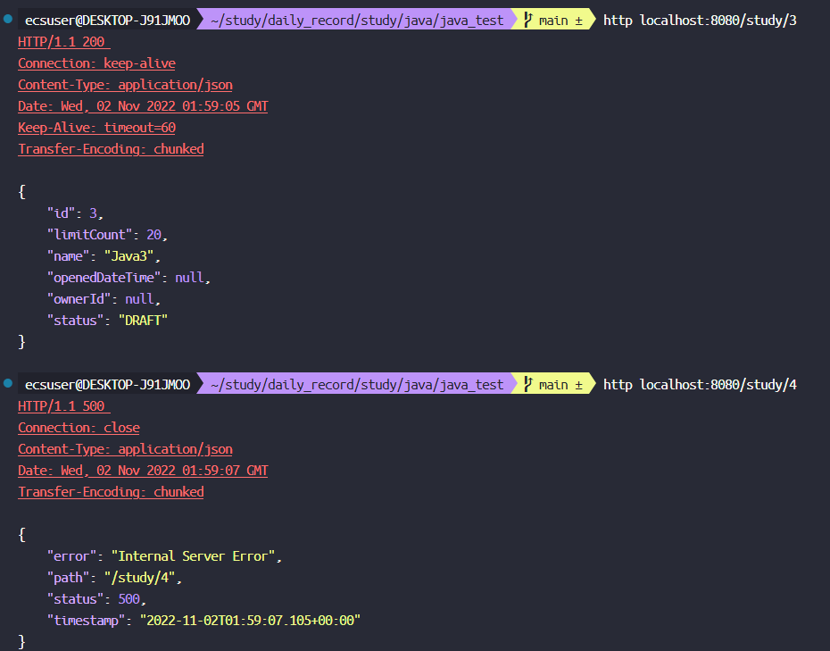
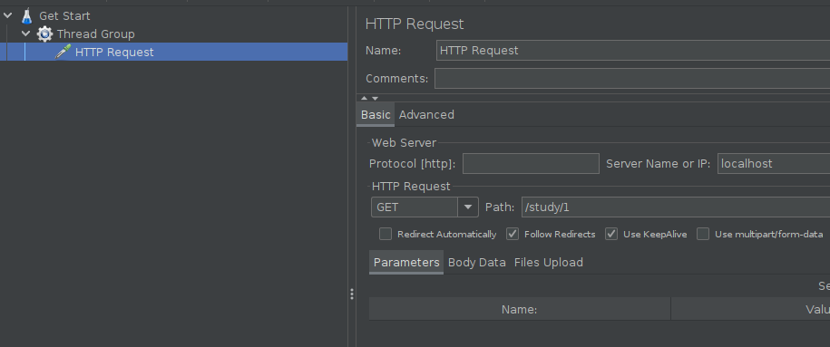
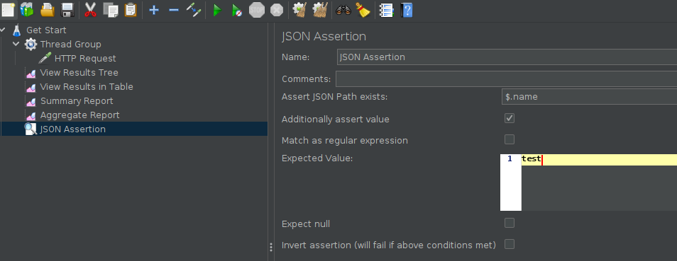
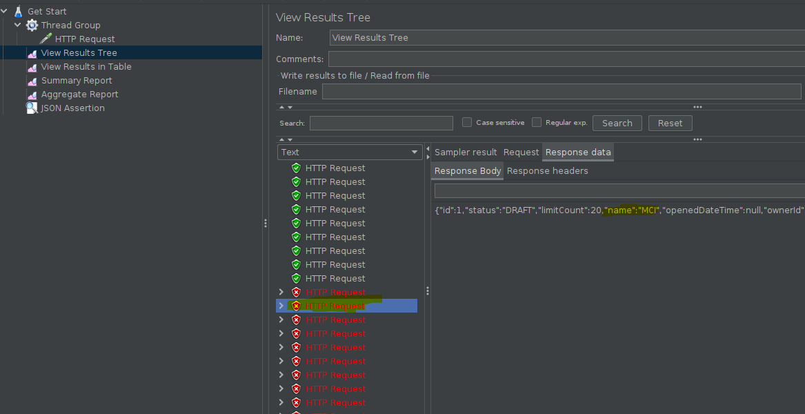
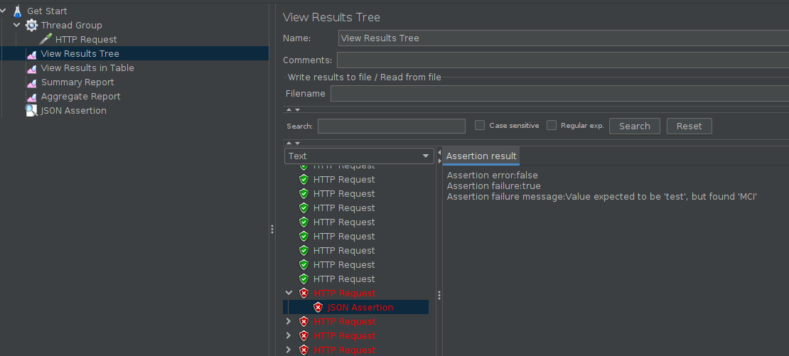

## Jmeter

### 준비물
- httppie 설치
  ```shell
  http post localhost:8080/study limitCount=20 name=MCI
  #  HTTP/1.1 200 
  #  Connection: keep-alive
  #  Content-Type: application/json
  #  Date: Wed, 02 Nov 2022 01:55:28 GMT
  #  Keep-Alive: timeout=60
  #  Transfer-Encoding: chunked
  #
  #  {
  #      "id": 1,
  #      "limitCount": 20,
  #      "name": "MCI",
  #      "openedDateTime": null,
  #      "ownerId": null,
  #      "status": "DRAFT"
  #  }
  ```
  
  Good!

- 그리고 간단하게 벤치 돌릴려면 [Apache-Bench](https://httpd.apache.org/docs/2.4/programs/ab.html) 를 쓰면 좋음
  ```shell
  ab -n 2000 -c 10 localhost:8080/study/2
  # This is ApacheBench, Version 2.3 <$Revision: 1843412 $>
  # Copyright 1996 Adam Twiss, Zeus Technology Ltd, http://www.zeustech.net/
  # Licensed to The Apache Software Foundation, http://www.apache.org/
  # 
  # Benchmarking localhost (be patient)
  # Completed 200 requests
  # Completed 400 requests
  # Completed 600 requests
  # Completed 800 requests
  # Completed 1000 requests
  # Completed 1200 requests
  # Completed 1400 requests
  # Completed 1600 requests
  # Completed 1800 requests
  # Completed 2000 requests
  # Finished 2000 requests
  # 
  # 
  # Server Software:        
  # Server Hostname:        localhost
  # Server Port:            8080
  # 
  # Document Path:          /study/2
  # Document Length:        92 bytes
  # 
  # Concurrency Level:      10
  # Time taken for tests:   1.235 seconds
  # Complete requests:      2000
  # Failed requests:        0
  # Total transferred:      394000 bytes
  # HTML transferred:       184000 bytes
  # Requests per second:    1619.97 [#/sec] (mean)
  # Time per request:       6.173 [ms] (mean)
  # Time per request:       0.617 [ms] (mean, across all concurrent requests)
  # Transfer rate:          311.65 [Kbytes/sec] received
  # 
  # Connection Times (ms)
  #               min  mean[+/-sd] median   max
  # Connect:        0    0   0.1      0       2
  # Processing:     2    6   2.9      5      35
  # Waiting:        2    6   2.8      5      33
  # Total:          2    6   2.9      5      35
  # 
  # Percentage of the requests served within a certain time (ms)
  #   50%      5
  #   66%      7
  #   75%      7
  #   80%      8
  #   90%     10
  #   95%     11
  #   98%     14
  #   99%     15
  #  100%     35 (longest request)
  ```

  - 그런데 Jmeter 를 사용해보자
    - 주요개념
    ```text
    ● Thread Group: 한 쓰레드 당 유저 한명
    ● Sampler: 어떤 유저가 해야 하는 액션
    ● Listener: 응답을 받았을 할 일 (리포팅, 검증, 그래프 그리기 등)
    ● Configuration: Sampler 또는 Listener가 사용할 설정 값 (쿠키, JDBC 커넥션 등)
    ● Assertion: 응답이 성공적인지 확인하는 방법 (응답 코드, 본문 내용 등)

    대체제:
      ● Gatling : https://gatling.io/
      ● nGrinder : https://naver.github.io/ngrinder/
    ```

### Jmeter 사용해보기
- Thread Group 만들기
  - Number of Threads: 쓰레드 개수
  - Ramp-up period: 쓰레드 개수를 만드는데 소요할 시간
  - Loop Count: infinite 체크 하면 위에서 정한 쓰레드 개수로 계속 요청 보내기. 값을 입력하면 해당 쓰레드 개수 X 루프 개수 만큼 요청 보냄.
  
  - Sampler 만들기
    - 여러 종류의 샘플러가 있지만 그 중에 우리가 사용할 샘플러는 HTTP Request 샘플러.
    - HTTP Sampler
    - 요청을 보낼 호스트, 포트, URI, 요청 본문 등을 설정
    - 여러 샘플러를 순차적으로 등록하는 것도 가능하다.



- Listener : 결과보기
  - View Results Tree
  - View Results in Table
  - Summary Report
  - Aggregate Report
  - Response Time Graph
  - Graph Results
  - ...
- Assertion 만들기
  - 응답 코드 확인
  - 응답 본문 확인
    
    
    

- CLI 사용하기
  ```shell
  # -n : ui 쓰지 않겠다
  jmeter -n -t 설정 파일 -l 리포트 파일
  ```