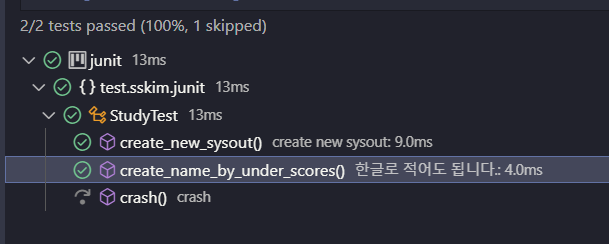
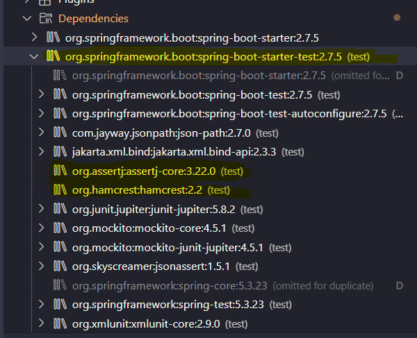
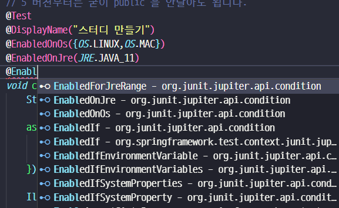

# 다루는 내용
- [Junit5](./study_junit.md)
- [Mockito](./study_mockito.md)

## JUnit5

### 개요
- 대체제 : TestNG, Spock, ...
- 4와 다르게 세부모듈로 나눠짐. [ Jupiter / Vintage / JUnit Platform ]
    - Platform:  테스트를 실행해주는 런처 제공. TestEngine API 제공.
    - Jupiter: TestEngine API 구현체로 JUnit 5를 제공.
    - Vintage: JUnit 4와 3을 지원하는 TestEngine 구현
    - [공식가이드](https://junit.org/junit5/docs/current/user-guide/)

### Junit5 기초

- springboot 2.2.1 버젼 이상은 JUnit5 가 기본
- 5버젼부터는 @Test 를 붙이는 메소드에 굳이 public 을 붙이지 않아도 됨.
    ```xml
    <dependency>
        <groupId>org.junit.jupiter</groupId>
        <artifactId>junit-jupiter-engine</artifactId>
        <version>5.5.2</version>
        <scope>test</scope>
    </dependency>
    ```
    

    ```java

    public class StudyTest {

        // 5 버젼부터는 굳이 public 을 안달아도 됩니다.
        @Test
        void create() {
            Study study = new Study();
            assertNotNull(study);
            System.out.println("create");
        };

        @Test
        void create1() {
            System.out.println("create1");
        };

        @Test
        @Disabled
        void crash() {
            System.out.println("crash");
        }


        //All은 private 안되며 void 이외를 리턴하면 안됨, 반드시 static 형이어야함.
        @BeforeAll
        static void beforeAll() {
            System.out.println("beforeAll");
        }

        @AfterAll
        static void afterAll() {
            System.out.println("afterAll");
        }

        // Each 는 굳이 static 일필요는 없음음 
        @BeforeEach
        void beforeEach() {
            System.out.println("beforeEach");
        }

        @AfterEach
        void afterEach() {
            System.out.println("afterEach");
        }
    }


    // 결과
    // beforeAll
    // beforeEach
    // create
    // afterEach
    // beforeEach
    // create1
    // afterEach
    // afterAll
    ```

- @DisplayNameGeneration / @DisplayName
  - 기본적으로 메소드 이름으로 테스트 이름이 적혀짐
  
  - @DisplayNameGeneration : class, metho에 달수 있으며, 전략에 해당하는 구현체를 넣어주어야함.
  - @DisplayName : 원하는 문자 모든지 넣어도 됨.
  

### Assertion
- 실제 테스트에서 검증하고자 하는 내용

```java
// 기대값 먼저, 실제 나오는 값, 메세지- 람다로도 가능함.
// 람다로 만들면 실패했을때만 메세지 연산을 함.
// all 로 묶으면 묶인 거를 독립적-병렬적? 으로 실행 가능함.
// 이렇게 하면 2,3번이 한번에 틀린걸 알 수 있음음
assertAll(
    () -> { assertNotNull(study);} 
    // 기대값 먼저, 실제 나오는 값, 메세지
    ,() -> { assertEquals(StudyStatus.DRAFT, study.getStatus(), 
        () -> "스터디를 처음 만들면 Status 는 DRAFT"); 
    }
    ,() -> { assertTrue( study.getLimit() >= 1 ,
         () -> "스터디 최대인원은 1명 이상이다. "); 
    }
);

// assertThrows 로 ex 도 받을 수 있음.
IllegalArgumentException ex = assertThrows(IllegalArgumentException.class, ()-> new Study(-10) ); 
assertEquals("limit 는 0보다 커야된다.", ex.getMessage());

// assertTimeout
// 그런데 이렇게 해두면 실제 100ms 까지 기다림...
assertTimeout(Duration.ofMillis(10),() -> {
    new Study(0);
    Thread.sleep(100);
});
// 원하는 시간만 기다리고 싶으면
// 하지만 테스트 코드가 별도의 쓰레드에서 돌아가서
// TODO ThreadLocal << 더 알아보기
assertTimeoutPreemptively(~~~) 을 쓰면 된다.

```
- 기타 참고할만한 라이브러리
    - [AssertJ](https://joel-costigliola.github.io/assertj/)
    - [Hamcrest](https://hamcrest.org/JavaHamcrest/)
    - [Truth](https://truth.dev/)
    - 스프링 부트 test 에는 기본적으로 AssertJ, Hamcrest 가 들어가 있음
    

### 조건별 테스트

- assume~~ 을 쓰면 되는데..
    ```java
        @Test
        @DisplayName("조건별 테스트")
        void conditionalTest() {
            // import static org.junit.jupiter.api.Assumptions.*;
            System.out.println(System.getenv("TEST_ENV"));
            assumeTrue("LOCAL".equalsIgnoreCase(System.getenv("TEST_ENV")));
        }
    ```
    $$
    - 실제값은 null 이고 에러가 나야되는데 사실은 여기서 멈춘거고
    - 조건을 통과해야지 나머지 assert 꺼를 성공/실패 할 수 있게 된다.

- Annotation 으로 도 가능함
  - @Enabledxxx / @Disabledxxxx
  ```java
	@EnabledOnOs({OS.LINUX,OS.MAC})
    ...
  ```
  


### 태킹 / 필터링

- `@Tag` 를 붙이면 실행할 때 태그를 찾아서 그것만 실행시킬 수 있음.
- 그런데 vscode 에서는 해당 태그만 하는 걸 찾기 어려웠음 // TODO : 더 찾아볼것
- pom.xml 사용할 태그를 지정하면 그것만 실행시킬수 잇음
    
  - 원래는 위처럼 되는데
  ```xml
  	<profiles>
		<profile>
			<id>default</id>
			<activation>
				<activeByDefault>true</activeByDefault>
			</activation>
			<build>
				<plugins>
					<plugin>
						<artifactId>maven-surefire-plugin</artifactId>
						<configuration>
                            <includeTags>fast</includeTags>
							<groupId>fast</groupId>
						</configuration>
					</plugin>
				</plugins>
			</build>
		</profile>
	</profiles>
  ```
  - 이렇게 추가하면 되야되는데 안된다;;
    - 참고링크 : https://www.baeldung.com/junit-filtering-tests
    - 참고링크2 : https://github.com/junit-team/junit5-samples/blob/r5.1.0/junit5-maven-consumer/pom.xml
    ```xml
    <!-- 참고링크2번 방법 -->
    <plugin>
        <artifactId>maven-surefire-plugin</artifactId>
        <version>2.19.1</version>
        <configuration>
            <includes>
                <include>**/Test*.java</include>
                <include>**/*Test.java</include>
                <include>**/*Tests.java</include>
                <include>**/*TestCase.java</include>
            </includes>
            <properties>
                <includeTags>fast</includeTags>
                <configurationParameters>
                    junit.jupiter.conditions.deactivate = *
                </configurationParameters>
            </properties>
        </configuration>
    </plugin>
    ```

    - 뭐지;;
    - [공식문서?](https://maven.apache.org/surefire/maven-surefire-plugin/test-mojo.html) : 확인해봐야됨
    - 해결책 : [TODO]추후 TIL 옮겨서 정리해야됨
      - [maven 플러그인 버젼 명시](https://code-overflow.tistory.com/entry/%EC%97%90%EB%9F%ACError-%EB%A9%94%EC%9D%B4%EB%B8%90Maven-Junit-5-%EB%B9%8C%EB%93%9C-%EC%8B%9C-groupsexcludedGroups-require-TestNG-or-JUunit48-on-project-test-classpath-%EB%AC%B8%EC%A0%9C) : maven-surefire-plugin -> 2.22.2

     -  [스택오버플로우](https://stackoverflow.com/questions/42421688/how-to-choose-which-junit5-tags-to-execute-with-maven)
    ```xml
	<profiles>
		<profile>
			<id>default</id>
			<activation>
				<activeByDefault>true</activeByDefault>
			</activation>
			<build>
				<plugins>
					<plugin>
						<artifactId>maven-surefire-plugin</artifactId>
						<version>2.22.2</version>
						<configuration>
							<groups>fast</groups>
						</configuration>
					</plugin>
				</plugins>
			</build>
		</profile>
	</profiles>

    ```
    - 특정 프로파일을 실행하려면
      - ./mvnw test -P ci[profile Name] 


    - meta Annotation을 통해 커스텀 할 수 있음.
    ```java
    @Target(ElementType.METHOD)
    @Retention(RetentionPolicy.RUNTIME)
    @Test
    @Tag("fast")
    public @interface FastTestTag {
    }

    // 실제 사용시에는
    @DisplayName("조건별 테스트")
    @FastTestTag
    void conditionalTest() {
        // import static org.junit.jupiter.api.Assumptions.*;
        // 그런데 환경변수는 vscode 가 들고가고 있어서 잘 안됨.
        System.out.println(System.getenv("TEST_ENV"));
        assumeTrue("LOCAL".equalsIgnoreCase(System.getenv("TEST_ENV")));
        // 위조건이 만족해야지 나머지 조건이 도는 구조이다.
        
        assertTimeoutPreemptively(Duration.ofMillis(10),() -> {
            new Study(0);
        });
    }
    ```
    - 

### 테스트 반복

- @RepeatedTest :반복 횟수와 반복 테스트 이름을 설정할 수 있다.
  - {displayName}
  - {currentRepetition}
  - {totalRepetitions}
  - RepetitionInfo 타입의 인자를 받을 수 있다.
    ```java
	@FastTestTag
	@DisplayName("반복학습")
	@RepeatedTest(value = 10, name ="{displayName} : {currentRepetition} / {totalRepetitions}" )
	void repeatedTest(RepetitionInfo repetitionInfo) {
		System.out.println("Repeat Count :" + repetitionInfo.getCurrentRepetition() 
		+ " / " + repetitionInfo.getTotalRepetitions());
	}
    ```
    

- ParameterizedTest : 테스트에 여러 다른 매개변수를 대입해가며 반복 실행한다.
  - {displayName}
  - {index}
  - {arguments}
  - {0}, {1}, ...
  - @ValueSource 로 간단히 파라미터를 던저 줄수 있음.
      ```java
  	@FastTestTag
  	@DisplayName("반복학습")
  	@ParameterizedTest(name ="{displayName} {0} {index}교시" )
  	@ValueSource(strings = {"수학","과학","사회","국어"})
  	void parameterRepeatedTest(String message) {
  		System.out.println("["+message+"] Repeat");
  	}

  ```
  

  - @ValueSource / @NullSource / @EmptySource / @NullAndEmptySource
      / @EnumSource / @MethodSource 
      / @CsvSource / @CvsFileSource
      / @ArgumentSource
      등을 쓸 수 있음.
  - 그런데 형을 변형해서 받고 싶을 수 있는데 primitive 는 자동 변형해주지만 CustomClass 는 그냥 안된다.

```java

@FastTestTag
@DisplayName("반복학습")
@ParameterizedTest(name ="{displayName} {0} {index}교시" )
@ValueSource(strings = {"수학","과학","사회","국어"})
void parameterRepeatedTest(@ConvertWith(StudyConverter.class) Study study) {
    System.out.println("["+study.getName()+"] Repeat");
}

static class StudyConverter extends SimpleArgumentConverter {
    @Override
    public Object convert(Object source, Class<?> targetType) {
        assertEquals(Study.class, targetType, "Can only convert to Study");
        Study object = new Study(0); 
        object.setName(String.valueOf(source));
        return object;
    }
}

@FastTestTag
@DisplayName("반복학습 2")
@ParameterizedTest(name ="{displayName} {0} {index}교시" )
@CsvSource({"1, 수학","3, 과학","4, 사회","1, 국어"})
void parameterRepeatedTest2(Integer limit, String name ) {
    System.out.println(new Study(limit, name));
}
// Study [limit=1, name=수학]
// Study [limit=3, name=과학]
// Study [limit=4, name=사회]
// Study [limit=1, name=국어]

@FastTestTag
@DisplayName("반복학습 3")
@ParameterizedTest(name ="{displayName} {0} {index}교시" )
@CsvSource({"10, 수학","13, 과학","43, 사회","12, 국어"})
void parameterRepeatedTest3(ArgumentsAccessor accessor) {
    System.out.println(
        new Study( 
            accessor.getInteger(0)
            , accessor.getString(1)
        ));
}
// Study [limit=10, name=수학]
// Study [limit=13, name=과학]
// Study [limit=43, name=사회]
// Study [limit=12, name=국어]

@DisplayName("반복학습 4")
@ParameterizedTest(name ="{displayName} {0} {index}교시" )
@CsvSource({"100, Java","100, Spring","100, boot","0, JPA "})
void parameterRepeatedTest3(@AggregateWith(StudyAggregator.class) Study study) {
    System.out.println(study);
}

static class StudyAggregator implements ArgumentsAggregator {

    @Override
    public Object aggregateArguments(ArgumentsAccessor accessor, ParameterContext context)
            throws ArgumentsAggregationException {
        return	new Study( 
            accessor.getInteger(0), accessor.getString(1)
        );
    }
}

// Study [limit=100, name=Java]
// Study [limit=100, name=Spring]
// Study [limit=100, name=boot]
// Study [limit=0, name=JPA]

```

- Junit5 참고 링크 : https://donghyeon.dev/junit/2021/04/11/JUnit5-%EC%99%84%EB%B2%BD-%EA%B0%80%EC%9D%B4%EB%93%9C/


### 테스트 인스턴스 와 테스트 순서

- Junit 의 기본 테스트 전략은 테스트 코드 하나마다 인스턴스를 하나를 만들어서 돌린다. -> 테스트 간의 의존성을 없애기 위함


```java
@DisplayNameGeneration(DisplayNameGenerator.ReplaceUnderscores.class)
@TestInstance(TestInstance.Lifecycle.PER_CLASS)
// 클래스당 하나의 인스턴스라면
public class StudyTest {

    // 제약이 풀린다.
    @BeforeAll
    void beforeAll() {
        System.out.println("beforeAll");
    }
```


- 원래 테스트의 순서는 정해진 순서가 있긴 하지만 내부로직에 따라 언제든 변할 수 있다. ( 사실 위의 사진도 그렇다. )
- 그런데 순서를 굳이 주고 싶다면 다음과 같이도 할 수 있다.
    
    ```java
    @DisplayNameGeneration(DisplayNameGenerator.ReplaceUnderscores.class)
    @TestInstance(TestInstance.Lifecycle.PER_CLASS)
    @TestMethodOrder(MethodOrderer.OrderAnnotation.class)
    public class StudyTest {

        // Order는 낮을수록 순위가 높다. 1번째 2번째 등등

        @Order(1)
        void conditionalTest() {}

        @Order(4)
        void repeatedTest(RepetitionInfo repetitionInfo) {}

        @Order(3)
        void parameterRepeatedTest(@ConvertWith(StudyConverter.class) Study study) {
        }

    }

    // beforeAll
    // LOCAL
    // Study [limit=1, name=수학]
    // Study [limit=3, name=과학]
    // Study [limit=4, name=사회]
    // Study [limit=1, name=국어]
    // [수학] Repeat
    // [과학] Repeat
    // [사회] Repeat
    // [국어] Repeat
    // Repeat Count :1 / 10
    // Repeat Count :2 / 10

    ```

    - @Order 스프링꺼는 [링크](https://unhosted.tistory.com/79) 참고


### Junit5 properties 설정

- /test/resources/junit-platform.properties 에 설정함.

```properties
#테스트 인스턴스 라이프사이클 설정
junit.jupiter.testinstance.lifecycle.default = per_class

#확장팩 자동 감지 기능
junit.jupiter.extensions.autodetection.enabled = true

#@Disabled 무시하고 실행하기
junit.jupiter.conditions.deactivate = org.junit.*DisabledCondition

#테스트 이름 표기 전략 설정, \ 은 줄바꿈
junit.jupiter.displayname.generator.default = \
    org.junit.jupiter.api.DisplayNameGenerator$ReplaceUnderscores
```

### Junit5 확장모델 사용하기

- JUnit 4의 확장 모델은 @RunWith(Runner), TestRule, MethodRule. 
- JUnit 5의 확장 모델은 단 하나, Extension.

- 만드는 방법 : 예제코드
    ```java
    import org.junit.jupiter.api.extension.AfterTestExecutionCallback;
    import org.junit.jupiter.api.extension.BeforeTestExecutionCallback;
    import org.junit.jupiter.api.extension.ExtensionContext;


    public class FindSlowTestExtension implements BeforeTestExecutionCallback, AfterTestExecutionCallback {

        private static final long THRESHOLD = 1000L;

        @Override
        public void beforeTestExecution(ExtensionContext context) throws Exception {
            
            ExtensionContext.Store store = getStore(context);
            store.put("START_TIME", System.currentTimeMillis());
        }

        @Override
        public void afterTestExecution(ExtensionContext context) throws Exception {
            String testMethodName = context.getRequiredTestMethod().getName();
            ExtensionContext.Store store = getStore(context);
        
            Long startTime = store.remove("START_TIME", long.class);
            long duration = System.currentTimeMillis() - startTime;
            if( duration > THRESHOLD ) {
                System.out.printf("Please consider mark method [%s] with @slowTest .\n",testMethodName);
            }
        
        }
        
        private ExtensionContext.Store getStore(ExtensionContext context) {
            String testClassName = context.getRequiredTestClass().getName();
            String testMethodName = context.getRequiredTestMethod().getName();
            ExtensionContext.Store store = context.getStore(ExtensionContext.Namespace.create(testClassName, testMethodName));
            return store;
        }
    }

    ```

- 등록 방법 : [공식문서링크](https://junit.org/junit5/docs/current/user-guide/#extensions)
    - 선언적인 등록 @ExtendWith
    ```java
    @ExtendWith(FindSlowTestExtension.class)
    @TestInstance(TestInstance.Lifecycle.PER_CLASS)
    public class StudyTest {
        ...
    }
    ```

    - 프로그래밍 등록 @RegisterExtension
      - 선언적인 @ExtensionWith 로 셋팅하면 별다른 수정을 가할 수가 없음
      - test 마다 다른 값으로 셋팅한다거나..
    ```java
    public class StudyTest {
        ...
        // field 에 정의한다.
        @RegisterExtension
        static FindSlowTestExtension findSlowTestExtension = new FindSlowTestExtension(1005L);
        ...
    }
    ```

    - 자동 등록 자바 ServiceLoader 이용
      - 이방법은 기본적으로 옵션값 `junit.jupiter.extensions.autodetection.enabled` 이 false 로 셋팅되어 있음.
      - 그런데 좀 경우가 까다로워서 공식문서를 확인하자.


### Junit4 마이그레이션
- 기본적으로 마이그레이션이 될려면 `junit-vintage-engine` 이 있어야됨.
- 차이점 정도만 수업자료 내용 옮김


