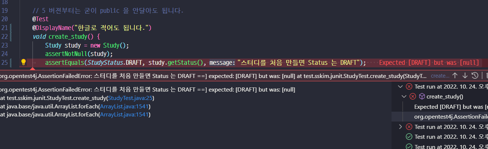

##  다루는 내용
  
- [Junit5](study_junit.md )
- [Mockito](study_mockito.md )
- [Test - Docker Container](study_docker_test.md )
  
##  JUnit5
  
  
###  개요
  
- 대체제 : TestNG, Spock, ...
- 4와 다르게 세부모듈로 나눠짐. [ Jupiter / Vintage / JUnit Platform ]
    - Platform:  테스트를 실행해주는 런처 제공. TestEngine API 제공.
    - Jupiter: TestEngine API 구현체로 JUnit 5를 제공.
    - Vintage: JUnit 4와 3을 지원하는 TestEngine 구현
    - [공식가이드](https://junit.org/junit5/docs/current/user-guide/ )
  
###  Junit5 기초
  
  
- springboot 2.2.1 버젼 이상은 JUnit5 가 기본
- 5버젼부터는 @Test 를 붙이는 메소드에 굳이 public 을 붙이지 않아도 됨.
    ```xml
    <dependency>
        <groupId>org.junit.jupiter</groupId>
        <artifactId>junit-jupiter-engine</artifactId>
        <version>5.5.2</version>
        <scope>test</scope>
    </dependency>
    ```
    
  
    ```java
  
    public class StudyTest {
  
        // 5 버젼부터는 굳이 public 을 안달아도 됩니다.
        @Test
        void create() {
            Study study = new Study();
            assertNotNull(study);
            System.out.println("create");
        };
  
        @Test
        void create1() {
            System.out.println("create1");
        };
  
        @Test
        @Disabled
        void crash() {
            System.out.println("crash");
        }
  
  
        //All은 private 안되며 void 이외를 리턴하면 안됨, 반드시 static 형이어야함.
        @BeforeAll
        static void beforeAll() {
            System.out.println("beforeAll");
        }
  
        @AfterAll
        static void afterAll() {
            System.out.println("afterAll");
        }
  
        // Each 는 굳이 static 일필요는 없음음 
        @BeforeEach
        void beforeEach() {
            System.out.println("beforeEach");
        }
  
        @AfterEach
        void afterEach() {
            System.out.println("afterEach");
        }
    }
  
  
    // 결과
    // beforeAll
    // beforeEach
    // create
    // afterEach
    // beforeEach
    // create1
    // afterEach
    // afterAll
    ```
  
- @DisplayNameGeneration / @DisplayName
  - 기본적으로 메소드 이름으로 테스트 이름이 적혀짐
  
  - @DisplayNameGeneration : class, method에 달수 있으며, 전략에 해당하는 구현체를 넣어주어야함.
  - @DisplayName : 원하는 문자 모든지 넣어도 됨.
  
  
###  Assertion
  
- 실제 테스트에서 검증하고자 하는 내용

```java
// 기대값 먼저, 실제 나오는 값, 메세지- 람다로도 가능함.
// 람다로 만들면 실패했을때만 메세지 연산을 함.
// all 로 묶으면 묶인 거를 독립적-병렬적? 으로 실행 가능함.
// 이렇게 하면 2,3번이 한번에 틀린걸 알 수 있음음
assertAll(
    () -> { assertNotNull(study);} 
    // 기대값 먼저, 실제 나오는 값, 메세지
    ,() -> { assertEquals(StudyStatus.DRAFT, study.getStatus(), 
        () -> "스터디를 처음 만들면 Status 는 DRAFT"); 
    }
    ,() -> { assertTrue( study.getLimit() >= 1 ,
         () -> "스터디 최대인원은 1명 이상이다. "); 
    }
);
  
// assertThrows 로 ex 도 받을 수 있음.
IllegalArgumentException ex = assertThrows(IllegalArgumentException.class, ()-> new Study(-10) ); 
assertEquals("limit 는 0보다 커야된다.", ex.getMessage());
  
// assertTimeout
// 그런데 이렇게 해두면 실제 100ms 까지 기다림...
assertTimeout(Duration.ofMillis(10),() -> {
    new Study(0);
    Thread.sleep(100);
});
// 원하는 시간만 기다리고 싶으면
// 하지만 테스트 코드가 별도의 쓰레드에서 돌아가서
// TODO ThreadLocal << 더 알아보기
assertTimeoutPreemptively(~~~) 을 쓰면 된다.
  
```
- 기타 참고할만한 라이브러리
    - [AssertJ](https://joel-costigliola.github.io/assertj/ )
    - [Hamcrest](https://hamcrest.org/JavaHamcrest/ )
    - [Truth](https://truth.dev/ )
    - 스프링 부트 test 에는 기본적으로 AssertJ, Hamcrest 가 들어가 있음
    
  
###  조건별 테스트
  
  
- assume~~ 을 쓰면 되는데..
    ```java
        @Test
        @DisplayName("조건별 테스트")
        void conditionalTest() {
            // import static org.junit.jupiter.api.Assumptions.*;
            System.out.println(System.getenv("TEST_ENV"));
            assumeTrue("LOCAL".equalsIgnoreCase(System.getenv("TEST_ENV")));
        }
    ```
    <img src="https://latex.codecogs.com/gif.latex?$%20%20%20%20-%20실제값은%20null%20이고%20에러가%20나야되는데%20사실은%20여기서%20멈춘거고%20%20%20%20-%20조건을%20통과해야지%20나머지%20assert%20꺼를%20성공&#x2F;실패%20할%20수%20있게%20된다.-%20Annotation%20으로%20도%20가능함%20%20-%20@Enabledxxx%20&#x2F;%20@Disabledxxxx%20%20```java	@EnabledOnOs({OS.LINUX,OS.MAC})%20%20%20%20...%20%20```%20%20###%20%20태킹%20&#x2F;%20필터링-%20`@Tag`%20를%20붙이면%20실행할%20때%20태그를%20찾아서%20그것만%20실행시킬%20수%20있음.-%20그런데%20vscode%20에서는%20해당%20태그만%20하는%20걸%20찾기%20어려웠음%20&#x2F;&#x2F;%20TODO%20:%20더%20찾아볼것-%20pom.xml%20사용할%20태그를%20지정하면%20그것만%20실행시킬수%20잇음%20%20%20%20%20%20-%20원래는%20위처럼%20되는데%20%20```xml%20%20	&lt;profiles&gt;		&lt;profile&gt;			&lt;id&gt;default&lt;&#x2F;id&gt;			&lt;activation&gt;				&lt;activeByDefault&gt;true&lt;&#x2F;activeByDefault&gt;			&lt;&#x2F;activation&gt;			&lt;build&gt;				&lt;plugins&gt;					&lt;plugin&gt;						&lt;artifactId&gt;maven-surefire-plugin&lt;&#x2F;artifactId&gt;						&lt;configuration&gt;%20%20%20%20%20%20%20%20%20%20%20%20%20%20%20%20%20%20%20%20%20%20%20%20%20%20%20%20&lt;includeTags&gt;fast&lt;&#x2F;includeTags&gt;							&lt;groupId&gt;fast&lt;&#x2F;groupId&gt;						&lt;&#x2F;configuration&gt;					&lt;&#x2F;plugin&gt;				&lt;&#x2F;plugins&gt;			&lt;&#x2F;build&gt;		&lt;&#x2F;profile&gt;	&lt;&#x2F;profiles&gt;%20%20```%20%20-%20이렇게%20추가하면%20되야되는데%20안된다;;%20%20%20%20-%20참고링크%20:%20https:&#x2F;&#x2F;www.baeldung.com&#x2F;junit-filtering-tests%20%20%20%20-%20참고링크2%20:%20https:&#x2F;&#x2F;github.com&#x2F;junit-team&#x2F;junit5-samples&#x2F;blob&#x2F;r5.1.0&#x2F;junit5-maven-consumer&#x2F;pom.xml%20%20%20%20```xml%20%20%20%20&lt;!--%20참고링크2번%20방법%20--&gt;%20%20%20%20&lt;plugin&gt;%20%20%20%20%20%20%20%20&lt;artifactId&gt;maven-surefire-plugin&lt;&#x2F;artifactId&gt;%20%20%20%20%20%20%20%20&lt;version&gt;2.19.1&lt;&#x2F;version&gt;%20%20%20%20%20%20%20%20&lt;configuration&gt;%20%20%20%20%20%20%20%20%20%20%20%20&lt;includes&gt;%20%20%20%20%20%20%20%20%20%20%20%20%20%20%20%20&lt;include&gt;**&#x2F;Test*.java&lt;&#x2F;include&gt;%20%20%20%20%20%20%20%20%20%20%20%20%20%20%20%20&lt;include&gt;**&#x2F;*Test.java&lt;&#x2F;include&gt;%20%20%20%20%20%20%20%20%20%20%20%20%20%20%20%20&lt;include&gt;**&#x2F;*Tests.java&lt;&#x2F;include&gt;%20%20%20%20%20%20%20%20%20%20%20%20%20%20%20%20&lt;include&gt;**&#x2F;*TestCase.java&lt;&#x2F;include&gt;%20%20%20%20%20%20%20%20%20%20%20%20&lt;&#x2F;includes&gt;%20%20%20%20%20%20%20%20%20%20%20%20&lt;properties&gt;%20%20%20%20%20%20%20%20%20%20%20%20%20%20%20%20&lt;includeTags&gt;fast&lt;&#x2F;includeTags&gt;%20%20%20%20%20%20%20%20%20%20%20%20%20%20%20%20&lt;configurationParameters&gt;%20%20%20%20%20%20%20%20%20%20%20%20%20%20%20%20%20%20%20%20junit.jupiter.conditions.deactivate%20=%20*%20%20%20%20%20%20%20%20%20%20%20%20%20%20%20%20&lt;&#x2F;configurationParameters&gt;%20%20%20%20%20%20%20%20%20%20%20%20&lt;&#x2F;properties&gt;%20%20%20%20%20%20%20%20&lt;&#x2F;configuration&gt;%20%20%20%20&lt;&#x2F;plugin&gt;%20%20%20%20```%20%20%20%20-%20뭐지;;%20%20%20%20-%20[공식문서?](https:&#x2F;&#x2F;maven.apache.org&#x2F;surefire&#x2F;maven-surefire-plugin&#x2F;test-mojo.html%20)%20:%20확인해봐야됨%20%20%20%20-%20해결책%20:%20[TODO]추후%20TIL%20옮겨서%20정리해야됨%20%20%20%20%20%20-%20[maven%20플러그인%20버젼%20명시](https:&#x2F;&#x2F;code-overflow.tistory.com&#x2F;entry&#x2F;%EC%97%90%EB%9F%ACError-%EB%A9%94%EC%9D%B4%EB%B8%90Maven-Junit-5-%EB%B9%8C%EB%93%9C-%EC%8B%9C-groupsexcludedGroups-require-TestNG-or-JUunit48-on-project-test-classpath-%EB%AC%B8%EC%A0%9C%20)%20:%20maven-surefire-plugin%20-&gt;%202.22.2%20%20%20%20%20-%20%20[스택오버플로우](https:&#x2F;&#x2F;stackoverflow.com&#x2F;questions&#x2F;42421688&#x2F;how-to-choose-which-junit5-tags-to-execute-with-maven%20)%20%20%20%20```xml	&lt;profiles&gt;		&lt;profile&gt;			&lt;id&gt;default&lt;&#x2F;id&gt;			&lt;activation&gt;				&lt;activeByDefault&gt;true&lt;&#x2F;activeByDefault&gt;			&lt;&#x2F;activation&gt;			&lt;build&gt;				&lt;plugins&gt;					&lt;plugin&gt;						&lt;artifactId&gt;maven-surefire-plugin&lt;&#x2F;artifactId&gt;						&lt;version&gt;2.22.2&lt;&#x2F;version&gt;						&lt;configuration&gt;							&lt;groups&gt;fast&lt;&#x2F;groups&gt;						&lt;&#x2F;configuration&gt;					&lt;&#x2F;plugin&gt;				&lt;&#x2F;plugins&gt;			&lt;&#x2F;build&gt;		&lt;&#x2F;profile&gt;	&lt;&#x2F;profiles&gt;%20%20%20%20```%20%20%20%20-%20특정%20프로파일을%20실행하려면%20%20%20%20%20%20-%20.&#x2F;mvnw%20test%20-P%20ci[profile%20Name]%20%20%20%20%20-%20meta%20Annotation을%20통해%20커스텀%20할%20수%20있음.%20%20%20%20```java%20%20%20%20@Target(ElementType.METHOD)%20%20%20%20@Retention(RetentionPolicy.RUNTIME)%20%20%20%20@Test%20%20%20%20@Tag(&quot;fast&quot;)%20%20%20%20public%20@interface%20FastTestTag%20{%20%20%20%20}%20%20%20%20&#x2F;&#x2F;%20실제%20사용시에는%20%20%20%20@DisplayName(&quot;조건별%20테스트&quot;)%20%20%20%20@FastTestTag%20%20%20%20void%20conditionalTest()%20{%20%20%20%20%20%20%20%20&#x2F;&#x2F;%20import%20static%20org.junit.jupiter.api.Assumptions.*;%20%20%20%20%20%20%20%20&#x2F;&#x2F;%20그런데%20환경변수는%20vscode%20가%20들고가고%20있어서%20잘%20안됨.%20%20%20%20%20%20%20%20System.out.println(System.getenv(&quot;TEST_ENV&quot;));%20%20%20%20%20%20%20%20assumeTrue(&quot;LOCAL&quot;.equalsIgnoreCase(System.getenv(&quot;TEST_ENV&quot;)));%20%20%20%20%20%20%20%20&#x2F;&#x2F;%20위조건이%20만족해야지%20나머지%20조건이%20도는%20구조이다.%20%20%20%20%20%20%20%20%20%20%20%20%20%20%20%20assertTimeoutPreemptively(Duration.ofMillis(10),()%20-&gt;%20{%20%20%20%20%20%20%20%20%20%20%20%20new%20Study(0);%20%20%20%20%20%20%20%20});%20%20%20%20}%20%20%20%20```%20%20%20%20-%20###%20%20테스트%20반복-%20@RepeatedTest%20:반복%20횟수와%20반복%20테스트%20이름을%20설정할%20수%20있다.%20%20-%20{displayName}%20%20-%20{currentRepetition}%20%20-%20{totalRepetitions}%20%20-%20RepetitionInfo%20타입의%20인자를%20받을%20수%20있다.%20%20%20%20```java	@FastTestTag	@DisplayName(&quot;반복학습&quot;)	@RepeatedTest(value%20=%2010,%20name%20=&quot;{displayName}%20:%20{currentRepetition}%20&#x2F;%20{totalRepetitions}&quot;%20)	void%20repeatedTest(RepetitionInfo%20repetitionInfo)%20{		System.out.println(&quot;Repeat%20Count%20:&quot;%20+%20repetitionInfo.getCurrentRepetition()%20		+%20&quot;%20&#x2F;%20&quot;%20+%20repetitionInfo.getTotalRepetitions());	}%20%20%20%20```%20%20%20%20-%20ParameterizedTest%20:%20테스트에%20여러%20다른%20매개변수를%20대입해가며%20반복%20실행한다.%20%20-%20{displayName}%20%20-%20{index}%20%20-%20{arguments}%20%20-%20{0},%20{1},%20...%20%20-%20@ValueSource%20로%20간단히%20파라미터를%20던저%20줄수%20있음.%20%20%20%20%20%20```java%20%20	@FastTestTag%20%20	@DisplayName(&quot;반복학습&quot;)%20%20	@ParameterizedTest(name%20=&quot;{displayName}%20{0}%20{index}교시&quot;%20)%20%20	@ValueSource(strings%20=%20{&quot;수학&quot;,&quot;과학&quot;,&quot;사회&quot;,&quot;국어&quot;})%20%20	void%20parameterRepeatedTest(String%20message)%20{%20%20		System.out.println(&quot;[&quot;+message+&quot;]%20Repeat&quot;);%20%20	}%20%20```%20%20%20%20-%20@ValueSource%20&#x2F;%20@NullSource%20&#x2F;%20@EmptySource%20&#x2F;%20@NullAndEmptySource%20%20%20%20%20%20&#x2F;%20@EnumSource%20&#x2F;%20@MethodSource%20%20%20%20%20%20%20&#x2F;%20@CsvSource%20&#x2F;%20@CvsFileSource%20%20%20%20%20%20&#x2F;%20@ArgumentSource%20%20%20%20%20%20등을%20쓸%20수%20있음.%20%20-%20그런데%20형을%20변형해서%20받고%20싶을%20수%20있는데%20primitive%20는%20자동%20변형해주지만%20CustomClass%20는%20그냥%20안된다.```java@FastTestTag@DisplayName(&quot;반복학습&quot;)@ParameterizedTest(name%20=&quot;{displayName}%20{0}%20{index}교시&quot;%20)@ValueSource(strings%20=%20{&quot;수학&quot;,&quot;과학&quot;,&quot;사회&quot;,&quot;국어&quot;})void%20parameterRepeatedTest(@ConvertWith(StudyConverter.class)%20Study%20study)%20{%20%20%20%20System.out.println(&quot;[&quot;+study.getName()+&quot;]%20Repeat&quot;);}static%20class%20StudyConverter%20extends%20SimpleArgumentConverter%20{%20%20%20%20@Override%20%20%20%20public%20Object%20convert(Object%20source,%20Class&lt;?&gt;%20targetType)%20{%20%20%20%20%20%20%20%20assertEquals(Study.class,%20targetType,%20&quot;Can%20only%20convert%20to%20Study&quot;);%20%20%20%20%20%20%20%20Study%20object%20=%20new%20Study(0);%20%20%20%20%20%20%20%20%20object.setName(String.valueOf(source));%20%20%20%20%20%20%20%20return%20object;%20%20%20%20}}@FastTestTag@DisplayName(&quot;반복학습%202&quot;)@ParameterizedTest(name%20=&quot;{displayName}%20{0}%20{index}교시&quot;%20)@CsvSource({&quot;1,%20수학&quot;,&quot;3,%20과학&quot;,&quot;4,%20사회&quot;,&quot;1,%20국어&quot;})void%20parameterRepeatedTest2(Integer%20limit,%20String%20name%20)%20{%20%20%20%20System.out.println(new%20Study(limit,%20name));}&#x2F;&#x2F;%20Study%20[limit=1,%20name=수학]&#x2F;&#x2F;%20Study%20[limit=3,%20name=과학]&#x2F;&#x2F;%20Study%20[limit=4,%20name=사회]&#x2F;&#x2F;%20Study%20[limit=1,%20name=국어]@FastTestTag@DisplayName(&quot;반복학습%203&quot;)@ParameterizedTest(name%20=&quot;{displayName}%20{0}%20{index}교시&quot;%20)@CsvSource({&quot;10,%20수학&quot;,&quot;13,%20과학&quot;,&quot;43,%20사회&quot;,&quot;12,%20국어&quot;})void%20parameterRepeatedTest3(ArgumentsAccessor%20accessor)%20{%20%20%20%20System.out.println(%20%20%20%20%20%20%20%20new%20Study(%20%20%20%20%20%20%20%20%20%20%20%20%20accessor.getInteger(0)%20%20%20%20%20%20%20%20%20%20%20%20,%20accessor.getString(1)%20%20%20%20%20%20%20%20));}&#x2F;&#x2F;%20Study%20[limit=10,%20name=수학]&#x2F;&#x2F;%20Study%20[limit=13,%20name=과학]&#x2F;&#x2F;%20Study%20[limit=43,%20name=사회]&#x2F;&#x2F;%20Study%20[limit=12,%20name=국어]@DisplayName(&quot;반복학습%204&quot;)@ParameterizedTest(name%20=&quot;{displayName}%20{0}%20{index}교시&quot;%20)@CsvSource({&quot;100,%20Java&quot;,&quot;100,%20Spring&quot;,&quot;100,%20boot&quot;,&quot;0,%20JPA%20&quot;})void%20parameterRepeatedTest3(@AggregateWith(StudyAggregator.class)%20Study%20study)%20{%20%20%20%20System.out.println(study);}static%20class%20StudyAggregator%20implements%20ArgumentsAggregator%20{%20%20%20%20@Override%20%20%20%20public%20Object%20aggregateArguments(ArgumentsAccessor%20accessor,%20ParameterContext%20context)%20%20%20%20%20%20%20%20%20%20%20%20throws%20ArgumentsAggregationException%20{%20%20%20%20%20%20%20%20return	new%20Study(%20%20%20%20%20%20%20%20%20%20%20%20%20accessor.getInteger(0),%20accessor.getString(1)%20%20%20%20%20%20%20%20);%20%20%20%20}}&#x2F;&#x2F;%20Study%20[limit=100,%20name=Java]&#x2F;&#x2F;%20Study%20[limit=100,%20name=Spring]&#x2F;&#x2F;%20Study%20[limit=100,%20name=boot]&#x2F;&#x2F;%20Study%20[limit=0,%20name=JPA]```-%20Junit5%20참고%20링크%20:%20https:&#x2F;&#x2F;donghyeon.dev&#x2F;junit&#x2F;2021&#x2F;04&#x2F;11&#x2F;JUnit5-%EC%99%84%EB%B2%BD-%EA%B0%80%EC%9D%B4%EB%93%9C&#x2F;###%20%20테스트%20인스턴스%20와%20테스트%20순서-%20Junit%20의%20기본%20테스트%20전략은%20테스트%20코드%20하나마다%20인스턴스를%20하나를%20만들어서%20돌린다.%20-&gt;%20테스트%20간의%20의존성을%20없애기%20위함```java@DisplayNameGeneration(DisplayNameGenerator.ReplaceUnderscores.class)@TestInstance(TestInstance.Lifecycle.PER_CLASS)&#x2F;&#x2F;%20클래스당%20하나의%20인스턴스라면public%20class%20StudyTest%20{%20%20%20%20&#x2F;&#x2F;%20제약이%20풀린다.%20%20%20%20@BeforeAll%20%20%20%20void%20beforeAll()%20{%20%20%20%20%20%20%20%20System.out.println(&quot;beforeAll&quot;);%20%20%20%20}```-%20원래%20테스트의%20순서는%20정해진%20순서가%20있긴%20하지만%20내부로직에%20따라%20언제든%20변할%20수%20있다.%20(%20사실%20위의%20사진도%20그렇다.%20)-%20그런데%20순서를%20굳이%20주고%20싶다면%20다음과%20같이도%20할%20수%20있다.%20%20%20%20%20%20%20%20```java%20%20%20%20@DisplayNameGeneration(DisplayNameGenerator.ReplaceUnderscores.class)%20%20%20%20@TestInstance(TestInstance.Lifecycle.PER_CLASS)%20%20%20%20@TestMethodOrder(MethodOrderer.OrderAnnotation.class)%20%20%20%20public%20class%20StudyTest%20{%20%20%20%20%20%20%20%20&#x2F;&#x2F;%20Order는%20낮을수록%20순위가%20높다.%201번째%202번째%20등등%20%20%20%20%20%20%20%20@Order(1)%20%20%20%20%20%20%20%20void%20conditionalTest()%20{}%20%20%20%20%20%20%20%20@Order(4)%20%20%20%20%20%20%20%20void%20repeatedTest(RepetitionInfo%20repetitionInfo)%20{}%20%20%20%20%20%20%20%20@Order(3)%20%20%20%20%20%20%20%20void%20parameterRepeatedTest(@ConvertWith(StudyConverter.class)%20Study%20study)%20{%20%20%20%20%20%20%20%20}%20%20%20%20}%20%20%20%20&#x2F;&#x2F;%20beforeAll%20%20%20%20&#x2F;&#x2F;%20LOCAL%20%20%20%20&#x2F;&#x2F;%20Study%20[limit=1,%20name=수학]%20%20%20%20&#x2F;&#x2F;%20Study%20[limit=3,%20name=과학]%20%20%20%20&#x2F;&#x2F;%20Study%20[limit=4,%20name=사회]%20%20%20%20&#x2F;&#x2F;%20Study%20[limit=1,%20name=국어]%20%20%20%20&#x2F;&#x2F;%20[수학]%20Repeat%20%20%20%20&#x2F;&#x2F;%20[과학]%20Repeat%20%20%20%20&#x2F;&#x2F;%20[사회]%20Repeat%20%20%20%20&#x2F;&#x2F;%20[국어]%20Repeat%20%20%20%20&#x2F;&#x2F;%20Repeat%20Count%20:1%20&#x2F;%2010%20%20%20%20&#x2F;&#x2F;%20Repeat%20Count%20:2%20&#x2F;%2010%20%20%20%20```%20%20%20%20-%20@Order%20스프링꺼는%20[링크](https:&#x2F;&#x2F;unhosted.tistory.com&#x2F;79%20)%20참고###%20%20Junit5%20properties%20설정-%20&#x2F;test&#x2F;resources&#x2F;junit-platform.properties%20에%20설정함.```properties#테스트%20인스턴스%20라이프사이클%20설정junit.jupiter.testinstance.lifecycle.default%20=%20per_class#확장팩%20자동%20감지%20기능junit.jupiter.extensions.autodetection.enabled%20=%20true#@Disabled%20무시하고%20실행하기junit.jupiter.conditions.deactivate%20=%20org.junit.*DisabledCondition#테스트%20이름%20표기%20전략%20설정,%20&#x5C;%20은%20줄바꿈junit.jupiter.displayname.generator.default%20=%20&#x5C;%20%20%20%20org.junit.jupiter.api.DisplayNameGenerator"/>ReplaceUnderscores
```
  
###  Junit5 확장모델 사용하기
  
  
- JUnit 4의 확장 모델은 @RunWith(Runner), TestRule, MethodRule. 
- JUnit 5의 확장 모델은 단 하나, Extension.
  
- 만드는 방법 : 예제코드
    ```java
    import org.junit.jupiter.api.extension.AfterTestExecutionCallback;
    import org.junit.jupiter.api.extension.BeforeTestExecutionCallback;
    import org.junit.jupiter.api.extension.ExtensionContext;
  
  
    public class FindSlowTestExtension implements BeforeTestExecutionCallback, AfterTestExecutionCallback {
  
        private static final long THRESHOLD = 1000L;
  
        @Override
        public void beforeTestExecution(ExtensionContext context) throws Exception {
  
            ExtensionContext.Store store = getStore(context);
            store.put("START_TIME", System.currentTimeMillis());
        }
  
        @Override
        public void afterTestExecution(ExtensionContext context) throws Exception {
            String testMethodName = context.getRequiredTestMethod().getName();
            ExtensionContext.Store store = getStore(context);
  
            Long startTime = store.remove("START_TIME", long.class);
            long duration = System.currentTimeMillis() - startTime;
            if( duration > THRESHOLD ) {
                System.out.printf("Please consider mark method [%s] with @slowTest .\n",testMethodName);
            }
  
        }
  
        private ExtensionContext.Store getStore(ExtensionContext context) {
            String testClassName = context.getRequiredTestClass().getName();
            String testMethodName = context.getRequiredTestMethod().getName();
            ExtensionContext.Store store = context.getStore(ExtensionContext.Namespace.create(testClassName, testMethodName));
            return store;
        }
    }
  
    ```
  
- 등록 방법 : [공식문서링크](https://junit.org/junit5/docs/current/user-guide/#extensions )
    - 선언적인 등록 @ExtendWith
    ```java
    @ExtendWith(FindSlowTestExtension.class)
    @TestInstance(TestInstance.Lifecycle.PER_CLASS)
    public class StudyTest {
        ...
    }
    ```
  
    - 프로그래밍 등록 @RegisterExtension
      - 선언적인 @ExtensionWith 로 셋팅하면 별다른 수정을 가할 수가 없음
      - test 마다 다른 값으로 셋팅한다거나..
    ```java
    public class StudyTest {
        ...
        // field 에 정의한다.
        @RegisterExtension
        static FindSlowTestExtension findSlowTestExtension = new FindSlowTestExtension(1005L);
        ...
    }
    ```
  
    - 자동 등록 자바 ServiceLoader 이용
      - 이방법은 기본적으로 옵션값 `junit.jupiter.extensions.autodetection.enabled` 이 false 로 셋팅되어 있음.
      - 그런데 좀 경우가 까다로워서 공식문서를 확인하자.
  
  
###  Junit4 마이그레이션
  
- 기본적으로 마이그레이션이 될려면 `junit-vintage-engine` 이 있어야됨.
- 차이점 정도만 수업자료 내용 옮김

  
  
  