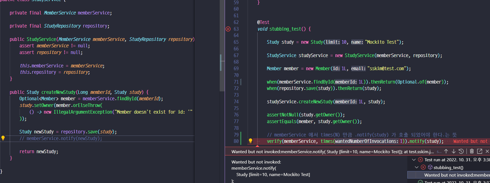
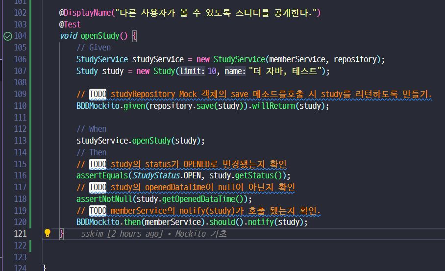

## Mockito

### 준비물 및 공식 링크
- [java 트렌드](https://www.jetbrains.com/lp/devecosystem-2021/java/) 
- [단위테스트 고찰](https://martinfowler.com/bliki/UnitTest.html)
- [Mockito 공식](https://site.mockito.org/)

- Springboot 를 사용하지 않으면 별도 의존성 추가
   ```xml
   <dependency>
      <groupId>org.mockito</groupId>
      <artifactId>mockito-core</artifactId>
      <version>3.1.0</version>
      <scope>test</scope>
   </dependency>

   <dependency>
      <groupId>org.mockito</groupId>
      <artifactId>mockito-junit-jupiter</artifactId>
      <version>3.1.0</version>
      <scope>test</scope>
   </dependency>
   ```


### Mockito 시작하기


- 그런데 이렇게만 하면 아직은 Null

```java
// 이럴대 Extension 추가!

@DisplayNameGeneration(DisplayNameGenerator.ReplaceUnderscores.class)
@ExtendWith(MockitoExtension.class)
public class StudyServiceTest {

	@Mock
	MemberService memberService;


	@Test
   // 해당 메소드에서만 쓰고 싶을때
	void create_study_service(@Mock StudyRepository repository) {

		StudyService studyService = new StudyService(memberService, repository);
		assertNotNull(studyService);
	}

}
```


### Mock 객체 Stubbing

- Mock 객체의 행동
  - Null을 리턴
  - Primitive 타입은 기본 Primitive 값
  - Optional 타입은 Optional.empty
  - 콜렉션은 비어있는
  - Void 메소드는 예외를 던지지 않고 아무런 일을 하지 않음.

```java
Member member = new Member(1L, "sskim@test.com");
// 1로 호출해야지만 member 가 리턴됨.
Mockito.when(memberService.findById(1L)).thenReturn(Optional.of(member));

// 어떠한 것이든 무조건 리턴하는 법
//import static org.mockito.ArgumentMatchers.any;
// https://javadoc.io/doc/org.mockito/mockito-core/latest/org/mockito/Mockito.html#3
Mockito.when(memberService.findById(any())).thenReturn(Optional.of(member));

```

   - [arguments 관련](https://javadoc.io/doc/org.mockito/mockito-core/latest/org/mockito/Mockito.html#3)
   - [Exception 던지는 방법](https://javadoc.io/doc/org.mockito/mockito-core/latest/org/mockito/Mockito.html#3)
     - doThrow().when()
     - Mockito.when().thenTrow()
     
   - [메소드가 여러번 호출될 때 다르게 Stubbing / Mocking 하기](https://javadoc.io/doc/org.mockito/mockito-core/latest/org/mockito/Mockito.html#10)
      ```java
      Mockito.when(memberService.findById(any()))
         .thenReturn(Optional.of(member))
         .thenThrow(new RuntimeException());
      ```

### 예제 테스트
- 문제 / 답
  ```java
	@Test
	void stubbing_test() {

		Study study = new Study(10, "Mockito Test");

		StudyService studyService = new StudyService(memberService, repository);

		Member member = new Member(1L, "sskim@test.com");

		// memberService 객체에 findById 메소드를 1L 값으로 호출하면 
		// Optional.of(member) 객체를 리턴하도록 Stubbing
		when(memberService.findById(1L)).thenReturn(Optional.of(member));
		
      


		// studyRepository 객체에 save 메소드를 study 객체로 호출하면 
		// study 객체 그대로 리턴하게 Stubbing
		when(repository.save(study)).thenReturn(study);

		studyService.createNewStudy(1L, study);

		assertNotNull(study.getOwner());
		assertEquals(member, study.getOwner());

	}
  ```
- 그런데 첫번째꺼 안하면 이런 에러도 나옴.


### Mock객체 확인

- 가정
   
- 확인
   ```java
   // memberService 에서 times(N) 만큼 .notify(study) 가 호출 되었어야 한다.는 뜻
   verify(memberService, times(1)).notify(study);
   ```
- 안했을 때
   

- 순서가 중요할 때는 `inOrder` 사용
  
  
   ```java
   // 더이상 하지마라
   verify(memberService, times(1)).notify(study);
   verifyNoMoreInteractions(memberService);
   // 특정시간 내에 되어야된다.
   verify(mock, timeout(100).times(1))...
   ```

- 참고링크 
  - [Verifying exact number of invocations](https://javadoc.io/doc/org.mockito/mockito-core/latest/org/mockito/Mockito.html#exact_verification)
  - [Verification in order](https://javadoc.io/doc/org.mockito/mockito-core/latest/org/mockito/Mockito.html#6)
  - [Verification with timeout](https://javadoc.io/doc/org.mockito/mockito-core/latest/org/mockito/Mockito.html#22)
  - [Finding redundant invocations - 더이상 호출하지마라](https://javadoc.io/doc/org.mockito/mockito-core/latest/org/mockito/Mockito.html#finding_redundant_invocations)


### BDD 스타일 API
- [Behavior-driven development](https://en.wikipedia.org/wiki/Behavior-driven_development) 기반.. 어플리케이션이 **어떻게 행동** 해야되는지 
- 행동을 정의할때
  - Title : 이름
  - As a [ Role ] / I want [ 내가 참여 ] / so that [ 그래서 - 부수효과]
  - Acceptance criteria [ 인수테스트 ] 는
    - Given : 주어진 상황 
    - When : 어떤 조건 
    - Then : 그러면 이렇게 동작
    ```java
      // Given
      Study study = new Study(10, "Mockito Test");
      StudyService studyService = new StudyService(memberService, repository);
      Member member = new Member(1L, "sskim@test.com");


      when(memberService.findById(1L)).thenReturn(Optional.of(member));
      when(repository.save(study)).thenReturn(study);

      // When
      studyService.createNewStudy(1L, study);


      // Then
      assertNotNull(study.getOwner());
      assertEquals(member, study.getOwner());
		verify(memberService, times(1)).notify(study);
		verifyNoMoreInteractions(memberService);
    ```
    - 위와 같은 스타일로 정해놓고 한다는 뜻

- 그래서 이걸 위한 새로운 library 들도 있지만 이걸 Mockito 로 할 수 있는데
  - when 으로 셋팅하는게 사실은 `Given` 의 역할이라 애매하다. (Verify 도 단어가 애매하다.)
  - 그래서 `BDDMockito` 에서 이를 가져온다.
  ```java
   // when(memberService.findById(1L)).thenReturn(Optional.of(member));
   // when(repository.save(study)).thenReturn(study);
   BDDMockito.given(memberService.findById(1L)).willReturn(Optional.of(member));
   BDDMockito.given(repository.save(study)).willReturn(study);
   
   // verify(memberService, times(1)).notify(study);
   // verifyNoMoreInteractions(memberService);
   BDDMockito.then(memberService).should(times(1)).notify(study);
   BDDMockito.then(memberService).shouldHaveNoMoreInteractions();
  ```
  


### Mockito 연습문제 2


