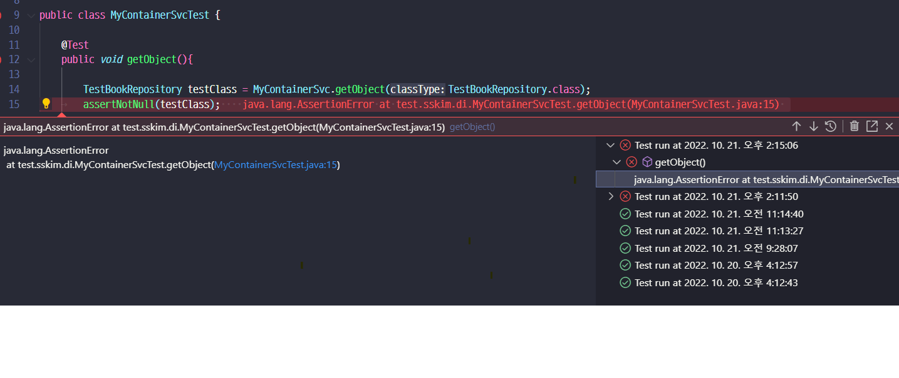
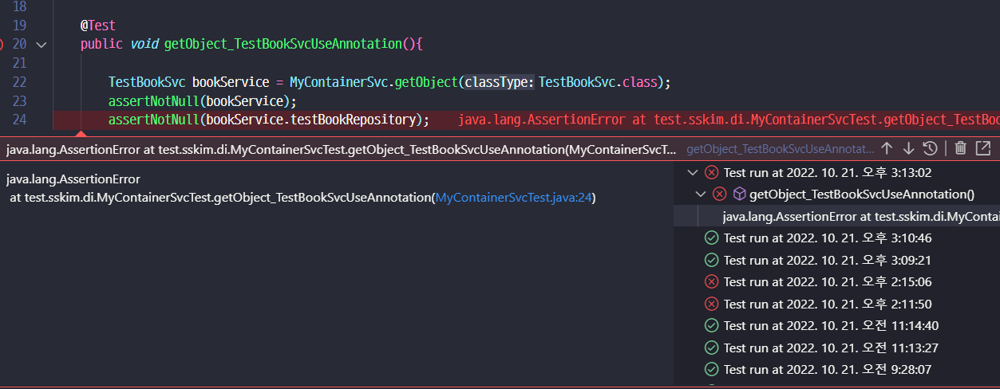
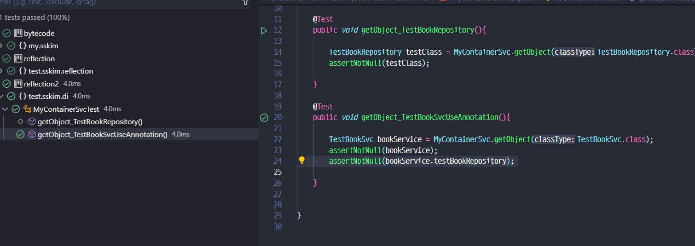
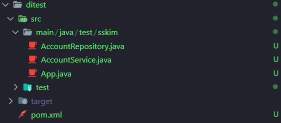
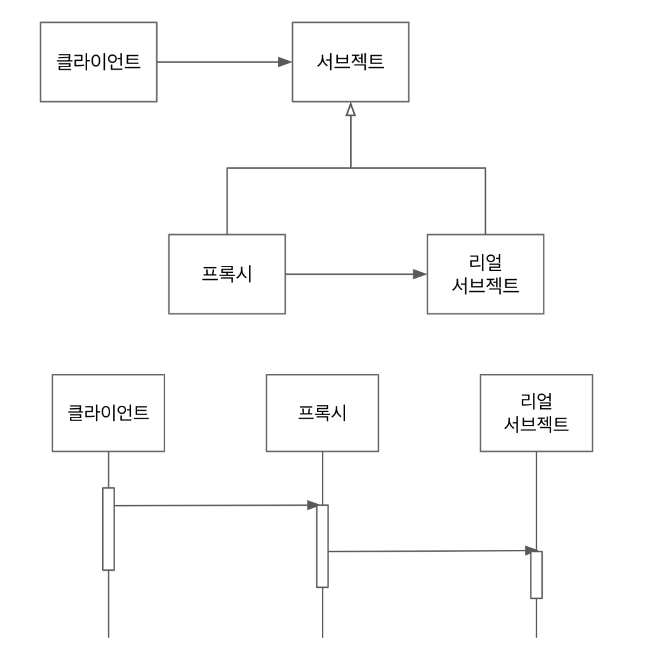
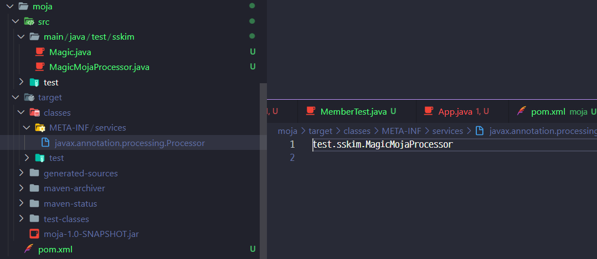
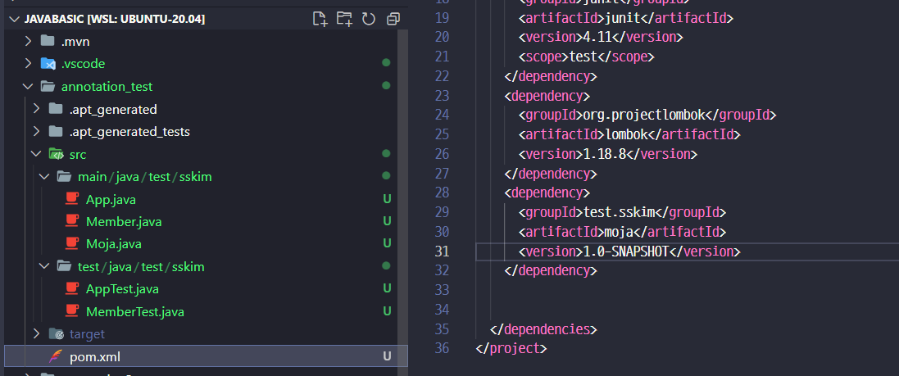
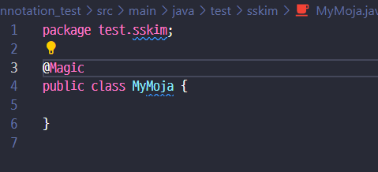
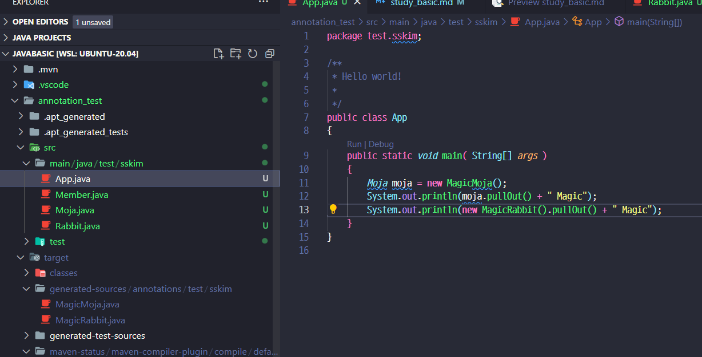

<!-- code_chunk_output -->

- [JVM 이해하기](#jvm-이해하기)
  - [JVM 구조](#jvm-구조)
  - [클래스로더 좀더 자세히](#클래스로더-좀더-자세히)
- [바이트코드](#바이트코드)
  - [바이트코드 조작](#바이트코드-조작)
  - [agent-jar 로 만들어서 조작](#agent-jar-로-만들어서-조작)
  - [바이트코드 조작툴 활용 예](#바이트코드-조작툴-활용-예)
- [리플렉션](#리플렉션)
  - [애노테이션 + 리플렉션](#애노테이션--리플렉션)
  - [나만의 DI 만들어보기](#나만의-di-만들어보기)
- [다이나믹 프록시](#다이나믹-프록시)
  - [Proxy Pattern](#proxy-pattern)
  - [다이나믹 프록시 실습](#다이나믹-프록시-실습)
  - [proxy 예제](#proxy-예제)
- [Annotation 프로세서](#annotation-프로세서)
  - [Lombak 동작원리](#lombak-동작원리)
  - [Annotation 교육자료](#annotation-교육자료)
  - [Annotation 실습](#annotation-실습)

<!-- /code_chunk_output -->


## JVM 이해하기

- JVM (Java Virtual Machine)
  - 자바 가상 머신으로 자바 바이트 코드(.class 파일)를 OS에 특화된 코드로 변환(인터프리터와 JIT 컴파일러)하여 실행한다.
    - 바이트 코드를 실행하는 표준(JVM 자체는 표준)이자 구현체(특정 밴더가 구현한 JVM)다.
    - [JVM 스팩](https://docs.oracle.com/javase/specs/jvms/se11/html/)
    - JVM 밴더: 오라클, 아마존, Azul, ...
    - JVM 자체는 OS에 종속적임.

- JRE (Java Runtime Environment): JVM + 라이브러리
    - 자바 애플리케이션을 실행할 수 있도록 구성된 배포판.
    - JVM과 핵심 라이브러리 및 자바 런타임 환경에서 사용하는 프로퍼티 세팅이나 리소스 파일을 가지고 있다.
    - 개발 관련 도구는 포함하지 않는다. (그건 JDK에서 제공)
    - 9 버젼부터는 module - jlink 를 통해 작은 jre 도 만들 수 있음.

- JDK (Java Development Kit): JRE + 개발 툴
    - JRE + 개발에 필요할 툴
    - 소스 코드를 작성할 때 사용하는 자바 언어는 플랫폼에 독립적.
    - 오라클은 자바 11부터는 JDK만 제공하며 JRE를 따로 제공하지 않는다.
    - Write Once Run Anywhere
    - JDK에 들어있는 자바 컴파일러(javac)를 사용하여 바이트코드(.class 파일)로 컴파일 할 수 있다.
    - `javap -c 클래스명` 으로 바이트코드를 확인 할수 있음
    - appletviewer, javadoc, jar, jconsole, extchek 등등...


- JVM 언어 : JAVA, 클로저, 그루비, JRuby, Jython, Kotlin, Scala, ...

- 참고
    - [JIT 컴파일러](https://aboullaite.me/understanding-jit-compiler-just-in-time-compiler/)
    - [JDK, JRE 그리고 JVM](https://howtodoinjava.com/java/basics/jdk-jre-jvm/)
    - [https://en.wikipedia.org/wiki/List_of_JVM_languages]

```shell
$ korlinx HellKt -include-runtime -d hellokt.jar 
$ java hellokt.jar 로 실행가능
```

### JVM 구조
- 클래스 로더 시스템 : 컴파일을 한 class 에서 바이트코드를 읽고 저장
    - 로딩 : class 읽어오고 
    - 링크 : 래퍼런스 연결하고
    - 초기화 : static, 값 초기화 및 변수 할당

- 메모리 : 5가지 영역으로 나눠짐
    - 메소드(Method) : 클래스이름, 부모클래스 이름, 메소드, 변수 등을 저장
    - 힙(Heap) : 객체를 저장, 공유함.
    - 스택(Stack) / PC-registers / 네이티드 메소드 스택 : 쓰레드 마다 공유하는 자원이 들어감. [참고링크](https://javapapers.com/core-java/java-jvm-run-time-data-areas/#Program_Counter_PC_Register)

- 실행엔진
    - 인터프리터 : 바이트코드를 한줄 한줄 읽어서 네이티브로 컴파일 해서 실행.
    - JIT (Just in Time) 컴파일러 : 인터프리터의 효율을 올리기 위해서 반복되는 바이트코드를 네이티브로 변환시켜둔다.
    - GC (Garbage Collector) : 더이상 참조되지 않는 객체 / 메모리르 정리한다.

- JNI ( Javaeeee Natvie Intergert)
- [네이트브 메소드만드는 링크](https://medium.com/@bschlining/a-simple-java-native-interface-jni-example-in-java-and-scala-68fdafe76f5f )


### 클래스로더 좀더 자세히

- 로딩 -> 링크 -> 초기화 순으로 진행됨

- 로딩
    - 클래스 로더가 .class 파일을 읽고 그 내용에 따라 적절한 바이너리 데이터를 만들고 “메소드” 영역에 저장.
    - 이때 메소드 영역에 저장하는 데이터
        - FQCN ( Fully-Qualified Class Name )
        - 클래스 | 인터페이스 | 이늄
        - 메소드와 변수
    - 로딩이 끝나면 해당 클래스 타입의 Class 객체[ Class<MyApp> 같은 ] 를 생성하여 “힙" 영역에 저장.

- 링크 :Verify, Prepare, Reolve(optional) 세 단계로 나눠져 있다.
    - 검증: .class 파일 형식이 유효한지 체크한다.
    - Preparation: 클래스 변수(static 변수)와 기본값에 필요한 메모리
    - Resolve: 심볼릭 메모리 레퍼런스(힙영역에 있는) 를 메소드 영역에 있는 실제 레퍼런스로 교체한다.

- 초기화 : Static 변수의 값을 할당한다. (static 블럭이 있다면 이때 실행된다.)
    - 클래스 로더는 계층 구조로 이뤄져 있으면 기본적으로 세가지 클래스 로더가 제공된다.
    - 부트 스트랩 클래스 로더 -  JAVA_HOME\lib에 있는 코어 자바 API를 제공한다. 최상위 우선순위를 가진 클래스 로더
    - 플랫폼 클래스로더 - JAVA_HOME\lib\ext 폴더 또는 java.ext.dirs 시스템 변수에 해당하는 위치에 있는 클래스를 읽는다.
    - 애플리케이션 클래스로더 - 애플리케이션 클래스패스(애플리케이션 실행할 때 주는 -classpath 옵션 또는 java.class.path 환경 변수의 값에 해당하는 위치)에서 클래스를 읽는다.


## 바이트코드

- jacoco 수업자료
    - [https://www.eclemma.org/jacoco/trunk/doc/index.html]
    - [http://www.semdesigns.com/Company/Publications/TestCoverage.pdf]


- jacoco 삽질기 [참고링크](https://medium.com/@karlrombauts/setting-up-unit-testing-for-java-in-vs-code-with-maven-3dc75579122f)
    ```xml
    <plugin>
        <groupId>org.jacoco</groupId>
        <artifactId>jacoco-maven-plugin</artifactId>
        <version>0.8.4</version>
        <executions>
            <execution>
                <goals>
                    <goal>prepare-agent</goal>
                </goals>
            </execution>
            <execution>
                <id>report</id>
                <phase>prepare-package</phase>
                <goals>
                    <goal>report</goal>
                </goals>
            </execution>
        </executions>
    </plugin>

    ```
    ```shell
    # 
     mvn jacoco:prepare-agent test install jacoco:report
    ```

- 커버리지를 어떻게 채워지는지는 바이트코드 수를 세고 


### 바이트코드 조작

- 바이트코드 조작 라이브러리
    - ASM: https://asm.ow2.io/
    - Javassist: https://www.javassist.org/
    - [추천] ByteBuddy: https://bytebuddy.net/#/

- code
```java
    // 이렇게 하면 println 하기전에 EmptyMoja를 한번 불러(조작)와서 값을 빼낼수 있는데 다른 곳에서 먼저 
    // EmptyMoja 를 불러로 오면 잘 안된다.
    public static void main(String[] args) {
        ClassLoader classLoader = App.class.getClassLoader();
        TypePool typePool = TypePool.Default.of(classLoader);

        try {
            new ByteBuddy()
                    .redefine(
                            typePool.describe("my.sskim.EmptyMoja").resolve(),
                            ClassFileLocator.ForClassLoader.of(classLoader))
                    .method(named("pullout")).intercept(FixedValue.value("Rabbit"))
                    .make().saveIn(new File("/home/ecsuser/study/daily_record/study/java/javabasic/target/classes"));
        } catch (IOException e) {
            e.printStackTrace();
        }

        System.out.println(new EmptyMoja().pullout());
    }
```

### agent-jar 로 만들어서 조작

- Javaagent JAR 파일 만들기 \[[오라클문서](https://docs.oracle.com/javase/8/docs/api/java/lang/instrument/package-summary.html)\]
    - 붙이는 방식은 시작시 붙이는 방식 premain과 런타임 중에 동적으로 붙이는 방식 agentmain이 있다.
    - Instrumentation을 사용한다.

- Javaagent 붙여서 사용하기
    - 클래스로더가 클래스를 읽어올 때 javaagent를 거쳐서 변경된 바이트코드를 읽어들여 사용한다.


```java
// 새로운 프로젝트를 만들어서 아래와 같이 작업한다.
package my.sskim;

import java.lang.instrument.Instrumentation;

import net.bytebuddy.agent.builder.AgentBuilder;
import net.bytebuddy.implementation.FixedValue;
import net.bytebuddy.matcher.ElementMatchers;

public class ByteCodeAgent {

    // premain 을 오버라이딩 한거
    public static void premain(String agentArgs, Instrumentation inst) {
        new AgentBuilder.Default()
            .type(ElementMatchers.any())
            // 조작을  transform 쪽에 넣어주면 되는데...
            .transform((builder, typeDescription, classLoader, module) -> builder.method(ElementMatchers.named("pullout")).intercept(FixedValue.value("NotEmpty"))).installOn(inst);
    }
}
```
```xml
<!-- pom.xml 에 다음과 같이 수정함.-->
<!-- google에 `maven jar manifest` 로 검색 링크 참고 : https://maven.apache.org/plugins/maven-jar-plugin/examples/manifest-customization.html -->

<project>
  ...
  <build>
    <plugins>
      <plugin>
        <groupId>org.apache.maven.plugins</groupId>
        <artifactId>maven-jar-plugin</artifactId>
        <version>3.3.0</version>
        <configuration>
          <archive>
            <index>true</index>
            <manifest>
              <addClasspath>true</addClasspath>
            </manifest>
            <manifestEntries>
              <mode>development</mode>
              <url>${project.url}</url>
              <key>value</key>
            <!-- 추가분--> 
        
              <Premain-class>my.sskim.ByteCodeAgent</Premain-class>
              <Can-Redefine-classes>true</Can-Redefine-classes>
              <Can-REtransform-classes>true</Can-REtransform-classes>
            <!-- 추가분 끝 -->
              
            </manifestEntries>
          </archive>
        </configuration>
        ...
      </plugin>
    </plugins>
  </build>
  ...
</project>

```
```shell
#  그리고 package
mvn clean package -f "/home/ecsuser/study/daily_record/study/java/javabasic/bytecode2/pom.xml"
```
```json
// vscode 에서 실행할때 javaagent 추가
        {
            "type": "java",
            "name": "bytecode with option",
            "request": "launch",
            "mainClass": "my.sskim.App",
            "projectName": "bytecode",
            "vmArgs": "-javaagent:/home/ecsuser/study/daily_record/study/java/javabasic/bytecode2/target/bytecode2-1.0-SNAPSHOT.jar"
        }
```

### 바이트코드 조작툴 활용 예

- 코드에서 버그 찾거나 복잡도 계산
- 클래스 파일 생성 -> 프록시, 특정 API 호출 제한 가능

- 프로파일러 ( 특정 Agent ) : Thread 활성도 정도 등 성능 분석시 쓰임.

- 스프링이 컴포넌트스캔 시 ASM 을 사용함.
  - @ComponentSacn  빈으로 등록할 후보 클래스 ( @Component )  정보를 찾는데 사용
  - ClassPathScanningCandidateComponentProvider -> SimpleMetadataReader
    - ClassReader와 Visitor 사용해서 클래스에 있는 메타 정보를 읽어온다.
    - ASM, Javassist, ByteBuddy, CGl을 더 찾아보면 좋음
    - [참고영상](https://www.youtube.com/watch?v=39kdr1mNZ_s)


## 리플렉션

- Class 객체 가져오는 법 ( 이정보는 메소드 영역에 있음 )
```java
        // 1. 타입을 가지고 가져옴
        Class<Book> bookclass = Book.class;

        // 2. 인스턴스에서 가져오기
        Book book = new Book();
        Class<? extends Book> bookclass2 = book.getClass();
        
        // 3. FQCN
        try {
            Class<?> bookClass3 = Class.forName("test.sskim.Book");
        } catch (ClassNotFoundException e) {
            e.printStackTrace();
        }

//// 
        Class<Book> bookclass = Book.class;
        // public fields 만 리턴
        Arrays.stream(bookclass.getFields()).forEach(System.out::println);
        z
        // 선언된 모든
        Arrays.stream(bookclass.getDeclaredFields()).forEach(System.out::println);

        // 결과
        // public java.lang.String test.sskim.Book.pageNum
        // ================================================================
        // private static java.lang.String test.sskim.Book.author
        // private static final java.lang.String test.sskim.Book.isbn
        // private java.lang.String test.sskim.Book.title
        // public java.lang.String test.sskim.Book.pageNum
        // protected java.lang.String test.sskim.Book.category

```

- 그런데 이걸 직접 접근하려고 하면 이렇게 나온다
```java
        Arrays.stream(bookclass.getDeclaredFields()).forEach( f -> {

            try {
                System.out.printf("\n %s %s \n" , f, f.get(book) );
            } catch (IllegalArgumentException | IllegalAccessException e) {
                e.printStackTrace();
            }
        });

        // 결과 
        // java.lang.IllegalAccessException: class test.sskim.App cannot access a member of class test.sskim.Book with modifiers "private static"
        //         at java.base/jdk.internal.reflect.Reflection.newIllegalAccessException(Reflection.java:361)
        //         at java.base/java.lang.reflect.AccessibleObject.checkAccess(AccessibleObject.java:591)
        //         at java.base/java.lang.reflect.Field.checkAccess(Field.java:1075)
        //         at java.base/java.lang.reflect.Field.get(Field.java:416)
        //         at test.sskim.App.lambda$1(App.java:23)
        //         at java.base/java.util.Spliterators$ArraySpliterator.forEachRemaining(Spliterators.java:948)
        //         at java.base/java.util.stream.ReferencePipeline$Head.forEach(ReferencePipeline.java:658)
        //         at test.sskim.App.main(App.java:20)
        // java.lang.IllegalAccessException: class test.sskim.App cannot access a member of class test.sskim.Book with modifiers "private static final"
        //         at java.base/jdk.internal.reflect.Reflection.newIllegalAccessException(Reflection.java:361)
        //         at java.base/java.lang.reflect.AccessibleObject.checkAccess(AccessibleObject.java:591)
        //         at java.base/java.lang.reflect.Field.checkAccess(Field.java:1075)
        //         at java.base/java.lang.reflect.Field.get(Field.java:416)
        //         at test.sskim.App.lambda$1(App.java:23)
        //         at java.base/java.util.Spliterators$ArraySpliterator.forEachRemaining(Spliterators.java:948)
        //         at java.base/java.util.stream.ReferencePipeline$Head.forEach(ReferencePipeline.java:658)
        //         at test.sskim.App.main(App.java:20)
        // java.lang.IllegalAccessException: class test.sskim.App cannot access a member of class test.sskim.Book with modifiers "private"
        //         at java.base/jdk.internal.reflect.Reflection.newIllegalAccessException(Reflection.java:361)
        //         at java.base/java.lang.reflect.AccessibleObject.checkAccess(AccessibleObject.java:591)
        //         at java.base/java.lang.reflect.Field.checkAccess(Field.java:1075)
        //         at java.base/java.lang.reflect.Field.get(Field.java:416)
        //         at test.sskim.App.lambda$1(App.java:23)
        //         at java.base/java.util.Spliterators$ArraySpliterator.forEachRemaining(Spliterators.java:948)
        //         at java.base/java.util.stream.ReferencePipeline$Head.forEach(ReferencePipeline.java:658)
        //         at test.sskim.App.main(App.java:20)

        //  public java.lang.String test.sskim.Book.pageNum 1234 

        //  protected java.lang.String test.sskim.Book.category Java 
```

- 그래서 접근하게 하려면
```java
         Arrays.stream(bookclass.getDeclaredFields()).forEach( f -> {
            try {
                // 접근 가능하게 바꿔줄려면
                f.setAccessible(true);
                System.out.printf("\n %s %s \n" , f, f.get(book) );
            } catch (IllegalArgumentException | IllegalAccessException e) {
                e.printStackTrace();
            }
        });
        // 결과
        //private static java.lang.String test.sskim.Book.author sskim 

        //private static final java.lang.String test.sskim.Book.isbn ISBN:1234 

        //private java.lang.String test.sskim.Book.title null 

        //public java.lang.String test.sskim.Book.pageNum 1234 

        //protected java.lang.String test.sskim.Book.category Java
```

- 필드 / 메소드 / 상위 클래스 / 인터페이스 (목록) / 애노테이션 / 생성자 를 가져올 수 있음


### 애노테이션 + 리플렉션

- `public @interface MyAnnotation {}` 으로 생성가능함.
- 하지만 아무런 주석없이 있으면 소스/클래스 파일까지만 존재(주석과 마찬가지)
- 그래서 이 정보가 로딩(메모리) 상으로 올라갈때 까지 남게 하기 위해서
```java
    import java.lang.annotation.Retention;
    import java.lang.annotation.RetentionPolicy;
    // 기본값 Class
    @Retention(RetentionPolicy.Runtime)
    public @interface MyAnnotation {

    }
```
- @Target 으로 원하는 위치 붙을수 있게 할수 있고
   Annotaion에 값을 부여 할 수 있는데.. primitive Type 만 가능함

```java
    // 여러개는 {} 로 묶어서
    @Retention(RetentionPolicy.RUNTIME)
    @Target({ElementType.TYPE, ElementType.FIELD})
    // 이러면 자식 클래스에서 부모클래스에 해당 애노테이션이 있는지 추적가능함.
    @Inherited
    public @interface MyAnnotation {
        // value 라고 하면 특별히 명시 하지 않아도 됨.
        String value() default "myAnnotation";

        String name();
        
        int number() default 100;

    }

    // 적용시
    @MyAnnotation(name = "123", number = 123 )


    // 부모꺼 까지도 가져오기
    Arrays.stream(MyBook.class.getAnnotations()).forEach(System.out::println );
    // 내꺼만 가져오기
    Arrays.stream(MyBook.class.getDeclaredAnnotations()).forEach(System.out::println );


    // 여러가지 조작해보기
    Class<?> bookClass = Class.forName("test.sskim.Book");
    Constructor<?> bookConstrutor = bookClass.getConstructor(String.class);
    Book book = (Book) bookConstrutor.newInstance("myFirst");

    System.out.println(book);
    Field field = Book.class.getDeclaredField("title");
    System.out.println(field.get(book));
```

### 나만의 DI 만들어보기

- 준비물
```java

// 실제 동작하는 메소드
package test.sskim.di;

public class MyContainerSvc {
    
    public static <T> T getObject(Class<T> classType ){
        return null;
    }

}
// Annotaion
package test.sskim.di;

import java.lang.annotation.Retention;
import java.lang.annotation.RetentionPolicy;

@Retention(RetentionPolicy.RUNTIME)
public @interface MyInject {
    
}
```

- 그리고 적용해볼려고 하면

    - 이런 에러가 나오는데 src 에서는 test 소스를 조회할 수 없어서 그렇다.
    - 그래서 리플렉션을 이용하여 생성하게 한다.
```java

package test.sskim.di;

import java.lang.reflect.InvocationTargetException;

public class MyContainerSvc {

    public static <T> T getObject(Class<T> classType) {

        return createInstance(classType);
    }

    private static <T> T createInstance(Class<T> classType) {
        try {
            return classType.getConstructor(null).newInstance();
        } catch (InstantiationException | IllegalAccessException | IllegalArgumentException
                | InvocationTargetException | NoSuchMethodException | SecurityException e) {
            throw new RuntimeException(e);
        }

    }

}
```


- 하지만 아직 이런 문제가 있음 - 안에 있는 field 가 만들어지지 않음..


- 그래서 필드도 체크해서 만들어준다.
```java
    public static <T> T getObject(Class<T> classType) {

        T instance = createInstance(classType);
        
        Arrays.stream(classType.getDeclaredFields()).forEach( f -> {
                if (f.getAnnotation(MyInject.class) != null) {
                   Object fieldInstance = createInstance(f.getType());
                   f.setAccessible(true);
                   try {
                    f.set(instance, fieldInstance);
                    } catch (IllegalArgumentException | IllegalAccessException e) {
                        throw new RuntimeException(e);
                    }
                }
            }
        );


        return instance;
    }

    private static <T> T createInstance(Class<T> classType) {
        try {
            return classType.getConstructor(null).newInstance();
        } catch (InstantiationException | IllegalAccessException | IllegalArgumentException
                | InvocationTargetException | NoSuchMethodException | SecurityException e) {
            throw new RuntimeException(e);
        }

    }

```




- 그래서 새프로젝트에서 써보면

```java
// pom.xml 의존성 추가
    <dependency>
      <groupId>test.sskim</groupId>
      <artifactId>myframework</artifactId>
      <version>1.0-SNAPSHOT</version>
    </dependency>
///

public class App 
{
    public static void main( String[] args )
    {
        AccountService accountSvc = MyContainerSvc.getObject(AccountService.class);
        accountSvc.join("ok");
    }
}

public class AccountService {

    @MyInject
    AccountRepository accountRepository;


    public void join(String joinMsg) {
        accountRepository.save(joinMsg);
    }
}


public class AccountRepository {
    
    public void save(String msg){
        System.out.printf("save! ->  %s \n", msg);
    }

}

/// 결과
// /usr/bin/env /usr/lib/jvm/java-11-openjdk-amd64/bin/java @/tmp/cp_3n1z5566czb0xb8ew889czx4q.argfile test.sskim.App 
// save! ->  ok 
```

- 그래서 springm, 하이버네이트, [junit](https://junit.org/junit5/docs/5.0.3/api/org/junit/platform/commons/util/ReflectionUtils.html) 등에서 다양하게 쓰임
- 단 컴파일 타임에서는 확인이 어렵고 - runtime 에서 사용되어지 / 성능의 문제가 있을 수 있으니 주의 [더 읽을 자료](https://docs.oracle.com/javase/tutorial/reflect/index.html)


## 다이나믹 프록시

- Proxy / ProxyFactory(AoP) 클래스에 해당 내용이 있는데, JPA 이걸 잘 활용해서 사용함.
- SpringDataJPA 는 SpringAOP를 기반으로 동작하며 `RepositoryFactorySupport` 를 이용함. 
- jpa 테스트시 @DataJapTest 라고 하면 좀더많은 정보를 볼수 있음.


### Proxy Pattern

- 수업자료 내용


  - 프록시와 리얼 서브젝트가 공유하는 인터페이스가 있고, 클라이언트는 해당 인터페이스 타입으로 프록시를 사용한다.  
  - 클라이언트는 프록시를 거쳐서 리얼 서브젝트를 사용하기 때문에 프록시는 리얼  서브젝트에 대한 접근을 관리거나 부가기능을 제공하거나, 리턴값을 변경할 수도 있다.  
  - 리얼 서브젠트는 자신이 해야 할 일만 하면서(SRP) 프록시를 사용해서 부가적인 기능(**접근 제한, 로깅, 트랜잭션**, 등)을 제공할 때 이런 패턴을 주로 사용한다.  

  - 참고링크 
    - https://www.oodesign.com/proxy-pattern.html  
    - https://en.wikipedia.org/wiki/Proxy_pattern  
    - https://en.wikipedia.org/wiki/Single_responsibility_principle

### 다이나믹 프록시 실습

- [공식문서](https://docs.oracle.com/javase/8/docs/technotes/guides/reflection/proxy.html)
  
- 뭔가 spring jpa 프로젝트 만들고 깨져서 그냥 강의내용만 정리함
```java
// 다음 메소드를 이용하는데
// Object a = Proxy.newProxyInstance(ClassLoader,   Interfaces,   InvocationHandler)

BookServcie bookServcie = (BookServcie) Proxy.newProxyInstance(
    // classLoader
    BookServcie.class.getClassLoader()
    
    , new Class[]{
        // 인터페이스 목록, 클래스 들어오면 안됨.
        BookServcie.class
    }
    , new InvocationHandler() {

        // 프록시에서 할일 적기..
        // 실제 오브젝트를 들고
        BookService bookService = new DefaultBookService();

        @Override
        public Object invoke(Object proxy, Method method, Object[] args) throws Throwable {
            
            // method 리플렉션 해서 하고 싶은거만 적용 할수 있고..
            System.out.println("원래꺼 돌기전에 할거");
            invoke = method.invoke(bookService, args);
            System.out.println("원래꺼 끝나고 할거");
            return invoke;
        }
    }
);
```

- 그런데 위처럼 하면 코드가 너무 복잡하고 클래스 기반의 Proxy 를 사용하지 못함.
- 저거를 쉽게 만든게 Spring AoP - `토비의 스프링 3.1, 6장 AOP` 참고
- [CGlib](https://github.com/cglib/cglib/wiki) / ByteBuddy 를 활용하는 경우인데..
```java
// Cglib 방식
MethodInterceptor handler = new MethodInterceptor() {
    // 실제 참고할 객체는 넣어주고
    BookService bookService = new BookService();  
    @Override  
    public Object intercept(Object o, Method method, Object[] objects, MethodProxy methodProxy throws Throwable {
        // 역시 여기서 필요한 작업을 더한다. 
        return method.invoke(bookService, objects);  
    }  
};  
// Enhancer 이용해서 한다.
BookService bookService = (BookService) Enhancer.create(BookService.class, handler);


// ByteBuudy 에서 작업
Class<? extends BookServcie> proxyClass = new ByteBuddy().subclass(BookServcie.class)
    // 프록시 작업
    .method(ElementMatchers.named("rent")).intercept(InvocationHandlerAdapter.of(new java.lang.reflect.InvocationHandler() {
        BookServcie bookServcie = new BookServcie();
        @Override
        public Object invoke(Object proxy, Method method, Object[] args) throws Throwable {
            // 여기서 실제 작업 진행
            return method.invoke(bookServcie, args);
        }
    }))
    .make().load(BookServcie.class.getClassLoader()).getLoaded();

BookServcie bookServcie = proxyClass.getConstructor(null).newInstance();
```

- 그런데 위 방법도 상속을 허용하지 않는 [private 생성자만 있을때 / final 일때 ] 문제가 생김.

### proxy 예제
- [Mockito](https://site.mockito.org/)
- [더 다양한 proxy예제](https://jenkov.com/tutorials/java-reflection/dynamic-proxies.html)


## Annotation 프로세서

### Lombak 동작원리

- [공식문서](https://projectlombok.org/)
- boilerplate ( getter,setter, equals, constructor 등 ) 코드 자동생성
-  컴파일 시점에 [애노테이션 프로세서](https://docs.oracle.com/javase/8/docs/api/javax/annotation/processing/Processor.html) 를 사용하여 소스코드의 AST(abstract syntax tree)를 조작한다.

### Annotation 교육자료
- [AutoService](https://github.com/google/auto/tree/master/service) : [서비스 프로바이더](https://itnext.io/java-service-provider-interface-understanding-it-via-code-30e1dd45a091) 레지스트리 생성기
 ```xml 
<dependency>
    <groupId>com.google.auto.service</groupId>
    <artifactId>auto-service</artifactId>
    <version>1.0.1</version>
</dependency>
 ``` 

 ```java
 // 자바에서 사용시
 @AutoService(Processor.class)
     public class MagicMojaProcessor extends AbstractProcessor {
     ...
 }
 ```
   - 컴파일 시점에 애노테이션 프로세서를 사용하여 
   `META-INF/services/javax.annotation.processor.Processor` 파일 자동으로 생성해 줌.


- 참고
    - [http://hannesdorfmann.com/annotation-processing/annotationprocessing101]
    - [http://notatube.blogspot.com/2010/12/project-lombok-creating-custom.html]
    - [https://medium.com/@jintin/annotation-processing-in-java-3621cb05343a]
    - [https://medium.com/@iammert/annotation-processing-dont-repeat-yourself-generate-your-code-8425e60c6657]
    - [https://docs.oracle.com/javase/7/docs/technotes/tools/windows/javac.html#processing]

- [Javapoet](https://github.com/square/javapoet): 소스 코드 생성 유틸리티   
  - 실제 Processor 에서 새로운 파일(소스/class) 를 만들때 사용함.
  ```xml
  <dependency>
    <groupId>com.squareup</groupId>
    <artifactId>javapoet</artifactId>
    <version>1.13.0</version>
  </dependency>
  ```

### Annotation 실습

  ```java
  // @Magic annotation
  package test.sskim;

    import java.lang.annotation.Retention;
    import java.lang.annotation.RetentionPolicy;

    // 소스 레벨에서 읽어서 프로세서에서 처리해서 컴파일 하면 새로운 소스가 만들어지게 함
    @Retention(RetentionPolicy.SOURCE)
    public @interface Magic {
        
    }

  // Processor
    package test.sskim;

    import java.util.Set;

    import javax.annotation.processing.AbstractProcessor;
    import javax.annotation.processing.RoundEnvironment;
    import javax.lang.model.SourceVersion;
    import javax.lang.model.element.Element;
    import javax.lang.model.element.ElementKind;
    import javax.lang.model.element.Name;
    import javax.lang.model.element.TypeElement;
    import javax.tools.Diagnostic;


    public class MagicMojaProcessor extends AbstractProcessor{

        // 이 프로세서가 어떤 어노테이션을 처리할 건지
        @Override
        public Set<String> getSupportedAnnotationTypes() {
            return Set.of(Magic.class.getName());
        }

        @Override
        public SourceVersion getSupportedSourceVersion() {
            
            // 부모꺼를 하던가
            // return super.getSupportedSourceVersion();
        
            // 최신으로 하던가
            return SourceVersion.latestSupported();
        }

        @Override
        public boolean process(Set<? extends TypeElement> annotations, RoundEnvironment roundEnv) {
            // RoundEnvironment : 필터 체인이랑 비슷하게 여러 과정에서 처리할수 있다고 보면 됨.

            Set<? extends Element> elements = roundEnv.getElementsAnnotatedWith(Magic.class);
            elements.stream()
                .forEach( e -> {
                    Name simpleName = e.getSimpleName();

                    if(e.getKind() != ElementKind.INTERFACE) {
                        //import javax.tools.Diagnostic;
                        processingEnv.getMessager().printMessage(Diagnostic.Kind.ERROR, "Magic Annotation can not be used on "+ simpleName);
                    } else {
                        processingEnv.getMessager().printMessage(Diagnostic.Kind.NOTE, "Magic Processing ->" + simpleName);
                    }
                });
            // true 를 리턴하면 이 애노테이션이 처리됬다고 보면 됨. 
            // (앞으로 더 다른 프로세서에서 처리 안한다는 뜻)
            return true;
        }
    }

  ```

  - 이렇게 만든 프로젝트를 원래 package 하려면 `src\main\resources\META-INF.services\javax.annotetion.process.Processor` 라는 파일을 만들고
 우리가 구현한 풀패키지 경로 `test.sskim.MagicMojaProcessor` 를 적어주어야 한다.
 - 그런데 그렇게 만들고 mvn clean install 을 하려고 해도 에러가 난다.
   - 소스를 컴파일 하는 시점에 프로세서가 동작하려고 하는데 그때는 아직 프로세서가 없어서 문제가 생김.
   - 그래서 풀패키지 경로를 한번 주석하고, `mvn clean install` 후 주석풀고 `mvn install` 해야된다
   - 그래서 또 등록을 도와주는게 `auto-service` 이다
     - 사용법
     ```java
        @AutoService(Processor.class)
        public class MagicMojaProcessor extends AbstractProcessor{
            .....
        }  
     ```
     ```shell
     mvn clean install -f "/home/ecsuser/study/daily_record/study/java/javabasic/moja/pom.xml"
     ```
     


  - 위까지 작업하고 적용할 프로젝트에 의존성 추가하면
  
    - 에러가 사라진다!
       
        - 그리고 `class` 에 붙이면 에러가 나온다
        
        

- 이제 본격적인 작업내용을 채우면
  ``` java
  public boolean process(Set<? extends TypeElement> annotations, RoundEnvironment roundEnv) {
            // RoundEnvironment : 필터 체인이랑 비슷하게 여러 과정에서 처리할수 있다고 보면 됨.

        Set<? extends Element> elements = roundEnv.getElementsAnnotatedWith(Magic.class);
        elements.stream()
            .forEach( e -> {

            ~~~

            // 새로운 소스코드 생성과정
            TypeElement typeElement = (TypeElement) e;
            ClassName className =  ClassName.get(typeElement);


            MethodSpec pullOut = MethodSpec.methodBuilder("pullOut")
            // import javax.lang.model.element.Modifier;
                .addModifiers(Modifier.PUBLIC)
                .returns(String.class)
                .addStatement("return $S", className.simpleName())
                .build();
                
            TypeSpec magicMoja = TypeSpec.classBuilder("Magic"+className.simpleName())
                .addModifiers(Modifier.PUBLIC)
                .addMethod(pullOut)
                .addSuperinterface(className) // 인터페이스 추가
                .build();
            // 이렇게 하면 메모리-객체 가지만 정의
            
            // 소스파일을 만들자. Filer 이용 
            // Filer 인터페이스 : 소스 코드, 클래스 코드 및 리소스를 생성할 수 있는 인터페이스
            // https://docs.oracle.com/en/java/javase/11/docs/api/java.compiler/javax/annotation/processing/Filer.html
            
            Filer filer = processingEnv.getFiler();             
            // javapoet 과 결합되면 쉽게 만듬.
            try {
                JavaFile.builder(className.packageName(), magicMoja)
                    .build()
                    .writeTo(filer);
            } catch (IOException ex) {
                processingEnv.getMessager().printMessage(Diagnostic.Kind.ERROR, "FATAL ERROR-Bulid Source : " + ex);
            }

            return true;
        });
  }

  ```
  - 그러면 이렇게.. 나온다. 소스 파일은 없지만
    
  - 그런데 코딩할때는 못쓴다... 컴파일 할때 만들어지는거라..  
    - [해결책 유튜브](https://www.youtube.com/watch?v=cN9FNVtJeR8) : [google auto-value](https://mvnrepository.com/artifact/com.google.auto.value/auto-value) / [google auto-annotations](https://mvnrepository.com/artifact/com.google.auto.value/auto-value-annotations)
       ```xml
        <!-- https://mvnrepository.com/artifact/com.google.auto.value/auto-value -->
        <dependency>
            <groupId>com.google.auto.value</groupId>
            <artifactId>auto-value</artifactId>
            <version>1.9</version>
            <scope>provided</scope>
        </dependency>


        <!-- https://mvnrepository.com/artifact/com.google.auto.value/auto-value-annotations -->
        <dependency>
            <groupId>com.google.auto.value</groupId>
            <artifactId>auto-value-annotations</artifactId>
            <version>1.9</version>
        </dependency>
        ```    
    