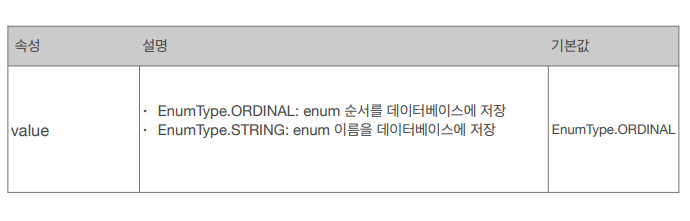
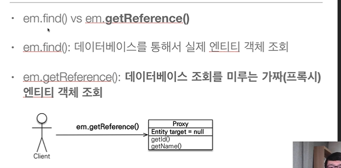

# 목표

- 객체[와 테이블을 제대로 설계, 맵핑하는 것이 중요함.
- JPA 내부동작방식의 이해 - 어떤 SQL, 언제 실행하는지 중요함.

## JPA 입문

### 상속 - 슈퍼타입/서브타입

- 객체는 상속, RDB는 슈퍼타입-서브타입인데..
- join 하고.. 저장할때는 두개 SQL 날리고 등등..
- 객체는 상속을 참조  / RDB는 키값이니까 필드(값)


- 객체는 객체 그래프를 탐색할수 있어야됨.


### 발전사

- EJB 엔티티빈(자바표준) -> 하이버네이트(오픈소스) -> JPA(자바표준)
- 트랜잭션 커밋하기전까지 모아두었다가 보낸다. ( 그래서 같은 트랜잭션에서 뽑은 객체-같은키는 같다)
- 지연로딩 / 즉시로딩 : 필요한 부분 즉시로딩하는 편.


### 준비물
- H2 ( docker로 준비함 )
  ```yml
	version: "1"
	services:
			h2-db:
					container_name: h2-db
					image: oscarfonts/h2
					volumes: 
							- ./h2/:/opt/h2-data
					environment:
							H2_OPTIONS: -ifNotExists
					ports: 
							- "1521:1521"
							- "18081:81"
	```
	- localhost:18081
	- jdbc:h2:tcp://localhost:1521/test 
  - sa / (없음)
- h2 버젼확인


- JPA(하이버네이트) 설정
 - persistence.xml
 ```xml
<?xml version="1.0" encoding="UTF-8"?>
<persistence version="2.2"
 xmlns="http://xmlns.jcp.org/xml/ns/persistence" xmlns:xsi="http://www.w3.org/2001/XMLSchema-instance"
 xsi:schemaLocation="http://xmlns.jcp.org/xml/ns/persistence http://xmlns.jcp.org/xml/ns/persistence/persistence_2_2.xsd">
 <persistence-unit name="hello">
 <properties>
 <!-- 필수 속성 -->
 <property name="javax.persistence.jdbc.driver" value="org.h2.Driver"/>
 <property name="javax.persistence.jdbc.user" value="sa"/>
 <property name="javax.persistence.jdbc.password" value=""/>
 <property name="javax.persistence.jdbc.url" value="jdbc:h2:tcp://localhost/~/test"/>
 <property name="hibernate.dialect" value="org.hibernate.dialect.H2Dialect"/>

 <!-- 옵션 -->
 <property name="hibernate.show_sql" value="true"/>
 <property name="hibernate.format_sql" value="true"/>
 <property name="hibernate.use_sql_comments" value="true"/>
 <!--<property name="hibernate.hbm2ddl.auto" value="create" />-->
 </properties>
 </persistence-unit>
</persistence>
 ```
 

- 여기서 중요시 볼 포인트는 
    ```
    <property name="hibernate.dialect" value="org.hibernate.dialect.H2Dialect"/>
    ```
	- JPA 자체는 특정데이터베이스에 종속적이지 않지만,
    
	
	- 와 같이 각 DB마다 특이점[표준적이지 않는] 이 존재한다.
	
  	- H2 : org.hibernate.dialect.H2Dialect
    - Oracle 10g : org.hibernate.dialect.Oracle10gDialect
    - MySQL : org.hibernate.dialect.MySQL5InnoDBDialect 


### JPA 구동방식

- java11 일때 추가할것 ([참고링크](https://www.inflearn.com/questions/13985/java11-javax-xml-bind-jaxbexception-%EC%97%90%EB%9F%AC))
    ```xml
	<dependency>
        <groupId>javax.xml.bind</groupId>
        <artifactId>jaxb-api</artifactId>
        <version>2.3.0</version>
    </dependency>
    ```


- 뭔가 되는거 같지만 안됨.
  - Transaction 만들어서 commit 까지 해줘야됨
	


- update는 가져온 객체를 수정하면 그걸 JPA가 감지했다가 수정함.


- 그래서 모든데이터 변경은 트랜잭션 안에서 실행되어야 함.


### JPQL 이란
- 그래서 검색조건이 다양할때는 어떻게 해야되냐?
  - 이럴때 쓰는게 JPQL
    
    
  - 특이점은 쿼리가 생긴건데.. JPQL에서 쓴 `m`은 `엔티티`라는 의미임.

- 이것의 장점은 아래처럼 방언만 바꾸면 쿼리를 알아서 만들어준다.
    
    
    
    
    - GooD
	- 객체지향 SQL 다양한 방언으로 변경해주는 거라고 볼수 있음.

## 영속성관리
- 객체 - 관계형 데이터베이스 매핑하기 가 핵심
- 그런의미에서 `영속성 컨텍스트` 에 대한 이해가 필수.


### 영속성 컨텍스트
- 엔티티를 영구히 저장하는 환경이란 뜻인데.
- 엔티티 매니저를 통해서 관리한다는 건데..


- 특별한 생명주기가 있음
  
	- 비영속 (New/Transient) : 컨텍스트와 관계없는 새로운
  - 영속 (Managed) : 관리되고 있는
  - 준영속 (Detached) : 저장되었다가 분리된
  - 삭제 (removed) : 삭제된 상태
	```java
		// 비영속
		Member member = new Member();
		member.setId(100L);
		member.setName("준비");
		
		// 영속
		em.persist(member);
		// 준영속
		//em.detach(member);
		// 삭제
		//em.remove(member);
	```


- 관리되고 있으면 다음과 같은 이점이 있음..
	- 1차캐시, 동일성 보장, 트랜잭션을 지원한 쓰기지연, 변경감지, 지연로딩...
	** 2차캐시는 하나의 어플리케이션에서 관리 / 1차는 트랜잭션
	
	
    
	
	
	
	

- 즉 일종의 버퍼가 있는건데 이걸 플러시 하는 법은
  - `em.flush()` :  직접호출
  - 트랜잭션 커밋 (플러시 자동호출)
  - JPQL 쿼리 실행 (플러시 자동호출)
  - 그런데 여기서 플러시는 영속성 컨텍스트를 비우는게 아니라 변경내용을 DB에 반영(동기화)


## 엔티티 매핑
- 객체 - 테이블 매핑 Annotation
	- @Entity / @Table
- 필드 - 컬럼 - 기본키 매핑 Annotation
	@Column, @Id, @ManyToOne, @JoinColumn

### Annotation

- @Entity
  - JPA가 관리하게되고, 기본생성자 필수 ( 파라미터 없는 Public, protected )
  - final, enum, interface, inner 클래스는 안됨.
  - 저장하고 싶은 필드에는 final 쓰면 안됨.
  - "name"울 사용하면 jpa에서 쓸 엔티티이름을 지정할 수 있음.
- @Table
  - 엔티티와 매핑할 DB Table 이름을 지정
  

- @Column
	
	
	- SpringBoot 를 쓰면 camel 형식을 소문자_underscore_소문자 방식을 기본값으로 한다.

- @Enumerated
	- 기본이 `ORDINAL` 인에 그럼 ENUM 의 순서가 저장됨.
  
	
	- 그래서 `@Enumerated(EnumType.STRING)` 로 지정해주는게 좋음.
 - 시간의 경우 `LocalDate`, `LocalDateTime` 을 하면 별도 어노테이션 필요없음
 
 - @Lob의 경우 문자면 CLOB, 나머지는 BLOB
 - @Transient 는 메모리(영속성 컨테스트) 에서만 쓰겠다는 뜻.

### 기본키 매핑

- @Id, @GeneratedValue 를 잘 활용해야됨.

- @GeneratedValue : 
  - IDENTITY : 데이터베이스에 위임 (mysql - AUTO_INCREMENT )
    - em.persist() 시점에 즉시 Insert SQL을 실행해서 식별자 조회함.
  - SEQUENCE : 시퀀스 오브젝트 사용(오라클) / `@SequenceGenerator` 가 필요
    
    
  - TABLE : 키 생성용 테이블 사용, 모든 DB에서 사용가능하지만 `@TableGenerator` 가 필요
		
		
	
	- AUTO : 방언에 따라 자동으로.

- 그래서 어떤 식별자를 쓸거냐 했을때
  - 변하면 안된다. --> 먼미래까지 -> 대체키를 사용하게 낫다... ( 자연키 - 주민등록번호, 전화번호)
	- Integer vs Long : 그냥 Long 으로 하자 나중에 Alter가 더 비용이 크다.
	- 종합하면 `Long + 대체키 + 키 생성전략`

- 키를 생성할때 `allocationSize` 를 지정해주면, 메모리에서 일단 지정한 갯수만큼 가져오고
  그걸를 다 사용하고나면 다시 DB에서 조회서 거기서 다시 지정한 갯수를 가져온다.
	( 매번 Next Value를 가져오기 위해서 노력하지 않는다는 뜻.)

- @Index 를 도 @Entity 정의할때 적어주면 좋음.

### DDL 자동생성
- 개발환경에서는 유용하지만 운영에서 절대 사용금지
- 애플리케이션 실행 시점에 방언을 이용해서 자동생성 가능.
	
	
	- validate 했을때 오류


## 데이터중심 설계(FK) vs 객체중심 설계(참조) : 연관관계 매핑

- Order에서 Member를 가져오기 위해선 `getMemeberId` 를 한 후 다시 finde 에서 가져오는데
- 객체를 바로 가져오게 설계하는게 아니라 데이터 중심으로 맞춘 설계.
- 즉 실체 참조값이 없어서 엄격히 UML을 그리면 틀린거라 볼 수 있음.

- 이걸 해결해주는게 `연관관계 매핑`
- 핵심단어
  - 방향(Direction) : 단방향 / 양방향
	- 다중성(Multiplicity) : N:1 / 1:N / 1:1
	- 연관관계 주인(Owner) : 양방향일 때 관리주체 필요.

- 데이터(테이블) 중심


- 그럼 객체- 단방향 연관관계 셋팅


### 양방향 연관관계 - 연관관계 주인에 대한 이해

- 기본적인 양방향 관계
  
	- FK 위치를 잘보면 아직 Member에 있는데 UML은 양쪽에 참조가 있다.

- 그래서 중요한 키워드 `mappedBy` 가 있음.
- 객체의 양방향 연관관계는 계약관계로 볼 수 있는데.. 갑-을 처럼 주종이 필요하다.
- 그래서 `오너가 FK 관계를 제어`한다고 볼수 있다.
	- `mappedBy` 에 적힌 객체의 필드 가 주인임.
	- 그래서 그냥 `FK 있는 테이블`이 `주인`인 경우가 편함 => 객체 - 테이블 일치하기에 편함. 성능적으로도 우수
	
	- 오너인 곳에만 수정이 가능함.

- 그런데 실제 사용할때는 양쪽다 값을 넣어주는게 맞음.
  - 1차캐시에는 아직 오너말고 다른쪽은 값이 안들어가 일 수 있음.
	- 그래서 이걸 편하게 하기 위해서 setter를 조금 수정한다.
	
	
	- 아님 이렇게 명시적으로 바꿔주거나...
	- 반대편에도 넣을수 있는데 이건 양쪽에 메소드를 만들지 말자.

- 그리고 무한루프를 조심해야되는데
  - toString(), lombok, JSON 생성 라이브러리.. 등에서
	- Req 등으로 온 JSON을 바로 Entity로 바꾸는 경우... 큰 문제 발생할 수 있음.
  	- 그래서 Controller에서 Json을 바로 Entity로 바로 리턴하면 안됨 (스펙 변경도 생길 수 있으니)
    - 그래서 DTO 로 변환해서 보내라.

- 그래서 제일 좋은건 단방향 매핑으로 끝내는게 좋음.


### 일대다 양뱡항...

- 사실 일대다에서 일이 FK를 관리한다는게 조금 설계상 미스이긴 하지만
- 위와 같은 상황을 꼭 해야된다고하면 강제로 셋팅해주는 방법이 있음.
	
  - `@JoinColumn(name = "TEAM_ID", insertable = false, updatable = false)`

### 일대일 
- 추가적으로 1:1에서는 이게 안됨( 자기꺼의 FK는 자기가 관리 )


### 다대다,
- 이건 그냥 중간에 조인테이블 만들고 엔티티로 올려버리는게 좋음.
- 만약써야되면 @ManyToMany / @JoinTable(name="객체_객체") 를 써야됨.
  - 주테이블에 @JoinTable / 대상테이블에 mappedBy 를 지정한다.

### 상속관계 맵핑

- 기본전략은 단일 테이블 전략임.


```java

@Entity
@Inheritance(strategy = InheritanceType.JOINED)
public class Item {
	
```
- 부모클래스에 @Inheritance(strategy=InheritanceType.XXX) 로 변경 가능
	- JOINED : 조인
	- SINGLE_TABLE : 단인테이블(기본값)
	- TABLE_PER_CLASS : 구현클래스마다 테이블
	

- @DiscriminatorColumn 을 붙이면 DTYPE 이 생기는거 볼 수 있음.


- 그럼 자식에서는 @DiscriminatorValue 로 위 칼럼에 생기는 값을 지정할 수 있음 ( Default 는 클래스명 )


### @MappedSuperClass

- 객체쪽에서만 속성만 상속받아서 쓰고 싶을때. 


- @Entity 붙은 클래스는 @Entity나 @MappedSuperClass 붙은 클래스만 상속가능.

- 그럼 실전에서는 어떻게 할거냐... 케바케... 
  - 사용자가 적을때는 상속관계가 큰 문제 없지만
  - 파티션 해야하고 사용자가 많아지면 테이블을 작게 관리하기 위해서 json을 말아넣거나 단순하게 가기도 한다.
  - 그런데 처음부터 너무 이렇게 갈필요는 없다.
  - 처음에는 object 위주로 가다가 나중에 개선해도 됨.


## 프록시 연관관계 관리

### 프록시 
- 왜써야 하나? : 
  - 맴버를 조회할때 팀도 같이 조회해야 할까 하는 경우...
  - 그리고 어느경우에는 그냥 맴버만 사용하는 경우
	
  - 뭔가 낭비적인 상황이 나올수도 있음
    - 이걸 극복하는게 프록시 또는 지연로딩
    
  - em.getReference() : 쿼리는 아직 안나가지만 객체는 존재.
  
	- 
	- 
	- 사용할때만 쿼리가 나간다!?!?
	- 정체는
	
		- 가짜. Proxy Class
		
		- Target 이 진자인데 초기에는 Null
		- 실제 엔티티를 상속받아서 만들어짐. ( hibernate 가 만든 )
		- 프록시 객체를 호출하면 실제 객체의 메소드의 호출 ( super ?? )
  		- 그런데 실체객제가 없을 텐데??

	- 그럼 프록시객체를 초기화 한다.
	
	- 그런데 이게 한번만 초기화 됨.
	- 그리고 프록시객체가 실제 엔티티로 바뀌는게 아니라 접근가능한 거임.
	- 그래서 타입체크시 `===` 말고 `instance of` 로 해야합니다.
		- 왜냐 실전은 이러니까
		
	- 그리고 초기화를 꼭한다고 쿼리가 가는게 아니라 영속성 컨테스트에 이미 있는 객체면 그걸 가져온다.
		
		- 허 이미 1차캐시에 있으니까 그걸 던지는건데..
		- 
		- 이게 == 비교일때 항상 true를 반환해야해서인데;;; 같은 Tx 안에서는...
		- 그래서 처음에 프록시면 같은 프록시
		

		- 그런데 이건.. 뭐지
		
          - 첨에 proxy 를 호출하면 나중에 find 해도 프록시를 던졌네? 왜냐 한 tx에서 `==` 으로 처리할려고
          - 그래서 중요한건 `proxy` 든 `entity` 든 다 가능하게 로직을 짜야함.
  
	- 그런데 영속성 컨테스트에서 도움받을 수 없는 상황이면 Ex!
		
		- `detach` 나 `clear`를 만나는 순간 발생할 수 있으니..
  
	-그래서 유틸도 기억해두자
		- emf.getPersistenceUnitUtil().isLoaded(findMember) : 초기화여부
		- 
		
### 즉시로딩 / 지연로딩
### 영속성 전이 : CASCADE
### 고아객체
  