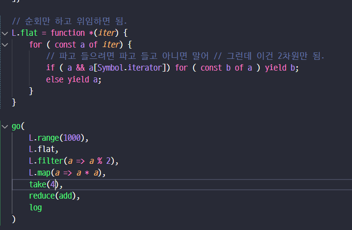
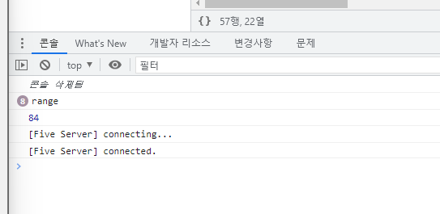
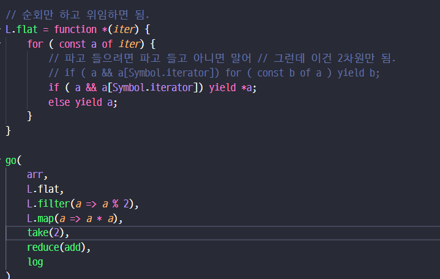
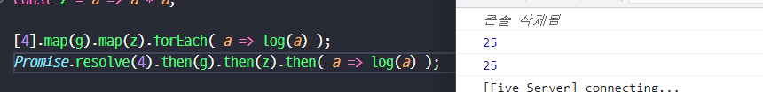
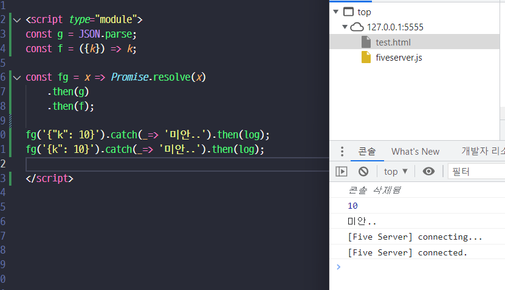
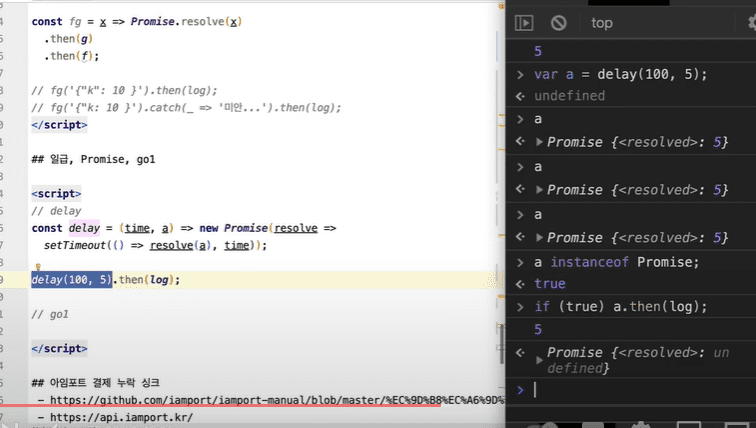

### 책추천
- [SICP](http://www.yes24.com/Product/Goods/23951885) : 컴퓨터 프로그램의 구조와 해석
- [프로그램 디자인 어떻게 할 것인가](http://www.yes24.com/Product/Goods/4853907)


### 1차비교
```javascript

<script> const log = console.log; </script>

## 명령형코드
<script type="module">
// 리스트에서 홀수를 length 만큼 뽑아서 제곱한 후 모두 더하기
function f (list, length) {
   let i = 0;
   let acc = 0;
   
   for ( const a of list ) {
       if( a % 2 ) {
         acc += a * a ;
       }
       if( ++i == length) break;
   }
   
   log(acc);
}


function main() {
   // f([1, 2, 3, 4, 5], 1);
   // f([1, 2, 3, 4, 5], 2);
   // f([1, 2, 3, 4, 5], 3);
}

main();
    
</script>

## 함수형 코드

<script>

    // 제너레이터 *
function *filter(f, iter){
    for ( const a of iter ) {
       if( f(a) ) yield a;
    }
}

function *map(f, iter){
    for ( const a of iter ) {
        yield f(a);
    }
}

// 명령은 선언한다.
function take(length, iter) {
    let res = [];
    for ( const a of iter) {
        res.push(a);
        if(res.length == length) return res;
    }
}

function reduce(f, acc, iter) {
    for ( const a of iter) {
        acc = f(acc,  a);
    }
    return acc;
}

const add = (a, b) => a + b; 

// 읽는 법은 맨 오른쪽 부터 왼쪽으로
const f = (list, length) =>
    reduce( add, 0, 
        take( length, 
            map( a => a * a , 
                filter( a => a % 2, list ))));
function main() {
    log( f([1, 2, 3, 4, 5], 1) );
    log( f([1, 2, 3, 4, 5], 2) );
    log( f([1, 2, 3, 4, 5], 3) );
}

main();

</script>

```


### go 함수


### range
```javascript
L.range = function *(stop){
    let i = -1;
    while( ++i < stop ) yield i;
}

```


### flat



- 할말이 없다.. 8번만 도네;;


- 이렇게 까지 축약가능


### 모나드
- 결국 특정 목적이 중요한데
- f . g : 함수형 프로그래밍은 결국 함수의 합성인데
- f(g(x)) = f(g(x)) : 처럼 언제나 합성이 일어나야 되지만
- 현실에서는 합성이 일어나다가 에러가 나올수도 있고 x가 이상할 수 있고
- g(x) 하다가 뻑 날수도 있고 한데
  
- f(g(x)) = x ([Kleisli Composition](https://blog.ploeh.dk/2022/04/04/kleisli-composition/)) : 그러면 내가 넣었던 X의 상태가 유지 되면 X에서 어떤 에러가 잇었는지 확인하고 싶을 거다.


-------
- 결국 x 를 모나드 형태로 만들어서 돌리면 난 언제나 모나드 상태에서 확인해보면 된다는 거다.


- 진짜 미쳤다 미쳤어...


- 진짜 미쳤다...


- 특정 값(객체-모나드) 로 감싸고 있기 때문에 우리는 의미가 있는 것들을 추가할 수 있음.

