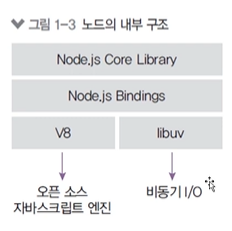
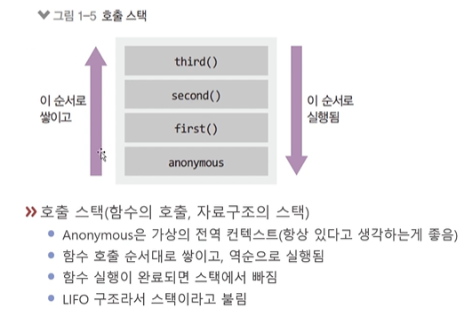
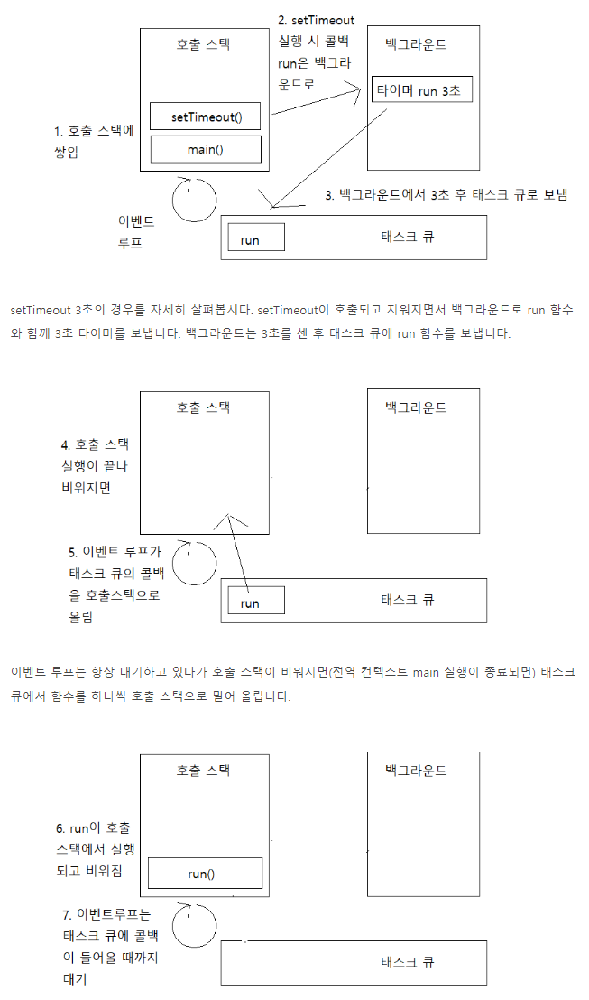
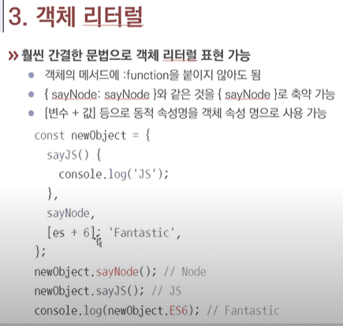
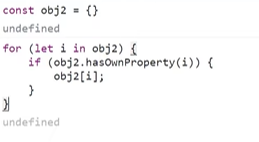
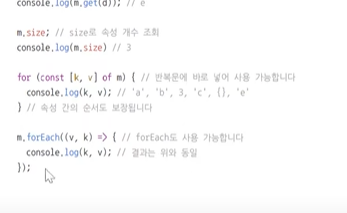

### 노드의 정의
- 크롬 V8 자바스크립엔진으로 빌드된 자바스크립트 런타임.
- 원래 자바스크립트는 브라우져에서 동작하는 환경이었음.
  -  그렇지만 이때는 html 이 필요했음.

- 내부구조는 `V8` + `libuv` 로 되어 있음.
  
  - V8 : 오픈소스 자바스크립트 엔진.
  - libuv : 비동기 I/O


### 자바스크립트 핵심

- 실행 context 
- 이벤트 루프
- protoType


### 호출스택 + 백그라운드 + 데스크큐 + 메모리

- 
- 
- 백그라운드 vs 호출스택이 경합할때는 무조건 호출스택이 먼저

- 호출스택이 비면 태스트큐에 있는걸 가져오는데, 이때는 마이크로 큐, 매크로큐가 있는데 
  - 마이크로큐는 프로미스의 후속처리 매소드 콜백
  - 매크로큐는 그외 비동기 함수의 콜백들

- 백그라운드와 태스크큐는 js가 아니라 다른언어 또는 운영체제 쪽 문제임.


### 변수 선언 ( var, let, const)

- var 는 함수 스코프
- let, const 는 블록스코프( {} )
- const 는 그냥 고정시킨다고 보자 객체를

### 객체리터럴
- 키, 이름 같은건 한번에 넣어줌.
- 
- [더읽을자료](https://ui.toast.com/weekly-pick/ko_20160725)

### function 과 화살표함수
- 스코프에서 엄청난 차이가 있음. context...
- `const obj = (x,y) => ({x,y});`
- function 은 자기만의 context[this] 를 가지는데 화살표는 부모의 context를 갖는다.

### 구조분해 할당(비구조화 할당)

```js
const ex = { a: 123, b: {c:135, d: 146}}

const { a, b: {d} = ex;
console.log(a,b,d);

const [x, y, , ,d] = [1,2,3,4,5];

let [a, b, c] = "abc"; // ["a", "b", "c"]
let [one, two, three] = new Set([1, 2, 3]);

// 이름과 성을 요소로 가진 배열
let arr = ["Bora", "Lee"]

// 구조 분해 할당을 이용해
// firstName엔 arr[0]을
// surname엔 arr[1]을 할당하였습니다.
let [firstName, surname] = arr;

alert(firstName); // Bora
alert(surname);  // Lee

let user = {
  name: "John",
  age: 30
};

// 객체의 키와 값 순회하기
for (let [key, value] of Object.entries(user)) {
  alert(`${key}:${value}`); // name:John, age:30이 차례대로 출력
}


// 교환 트릭
let guest = "Jane";
let admin = "Pete";

// 변수 guest엔 Pete, 변수 admin엔 Jane이 저장되도록 값을 교환함
[guest, admin] = [admin, guest];

alert(`${guest} ${admin}`); // Pete Jane(값 교환이 성공적으로 이뤄졌습니다!)


let options = {
  title: "Menu"
};

let {width = prompt("width?"), title = prompt("title?")} = options;

alert(title);  // Menu
alert(width);  // prompt 창에 입력한 값

let options = {
  title: "Menu",
  height: 200,
  width: 100
};

// title = 이름이 title인 프로퍼티
// rest = 나머지 프로퍼티들
let {title, ...rest} = options;

// title엔 "Menu", rest엔 {height: 200, width: 100}이 할당됩니다.
alert(rest.height);  // 200
alert(rest.width);   // 100


let options = {
  title: "My menu",
  items: ["Item1", "Item2"]
};

function showMenu({
  title = "Untitled",
  width: w = 100,  // width는 w에,
  height: h = 200, // height는 h에,
  items: [item1, item2] // items의 첫 번째 요소는 item1에, 두 번째 요소는 item2에 할당함
}) {
  alert( `${title} ${w} ${h}` ); // My Menu 100 200
  alert( item1 ); // Item1
  alert( item2 ); // Item2
}

showMenu(options);
```
- this가 있는걸 구조분해 할당하면 문제가 생길수 있음
- [더읽을자료](https://ko.javascript.info/destructuring-assignment)


### 클래스
- prototype의 설탕문법
- 상속하려면 무조건 부모껄 먼저 호출 또는 apply를 해줘야함.
  

### Promise 
- Promise.all([promise1, promise2])
- Promise.allSettled([promise1, promise2])
- 요즘은 top level await가 나와서 async 없이도 바로 쓸수 있음.
- async 에서 return 한거는 then 으로 받아서 처리해야함.

- [for await](https://developer.mozilla.org/ko/docs/Web/JavaScript/Reference/Statements/for-await...of) 도 있음


### Map


- 위와 같은 귀찮은 반복문도 Map으로 쉽게 가능

- for 도 되고, forEach 도 되고

- 배열과 비슷한 Set 이 있는데 중복은 허용하지 않는
	- 그래서 중복제거는 `Array.from(new Set(arr));`

- 그리고 WeakMap, WeakSet 이 있는데 GC가 잘된다고합니다.
```javascript
// 굳이 WeakMap 을 쓰는 이유
let user = { name : 'test', age : 29 };

// 1. 직접 넣기 // user.married = false;

// 2. 복사해서 넣기
const userObj = {
	user,
	married : false,
}

// 3. WeakMap
const wm = new WeakMap();
wm.set(user, { married: false});

// 추후 GC 가 잘될수 잇음
user = null; 
```

### 널병합 / 옵셔널 체이닝

- 널병합(`??`)은 `||` 연산자 대용으로 많이 사용할 수 있음. 이때 null, undefined만 구별
	- `||` 은 false, 0, '', NaN 도 넘어감. ( falsy 값 )
- 옵셔널 체이닝(`?.`) : 에러메세지 해석이 중요한데 `c?.d` 는 c가 null 인거를 방지하는거임.


### 브라우저에서 사용하는 JS
- Ajax 는 Axios ( fetch 는 json 처리가 조오금 귀찮아서 )
	- Axios는 프로미스 기반인데 정확한건 공식문서

- FormData 객체는 이미지나 파일 업로드시 많이 사용.
	- Axios 에서 이미지, 파일 전달시 FormData를 사용

- encodeURIComponent / decodeURIComponent

- 태그.dataset property => <태그 data-속성 > 이 생김
	- `tag.dataset.userJob === <tag data-user-job></tag>` 


