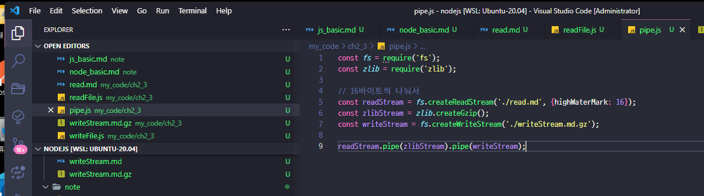

### CommonJs 모듈 쓰기

```js
// var.js
const odd = '홀수';
const even = '짝수';

// 보통은 하나나 객체로 넘겨준다.
module.exports = {
	odd,
	even,
}

//////////

const value = require('./var');
const {odd, even} = require('./var');

```

- 그런데 한가지만 보내고 싶으면 `modules.exports`, 여러개를 할려면 `exports.~~~` 로 하면 좋고
- 둘중에 한가지 방식으로만 사용해야함.

### node 에서 this
```js
// this.js
console.log('this->', this);

function a() {
	console.log('func a()', this);
	console.log('func a()', this);

}

a();
```


- 좀더 심화해보면
```js
// this.js
//console.log('this->', this);
console.log('this === module.exports ', this === module.exports);

function a() {
	// console.log('func a()', this);
	console.log('func a()-> this === global', this  === global) ;
}
```


- require를 콘솔로 찍어보면..
```js
[Function: require] {
  resolve: [Function: resolve] { paths: [Function: paths] },
  main: Module {
    id: '.',
    path: '/home/ecsuser/study/daily_record/study/javascript/nodejs/my_code',
    exports: {},
    filename: '/home/ecsuser/study/daily_record/study/javascript/nodejs/my_code/require.js',
    loaded: false,
    children: [ [Module] ],
    paths: [
      '/home/ecsuser/study/daily_record/study/javascript/nodejs/my_code/node_modules',
      '/home/ecsuser/study/daily_record/study/javascript/nodejs/node_modules',
      '/home/ecsuser/study/daily_record/study/javascript/node_modules',
      '/home/ecsuser/study/daily_record/study/node_modules',
      '/home/ecsuser/study/daily_record/node_modules',
      '/home/ecsuser/study/node_modules',
      '/home/ecsuser/node_modules',
      '/home/node_modules',
      '/node_modules'
    ]
  },
  extensions: [Object: null prototype] {
    '.js': [Function (anonymous)],
    '.json': [Function (anonymous)],
    '.node': [Function (anonymous)]
  },
  cache: [Object: null prototype] {
    '/home/ecsuser/study/daily_record/study/javascript/nodejs/my_code/require.js': Module {
      id: '.',
      path: '/home/ecsuser/study/daily_record/study/javascript/nodejs/my_code',
      exports: {},
      filename: '/home/ecsuser/study/daily_record/study/javascript/nodejs/my_code/require.js',
      loaded: false,
      children: [Array],
      paths: [Array]
    },
    '/home/ecsuser/study/daily_record/study/javascript/nodejs/my_code/var.js': Module {
      id: '/home/ecsuser/study/daily_record/study/javascript/nodejs/my_code/var.js',
      path: '/home/ecsuser/study/daily_record/study/javascript/nodejs/my_code',
      exports: [Object],
      filename: '/home/ecsuser/study/daily_record/study/javascript/nodejs/my_code/var.js',
      loaded: true,
      children: [],
      paths: [Array]
    }
  }
}
```
	- 여기서 `main` , `cache` 를 눈여겨 보면 좋음
	- require.main 이 현재 실행하는 함수인거고, 
	- require.cache 는 한번 불러온걸 메모리에 담는다고 보면 됨
	

	- `import` 는 제일 위에 있어야하지만, `require` 는 반드시 위에 없어도 됨.


### 순환참조

- 순환참조가 일어나면 빈객체로 바꿔버림.


### ECMAScript 모듈
- 이게 공식인데.. ( 위 방식들은 CommonJS )
- 파일을 `~~~.mjs` 로 하면 되고, `import { 변수명, } from test.mjs; ` `export const 변수명 = ~~~`  형태로 사용.
- 이름이 정확히 일치하면 `named export`, 아니면 `default export` 껄 가져온다.
- 그리고 이건 그냥 문법 자체임.

 
- 같은듯 다른데, `dynamic Import` 에서 조금 차이가 있는데,
```js
// CommonJS
const a = true;
if (a) {
	require('./func.js')
}

// ESModule
const a = true;
if (a) {
	// 보면 알겠지만 TOP LEVEL await이다.
	const m1 = await import('./func.mjs');
	console.log(m1);
	const m2 = await import('./var.mjs');
	console.log(m2);
}
```


- 그리고 `ESModule` 에서는 `__filename` , `__dirname` 사용불가


### 노드 내장객체

- global : 브라우저의 window 역할 
  - 그래서 헤깔리니 양쪽다 `globalThis` 로 통일 했지만 최신 브라우져에서 가능
  - `setTimeout`, `console` 등이 들어가 있음.
  - `console.time('이름')`, `console.timeEn('이름')`, 이면 그사이의 시간 재줌.
  - node 에서 특이한건 `setImmediate()` 가 있는데 우선순위에서 차이가 있다고함.

### Process


- 많은 정보가 나옴.

- `process.cwd()` 를 하면 프로세스가 실행되는 위치를 알수 있음. `__`(dunderscore) 변수와 비교 많이함.
- `process.env` 로 환경변수도 체크 가능.


- `process.nextTick()`
  - promise 처럼 다른 비동기 함수보다 우선순위가 높다.
  
  
  - 신기하구만...


### 내장묘듈

- `os` 는 [공식](https://nodejs.org/api/os.html)에서 찾아보고
- `path` 는 중요함.
  	
	
	- resolve는 절대경로가 있으면 그걸로 합쳐준다.
	- string 에서 파일명, 확장자, 이름등을 분해하거나 합칠수 있음.
	- `path.normalize` 로 `\\\\////` 이런걸 정리해줄 수 있음.

- `url` 의 경우 `WHATWG`(웹표준) 으로 통일되었으니 이걸 사용하자.
	- 
	- 
	- `searchParams` 는 쿼리스트링을 객체화 한거임
    	- 
    	- 그리고 이터레이터 객체임

- `dns` 는 실제 도메인으로 IP 나 DNS 정보를 얻을때 쓴다.

- `crypto`  는 단방향 암호화 ( 해시기법 ) / 양뱡형 암호화 ( 대칭형, 비대칭형 ) 이 있음
    - 단방향은 
        - createHash(알고리즘) -> update(문자열) -> digest(인코딩) 의 순서로 이루워진다.
    	- `pbkdf2`, `scrypt` 를 공식지원함.
  	- 양방향은 
      	- createCipheriv(알고리즘, key, iv) 으로 만들어지는데 대칭형은 FE에서 사용할 수가 없음 ( 코드가 공개되어 있어 )
      	- 그래서 이때는 비대칭형 ( RSA ) 로 함.
      	- key는 32bytes, iv는 16bytes 
      	- 그런데 공식지원은 조금 어려우니 `cypto-js` 라이브러리를 쓰자.

- 편의 기승으로 
    - `util` 모듈애는 `deprecated` ( 함수사용시 경고 console.log ),
    - `promisify` ( 기본 콜백함수를 Promise로 변경 / 단 콜백이 (error, data) 형태이어야함.)

- 나머지는 공식에서 확인


### worker Threads

- main 스레드에서 워커스레드로 분배 해줄 작업을 만들고
- main 에서 나중에 취합해서 결과를 내는 방식

```js
const { isMainThread, Worker, parentPort } = require('worker_threads');

if ( isMainThread ) {
// 메인 스레드
	const worker = new Worker(__filename);
	worker.on('message', value => console.log('워커로부터', value));
	worker.on('exit', () => console.log('워커 끄기'));
	
	worker.postMessage('ping');
} else {
// 워커 스레드
	parentPort.on('message', value => {
		console.log('부모에가 받은', value);
		parentPort.postMessage('pong');
		parentPort.close();
	})
}
```


- 여러개 워커
```js
const { isMainThread, Worker, parentPort, workerData } = require('worker_threads');

if ( isMainThread ) {
// 메인 스레드

	const threads = new Set();
	threads.add(new Worker(__filename, {
		workerData: {start : 1},
	}));
	threads.add(new Worker(__filename, {
		workerData: {start : 2},
	}));

	for ( let worker of threads) {
		worker.on('message', value => console.log('워커로부터', value));
		worker.on('exit', () => {
			threads.delete(worker);
			if(threads.size === 0) {
				console.log('모든 워커 끝')
			}
		});
	}
} else {
// 워커 스레드
	const data = workerData;
	parentPort.postMessage(data.start * 100);
}
```


- 소수 찾기로 한번 멀티스레드의 위력을 확인해보자
```js
// prime.js
const min = 2;
const max = 10_000_000;
const primes  = [];

function genPrimes(start, range) {
	let isPrime = true;
	const end = start + range;
	for( let i = start; i < end; i++) {
		for (let j = min; j < Math.sqrt(end); j++) {
			if( i !== j && i % j === 0){
				isPrime = false;
				break;
			}
		}
		if (isPrime) {
			primes.push(i);
		}
		isPrime = true;
	}
}

console.time('prime');
genPrimes(min, max);
console.timeEnd('prime');
console.log(primes.length);
```


- 멀티스레드..로
```js
const { isMainThread, Worker, parentPort, workerData } = require('worker_threads');

const min = 2;
const primes  = [];

function genPrimes(start, range) {
	let isPrime = true;
	const end = start + range;
	for( let i = start; i < end; i++) {
		for (let j = min; j < Math.sqrt(end); j++) {
			if( i !== j && i % j === 0){
				isPrime = false;
				break;
			}
		}
		if (isPrime) {
			primes.push(i);
		}
		isPrime = true;
	}
}

if ( isMainThread ) {
	const max = 10_000_000;
	const threadsCount = 8;
	const threads = new Set();
	const range = Math.ceil( (max-min) / threadsCount );
	let start = min;
	console.time('prime');

	for( let i = 0; i < threadsCount -1; i++){
		const wStart = start;
		threads.add(new Worker(__filename, {workerData: {start :wStart, range}}));
		start += range;
	}

	threads.add(new Worker(__filename,  {workerData: {start, range : range + ((max-min+1) % threadsCount)}}))
	for( let worker of threads) {
		worker.on('error', (err)=> {
			throw err;
		})

		worker.on('exit', ()=> {
			threads.delete(worker);
			if(threads.size === 0) {
				console.timeEnd('prime');
				console.log(primes.length);
			}
		});

		worker.on('message', msg => {
			primes = primes.concat(msg);
		})
	}

} else {
	genPrimes(workerData.start, workerData.range);
	parentPort.postMessage(primes);
}
```
- 시간차이


### child_process

- 다른언어의 프로세스를 끌어다 쓸수 있게 해주는거.
```js
const {exec} = require('child_process');

let process = exec('dir');

process.stdout.on('data', data => {
	console.log(data.toString());
})

process.stderr.on('data', data => {
	console.log(data.toString());
})
```


- 동작원리는 새로운 프로그램을 하나 띄워서 거기서 작업을 실행하고 그걸 다시 현재 노드 프로그램으로 던져주는거.

-다른언어 실행결과도 가져옴
```js
const {spawn} = require('child_process');

const process = spawn('python3', ['test.py']);

process.stdout.on('data', data => {
	console.log(data.toString('utf8'));
})

process.stderr.on('data', data => {
	console.log(data.toString('utf8'));
})
```


### fs(파일 시스템)

```js
const fs = require('fs');

fs.readFile('./read.md', (err, data) => {
	if(err) {
		throw err;
	}

	console.log(data);
	console.log(data.toString());
});
```


- 그런데 이러면 나중에 콜백지옥으로 갈수 있으니
	```js
	const fs = require('fs').promises;
	```
	형태로 사용한다.

	- 뫠냐면 그냥 사용하면 이렇게 됨
	
	

- fs 는 동기도 지원하는데 `fs.readFlieSync` 같은 형태임.

- 그외 더 읽을자료


### pipe / 스트림 메모리
```js
const fs = require('fs');

// 16바이트씩 나눠서
const readStream = fs.createReadStream('./read.md', {highWaterMark: 16});
const writeStream = fs.createWriteStream('./writeStream.md');

readStream.pipe(writeStream);
```
- 16바이트씩 읽어서 16바이트씩 쓴다.
- 여기에 추가작업을 할수 있는데
  - zlib을 이용해서 압축파일로 만들수도 있다.
  

- 사실 효용은 큰파일에서 나오는데...
```js
// buffer
const fs = require('fs');

console.log('before', process.memoryUsage().rss);

const data1 = fs.readFileSync('./big.txt');
fs.writeFileSync('./big2.txt', data1);
console.log('buffer' , process.memoryUsage().rss);

// stream
const fs = require('fs');

console.log('before', process.memoryUsage().rss);

const readStream = fs.createReadStream('./big.txt');
const writeStream = fs.createWriteStream('./big2_stream.txt');

readStream.pipe(writeStream);
readStream.on('end', ()=> {
	console.log('stream' , process.memoryUsage().rss);
})
```

- 엄청난 효과!


### 스레드풀

- fs, crypto, zlib 모듈이 메소드 실행시 백그라운드에서 동시실행이라는데 이걸 해주는게 스레드풀
	- 그리고 이게 기본설정에서는 4개인데 확인법은
	```js
	const crypto = require('crypto');

	const pass = 'pass';
	const salt =  'salt';
	const start = Date.now();

	crypto.pbkdf2(pass, salt, 1_000_000, 128, 'sha512', () => {
		console.log('1', Date.now() - start);
	});
	crypto.pbkdf2(pass, salt, 1_000_000, 128, 'sha512', () => {
		console.log('2', Date.now() - start);
	});
	crypto.pbkdf2(pass, salt, 1_000_000, 128, 'sha512', () => {
		console.log('3', Date.now() - start);
	});
	crypto.pbkdf2(pass, salt, 1_000_000, 128, 'sha512', () => {
		console.log('4', Date.now() - start);
	});
	crypto.pbkdf2(pass, salt, 1_000_000, 128, 'sha512', () => {
		console.log('5', Date.now() - start);
	});
	crypto.pbkdf2(pass, salt, 1_000_000, 128, 'sha512', () => {
		console.log('6', Date.now() - start);
	});
	crypto.pbkdf2(pass, salt, 1_000_000, 128, 'sha512', () => {
		console.log('7', Date.now() - start);
	});
	crypto.pbkdf2(pass, salt, 1_000_000, 128, 'sha512', () => {
		console.log('8', Date.now() - start);
	});
	```
	
	- 잘보면 4개씩 돌아간다.
	- 이걸 바꾸는게 `UV_THREADPOOL_SIZE=8`
	


### 커스텀 이벤트 등록

- 흔히 알고 있는 이벤트 리스너 개념이라고보면되는데
- 추가하고 지울때 주의점은 어떤걸 지워야 되는지 지정을 잘해야함.

### 예외처리

- node 는 싱글쓰레드라 에러처리가 중요함.
- 이 처리를 잘 하지 않으면 프로세스가 바로 멈춘다.
- 그런데 js 는 예외와 에러가 큰차이가 없음
- 기본적으로는 try...catch 로 하면 되지만..
  - 콜백에서 err 객체를 제공하는 경우도 있음
  ```js
	const fs = require('fs');

	setInterval(() => {
	fs.unlink('./abcdefg.js', (err) => {
		if (err) {
		console.error(err);
		}
	});
	}, 1000);
  ```
  - 버젼에 따라 다르지만 `Promise` 에서 꼭 catch 를 안 붙여도됨.
  - 그리고 `process.on('uncaughtException', err => console.error(err))` 로 못잡은 애들을 한번에 처리하는 것도 가능.
    - 그런데 저기 안 콜백이 꼭 실행된다는 보장이 없음(주의!!!)


