 ### 어플리케이션 배포
 - 배포전에 우선 build를 시작한다.
```shell
yarn build
```
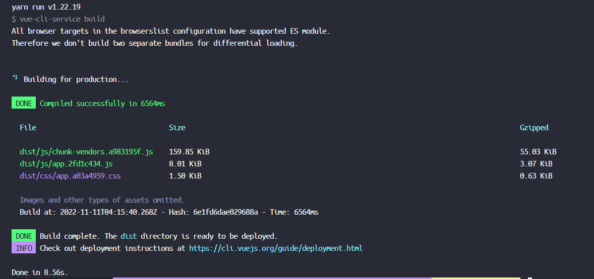
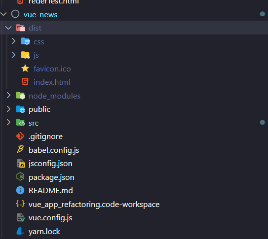

- 파일이 생성되었으면 이걸 실제 [Netlify](https://www.netlify.com/) 를 통해 배포해본다.

### Netlify
- 보니까 하나의 레포에서 하는게 좋을 것 같아서 [git 레포](https://github.com/emptyDrawing/netlify_test)를 새로팜.
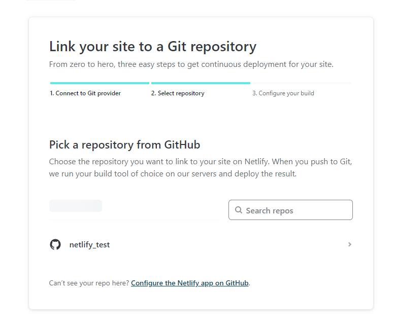
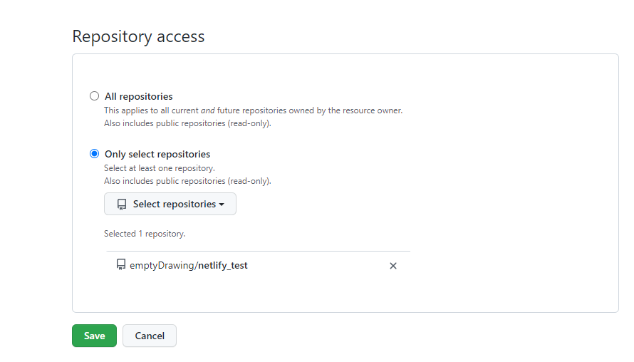
- 이렇게 연결 시키고
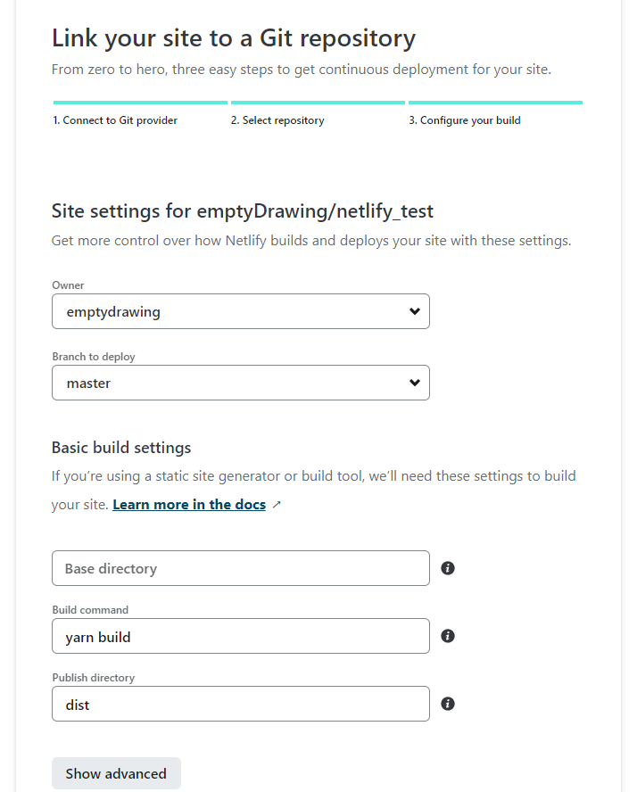
- yarn 으로 build 하게 한다.
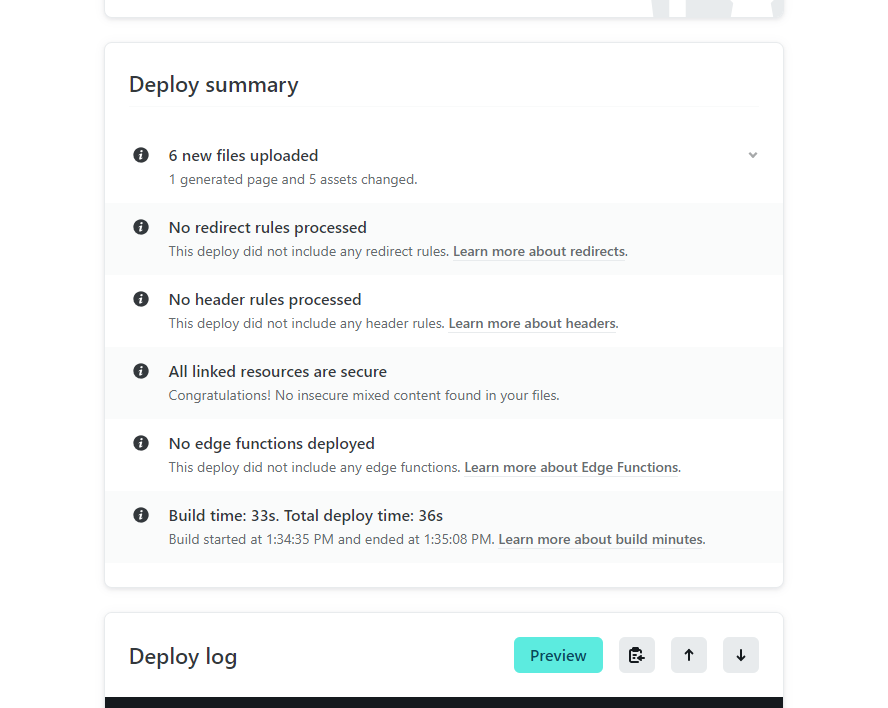
- 굿굿!
- 홈페이지 주소 : https://sskim-vue-test.netlify.app/news

- 수업에서는 잘안됬다고하는데 설정파일을 확인해보자.
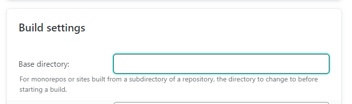
- 상대경로 였다...

- 그리고 원래는 `public` 에 Vue-router 에서 사용한 url 정보를 따로 설정해야되는데..
- 그정보는 [이링크 참고](https://cli.vuejs.org/guide/deployment.html#netlify)
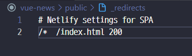


### 환경설정파일 `.env`
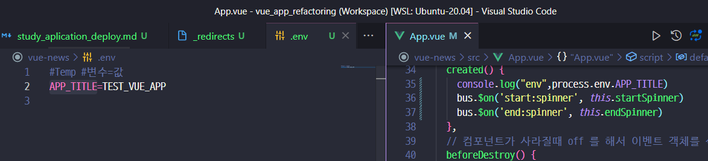
- 라고 찍을려고 하면
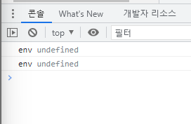

- 그래서 원래는 webpack 에서 아래와 같이 셋팅해야되는데
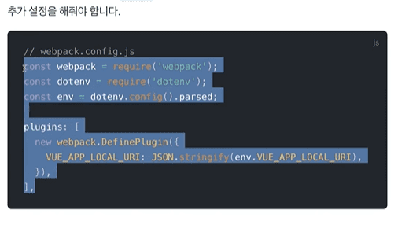

- `Vue Cli` `vesrion3` 에서부터는 좀더 쉽게 할 수 있다. ( 파일이라서 안전하게 서버를 내렸다가 올리면 )
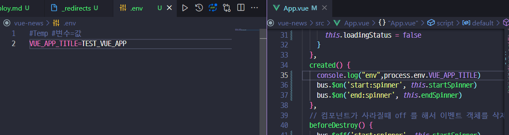
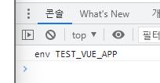
- !! 유용하겠다!
