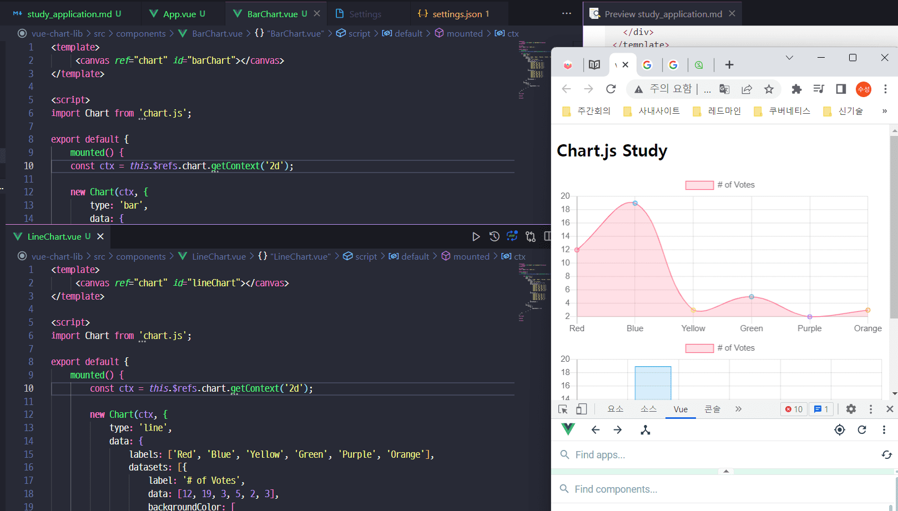
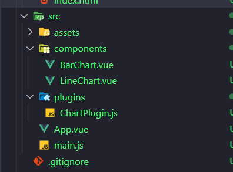
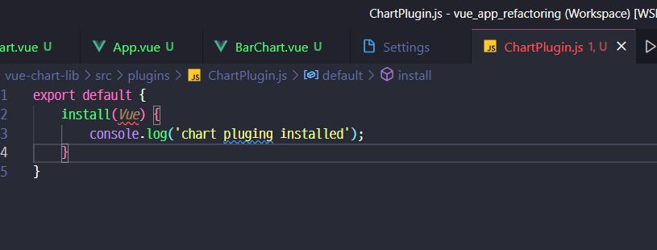
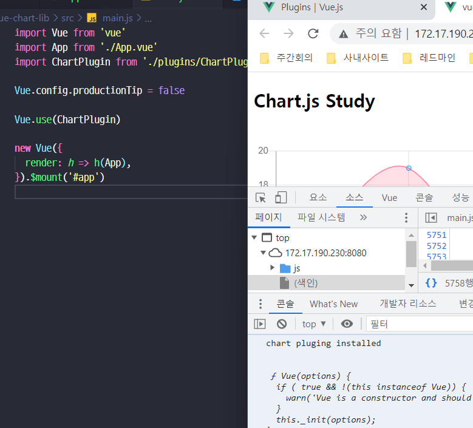
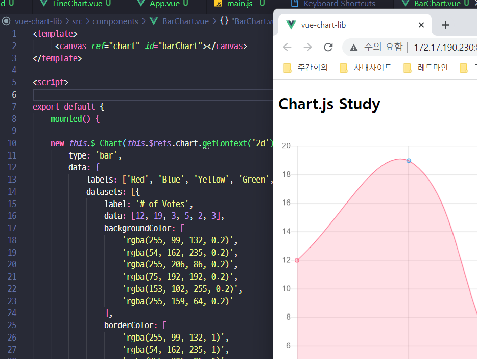

### 라이브러리 모듈화 이유
- [chart.js](https://www.chartjs.org/docs/latest/)를 사용하려고 하는데..
- Vue.js 관련 라이브러리가 없을 때가 많아서 일반 라이브러리 결합법을 알아야됨.
- 추세 알아보기 : https://stateofjs.com/en-us/

### Vue 라이브러리 만들어보기
```javascript
// yarn add chart.js@2 일때
<template>
  <div>
    <h2>Chart.js Study</h2>
    <canvas id="myChart" width="400" height="400"></canvas>
  </div>
</template>

<script>
import Chart from 'chart.js'

export default {
  // 컴포넌트 속성 && 인스턴스 속성
  // created 가 아닌 mounted 시점에 실행하게함
  mounted() {
    const ctx = document.getElementById('myChart').getContext('2d');
    new Chart(ctx, {
        ...
    });    
```
- 22.11.10 시점 : yarn add chart.js 로 하면 3버젼이 설치되는데 그땐 [이링크 참고](https://www.inflearn.com/questions/548271)

- 그럼 위에서 만들걸 어떻게 모듈화 할 것 인가

### Chart를 컴포넌트 / 플러그인 화
- 차트를 여러개 component 만들다보면 id 같은게 겹칠수도 있으니
- ref 를 활용해보자 : 이건 해당 컴포넌트에서만 찾기때문에 다른 컴포넌트와 겹칠일이 없다.
  

- 그런데 반복적으로 Chart 를 import 하니까 
  이제 이걸 [플러그인화](https://vuejs.org/guide/reusability/plugins.html#ad)도 해보자.
  
  
  - 뭔가 심각하게 이상하지만...
  

  !!! 그래서 실사용을 위해서 아래처럼 코드 변경
  ```javascript 
  import Chart from "chart.js";

  export default {
      install(Vue) {
          Vue.prototype.$_Chart = Chart;    
      }
  }
  ```
  