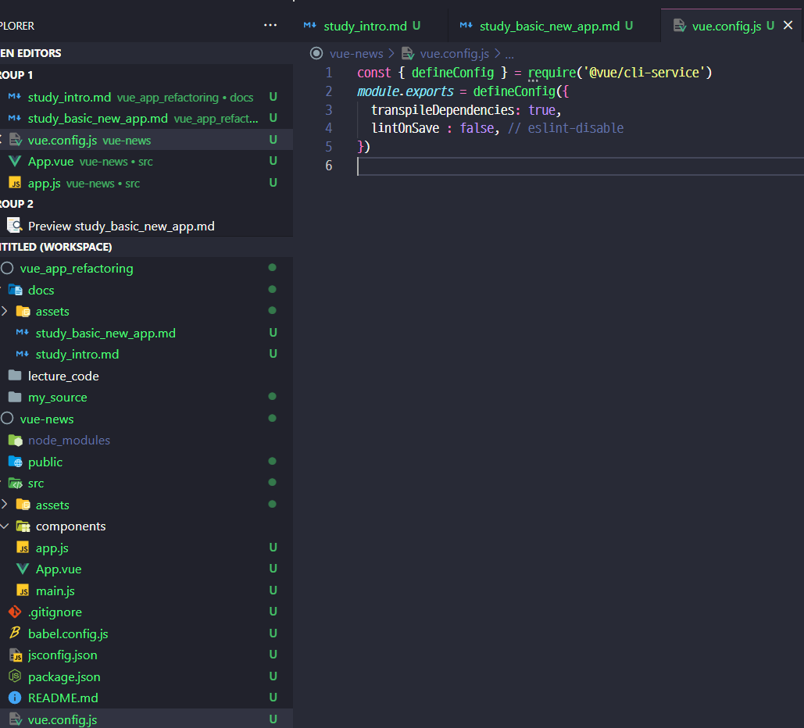

### 프로젝트 생성
```shell
# 2.x 이하
vue init webpack-simple vue-news

# 3.x 이상
vue create vue-news
```
- 2.x / 3.x의 차이점
  - 웹팩파일설정 노출   [  2.x  -> O  / 3.x -> X [(참고링크)](https://cli.vuejs.org/guide/webpack.html#inspecting-the-project-s-webpack-config)]
  - 프로젝트구성        [  2.x  -> 깃헙의 템플릿 다운로드  / 3.x -> 플러그인 기반으로 기능추가 ]
  - ES6 이해도 필요     [  2.x  -> X  / 3.x -> O ]
  

### ESLint

- 그런데 Vue Cli 3.x 이상에서 ESLint 끄는법은..
  - 파일마다
  
  - 설정파일로: [참고문서](https://cli.vuejs.org/core-plugins/eslint.html#configuration)
  

### 라우터 설치 및 설정
```shell
# 강의는 vue 2점대를 쓰기 때문에 아래처럼 router를 버젼 고정시켜줘야됨.
yarn add vue-router@3.5.3
```

  - router/index.js : 라우터 설정
  ```javascript
  import Vue from 'vue'
  import VueRouter from 'vue-router'
  import AskView from '../views/AskView.vue'
  import JobsView from '../views/JobsView.vue'
  import NewView from '../views/NewsView.vue'

  Vue.use(VueRouter)

  export const router = new VueRouter({
      routes: [
          { path: '/news', component: NewsView, },
          { path: '/ask', component: AskView, },
          { path: '/jobs', component: JobsView, },
      ],
  });
  ```
  - views/* : router에 연결되는 페이지 Vue-Component

  - main.js
  ```javascript
  import Vue from 'vue'
  import App from './App.vue'
  import router from './router/index'
  Vue.config.productionTip = false

  new Vue({
    render: h => h(App),
    router,
  }).$mount('#app')
  ```
  
  - App.vue
  ```javascript

  ```

  
  - 