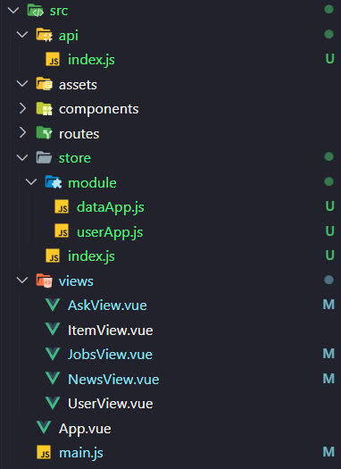

### 프로젝트 생성
```shell
# 2.x 이하
vue init webpack-simple vue-news

# 3.x 이상
vue create vue-news
```
- 2.x / 3.x의 차이점
  - 웹팩파일설정 노출   [  2.x  -> O  / 3.x -> X [(참고링크)](https://cli.vuejs.org/guide/webpack.html#inspecting-the-project-s-webpack-config)]
  - 프로젝트구성        [  2.x  -> 깃헙의 템플릿 다운로드  / 3.x -> 플러그인 기반으로 기능추가 ]
  - ES6 이해도 필요     [  2.x  -> X  / 3.x -> O ]
  

### ESLint

- 그런데 Vue Cli 3.x 이상에서 ESLint 끄는법은..
  - 파일마다
  
  - 설정파일로: [참고문서](https://cli.vuejs.org/core-plugins/eslint.html#configuration)
  

### 라우터 설치 및 설정
```shell
# 강의는 vue 2점대를 쓰기 때문에 아래처럼 router를 버젼 고정시켜줘야됨.
yarn add vue-router@3.5.3
```

  - router/index.js : 라우터 설정
  ```javascript
  import Vue from 'vue'
  import VueRouter from 'vue-router'
  import AskView from '../views/AskView.vue'
  import JobsView from '../views/JobsView.vue'
  import NewView from '../views/NewsView.vue'
  import UserView from '../views/UserView.vue'
  import ItemView from '../views/ItemView.vue'

  Vue.use(VueRouter)

  export const router = new VueRouter({
      mode: "history", // 이러면 # 라우터 없어짐
      routes: [
          { path: '/', redirect: '/news'          },
          { path: '/news', component: NewView,    },
          { path: '/ask', component: AskView,     },
          { path: '/jobs', component: JobsView,   },
          { path: '/user', component: UserView,   },
          { path: '/item', component: ItemView,   },
      ],
  });
  ```
  - views/* : router에 연결되는 페이지 Vue-Component

  - main.js
  ```javascript
  import Vue from 'vue'
  import App from './App.vue'
  import router from './routes/index'
  Vue.config.productionTip = false

  new Vue({
    render: h => h(App),
    router,
  }).$mount('#app')
  ```
  
  - App.vue
  ```javascript
  <template>
    <div id="app"> 
      <tool-bar></tool-bar>   
      <router-view></router-view>
    </div>
  </template>

  <script>
  import ToolBar from "./components/ToolBar.vue"

  export default {
    components: {
      ToolBar
    }
  }
  </script>

  <style>
  body {
    padding: 0;
    margin: 0;
  }
  </style>
  ```

  

### axios 관리법
- 컴포넌트마다 api를 불러오면 상당히 복잡해 질 수 있음.

  ```javascript
  import axios from "axios";
  // 1. HttP Request / Response 관련 기본설정
  const config = {
      baseurl : 'https://api.hnpwa.com/v0',
      apiList : ['news', 'jobs', 'ask']
  }
  // 2. API 함수 개별 정의
  const callAPIList = (name) => {
      return new Promise((resolve, reject) => {

          if( config.apiList.includes(name) ){
              resolve(callListByName(name));
          }

          reject(`This [${name}]API is not provided`);
      });
  }
  const callListByName= (name) => {
      return axios.get(`${config.baseurl}/${name}/1.json`)
  }
  // 3. export
  export {
      callAPIList
  }
  ```

  - 이걸 이제 component 나 view 에 그려야되는데
  - [라이프사이클](https://vuejs.org/guide/extras/reactivity-in-depth.html#ad) 을 알면 좀더 효과적으로 보여줄 수 있음.
  
  -------------------------------
  - **화살표함수 this 확인 필**
    - new 차이유무
    

    - 참고링크 : 
      - https://bohyeon-n.github.io/deploy/javascript/this.html
      - https://www.freecodecamp.org/news/when-and-why-you-should-use-es6-arrow-functions-and-when-you-shouldnt-3d851d7f0b26
      - https://www.codementor.io/@niladrisekhardutta/how-to-call-apply-and-bind-in-javascript-8i1jca6jp
      - https://gist.github.com/zcaceres/2a4ac91f9f42ec0ef9cd0d18e4e71262
  -------------------------------

### Vuex 적용

```shell
yarn add vuex@3.6.2
```

- 기존꺼 배운걸로 모듈화 시킴
  ```javascript
  // store/index.js
  import Vue from 'vue';
  import Vuex from 'vuex';
  import dataApp from './module/dataApp'
  import userApp from './module/userApp'


  Vue.use(Vuex);

  export const store = new Vuex.Store({
      modules: {
          data : dataApp,
          user : userApp
      }
  });

  export default {
      store
  }
  
  // dataApp.js
  import { callAPIList } from '../../api/index.js'


  const state = {
      newsList : [],
      jobsList : [],
      askList : [],
  }

  const getters =  {}

  const mutations = {
      setAPIData(state, { name, data }) {
          switch (name) {
              case 'news':
                  state.newsList = data;
                  break;
              case 'jobs':
                  state.jobsList = data;
                  break;
              case 'ask':
                  state.askList = data;
                  break;
          }
      }
  }
  
  const actions = {
      FETCH_DATA(context,{ name }) {
          callAPIList(name)
            .then(resp => { 
                  const data = resp.data
                  context.commit('setAPIData',{ name, data }) 
              })
            .catch( err => console.error(err) )
      }
  }

  export default {
      state, 
      getters, 
      mutations,
      actions
  }
  ```
  - 사용할때는..
  ```javascript
  // NewsView.vue
  // helper 함수 안쓰니 조금 번잡하긴 하다;;
  <template>
    <div>
      <div v-for="news in this.$store.state.data.newsList">{{news.title}}</div>
    </div>
  </template>

  <script>

  export default {
    created() {
      this.$store.dispatch('FETCH_DATA',{'name' : 'news'})     
    }
  }
  </script>

  <style>

  </style>
  ```

  - 그런데 강의를 보니까 이렇게도 줄일수 있더라...
  ```javascript
  // dataApp.js 에서.
  const actions = {
      // FETCH_DATA( context, { name })
      FETCH_DATA( { commit }, { name }) {
          callAPIList(name)
            .then( 
                //(resp) => { 
                //    const data = resp.data
                //    context.commit('setAPIData',{ name, data })      
                ({ data }) => {
                commit('setAPIData',{ name, data }) 
              })
            .catch( err => console.error(err) )
      }
  }
  ```
  - 그리고 다시 map 함수로 고치자
  ```javascript
  // NewsView.vue
  <template>
    <div>
      <div v-for="news in news">{{ news.title }}</div>
    </div>
  </template>

  <script>

  import { mapGetters } from 'vuex';

  export default {
    computed : {
      // ...mapState({
      //   news : (state, getters) => state.data.newsList
      // })
      ...mapGetters({
        news : 'getNewsList'
      })
    },
    created() {
      this.$store.dispatch('FETCH_DATA',{'name' : 'news'})     
    }
  }
  </script>

  <style></style>

  ```
  - 그리고 기본적인 스타일링
  ```javascript
  // AskView.vue
  <template>
    <div>
      <p v-for="ask in askList" :key='ask.id'>
        <a :href="ask.url">
          {{ ask.title }}
        </a>
        <small>{{ask.time_ago}} by {{ ask.user }}</small>
      </p>
    </div>
  </template>

  <script>
  import { mapGetters } from 'vuex'

  export default {
    computed : {
      ...mapGetters({
        askList : 'getAskList'
      })
    },
    created() {
      this.$store.dispatch('FETCH_DATA',{'name' : 'ask'})     
    }
  }
  </script>
  ```


### 동적라우팅 매칭 + mapGetter 특이하게 이용해보기
- 공식문서 : https://router.vuejs.org/guide/essentials/dynamic-matching.html
```javascript

export const router = new VueRouter({
    mode: "history", // 이러면 # 라우터 없어짐
    routes: [
        { path: '/',        redirect: '/news'      },
        { path: '/news',    component: NewView,    },
        { path: '/ask',     component: AskView,    },
        { path: '/jobs',    component: JobsView,   },
        { path: '/user/:id', component: UserView,   }, // 파람추가
        { path: '/item',    component: ItemView,   },
    ],
});
```


- 그럼 보낸 param을 꺼내보는데 `mapGetters` 를 이상하게 써보자 : [참고링크](https://www.rrrhys.com/vue-js-mapgetters-with-params/)
```javascript
// userApp.js
import { callUserInfo } from "@/api"

const state = {
    userList : [],
}
// https://www.rrrhys.com/vue-js-mapgetters-with-params/
const getters =  {
    getUserInfo : (state) => (user) => {
        return state.userList.filter( userInfo => userInfo.id === user.id);
    }
}

const mutations = {
    setUserInfo(state, { data }) {
        state.userList.push(data)
    }
}

const actions = {
    FETCH_USER( { state, commit }, { name: userName }) {
        if( state.userList.findIndex( userInfo => userInfo.id === userName ) < 0 ) {
            callUserInfo(userName)
            .then( ({ data }) => {
                commit('setUserInfo',{ data }) 
            })
            .catch( err => console.error(err) )        
        }
    }
}

export default {
    state, 
    getters, 
    mutations,
    actions,
}

//////////////////////////
// UserView.vue
//////////////////////////

<template>
  <div>
    <p>userName : {{user.id}}</p>
    <p>karma : {{user.karma}}</p>
    <p>created: {{user.created}}</p>
    <p v-if="user.about"> about : {{user.about}} </p>
  </div>
</template>

<script>
import { mapGetters } from 'vuex';


export default {
  computed : {
    ...mapGetters([
      'getUserInfo'
    ])
    ,user() {
      const userName = this.$route.params.id ?? '';
      return this.getUserInfo({ id : userName });
    }
  }
  ,created() {
    const userName = this.$route.params.id ?? '';
    if(userName) {
      this.$store.dispatch('FETCH_USER', {name: userName})
    }
  }

}
</script

```


### v-html vs data-bind
```
<template>
  <div>
    <section>
      <div class="user-container">
        <div><i class="fas fa-user"></i></div>
        <div class="user-description">
            <router-link :to="`/user/${item.user}`">{{ item.user }}</router-link>
            <div class="time">{{ item.time_ago }}</div>
        </div>
      </div>
      <h2>{{ item.title}}</h2>
    </section>
    <section>
      <div v-html="item.content"/>
    </section>
  </div>
</template>
```
- 참고문서 
  - https://vuejs.org/api/#v-html 
  - https://vuejs.org/guide/essentials/template-syntax.html#Raw-HTML


### Route Transition 효과 넣기

```javascript
// App.vue

<template>
  <div id="app"> 
    <tool-bar></tool-bar>
    <transition name="page">
      <router-view></router-view>
    </transition>   
  </div>
</template>


<style>
body {
  padding: 0;
  margin: 0;
}

/** router transition */
.page-enter-active, .page-leave-active {
  transition: opacity 0.5s ease;
}

.page-enter-from, .page-leave-to {
  opacity: 0;
}
</style>

```
-참고문서
  - [transition 기본문서](https://vuejs.org/guide/built-ins/transition.html)
  - [route transition 문서](https://router.vuejs.org/guide/advanced/transitions.html#per-route-transition)

