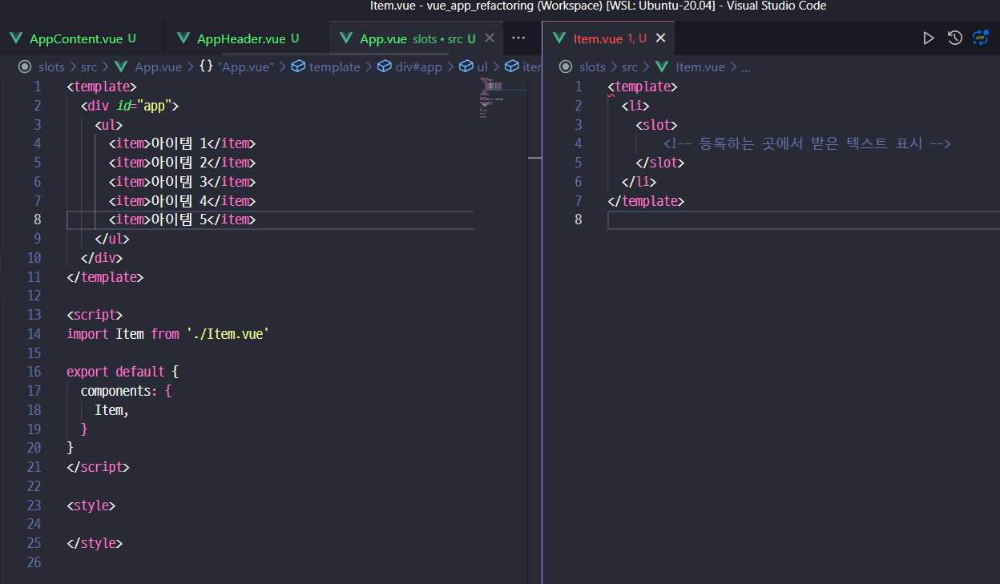
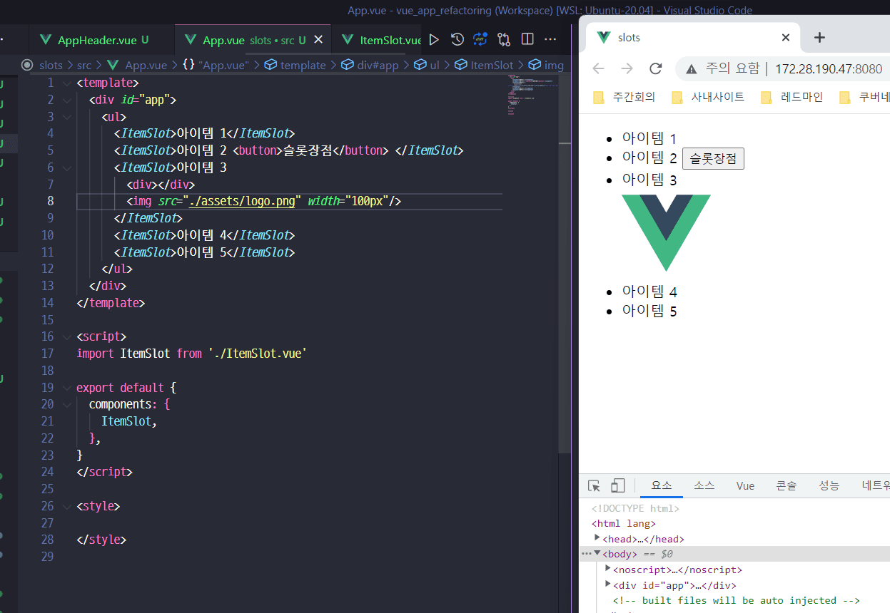
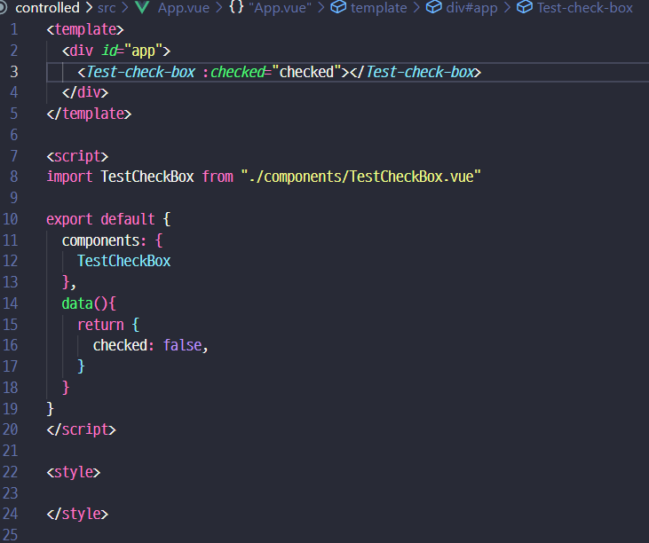
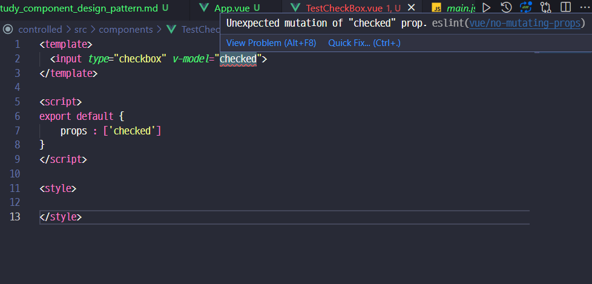
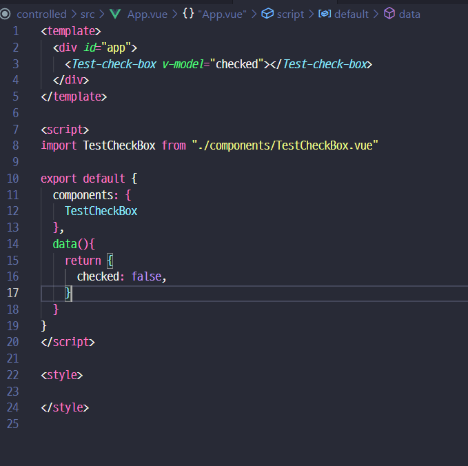
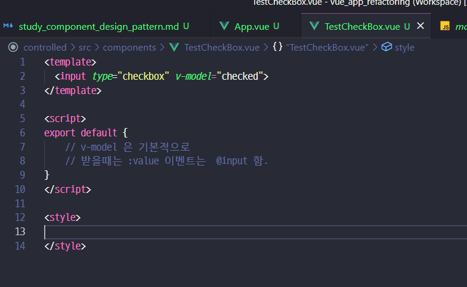
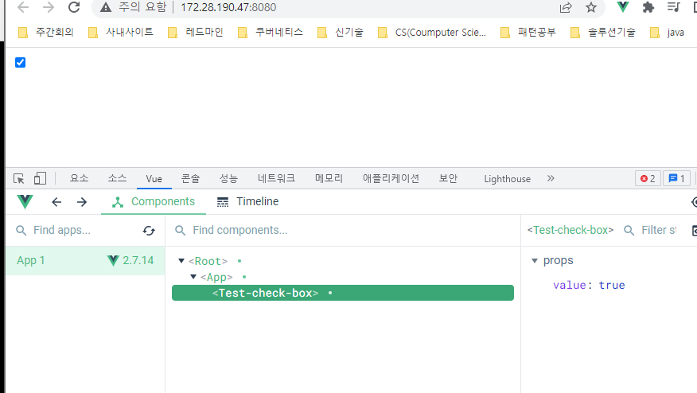
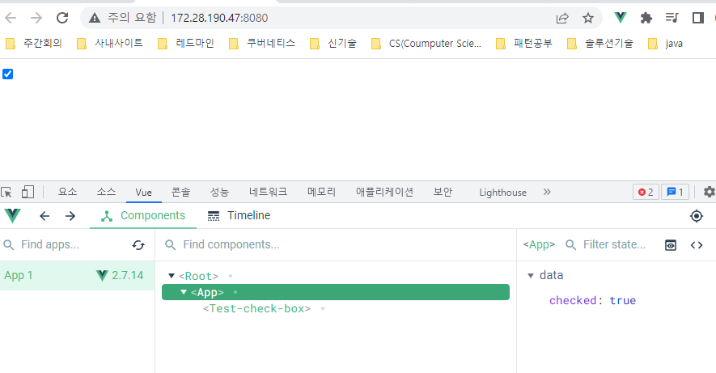
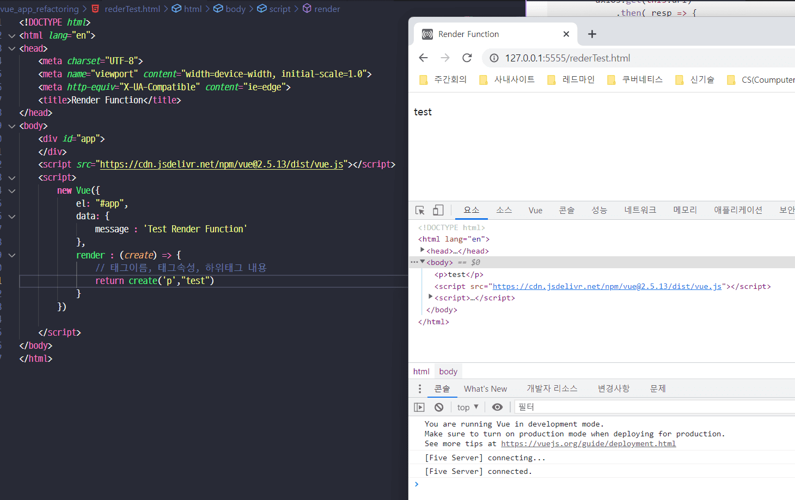

### Common
- 기본적인 컴포넌트 등록 / 통신
- 
### Slot 
- 마크업 확장이 가능한 컴포넌트

- 간단하게는 이렇게도 가능
- 그런데 이건 props 도 되는데.. slot으로 하면 더 장점이 있나?
- slot으로 하면 굳이 데이터를 하위 컴포넌트에 내려줄 필요가 없어짐.

- 그리고 이렇게 유연하게 확장 가능  

### Controlled
- 결합력 높은 컴포넌트


- 흠..
- 간단한 문제 해결은


- 이걸 까보면
```javascript
<template>
  <!-- <input type="checkbox" v-model="checked"> -->

  <input type="checkbox" :checked="value" @click="toggleCheckBox">
</template>

<script>
export default {
    // v-model 은 기본적으로 
    // 받을때는 :value 이벤트는  @input 으로 emit 함.
    props: ['value'],
    methods: {
        toggleCheckBox(){
            this.$emit('input',!this.value)
        }
    }
}
</script>
```
- 라고 하는데.. 이래야지만 실제 값이 연동됨
  

- 이벤트가 전달되면서 값이 변한 걸 볼 수 있음

- 결국 이렇게하면 상위에서 값을 다룬다고 볼 수 있음.


### Renderless
- 데이터 처리 컴포넌트
```javascript
<template>
    <!-- 
        없으니까 에러남 
        참고링크 : https://www.inflearn.com/questions/13907
    -->
    <div></div>
</template>
<script>
import axios from "axios";

export default {
    props: ['url'],
    data() {
        return {
            response: null,
            loading : true,
        }
    },
    created() {
        axios.get(this.url)
            .then( resp => { 
                this.response = resp.data
                this.loading = false
            })
            .catch( e => console.log(e))
    },
    render() {
        return console.log(this.$scopedSlots.this$$scopedSlots.defalut({
            response : this.response,
            loading : this.loading
        }))
    }
}
</script>

/// 사용시
<template>
  <div id="app">
    <fetch-data url="https://jsonplaceholder.typicode.com/users">
      <!-- ... ---> 
    </fetch-data>
  </div>
</template>

<script>
import FetchData from './components/FetchData.vue'

export default {
  name : 'app',
  components: {
    FetchData
  }
}
</script>
```
- 여기서 더 알아볼 게 `render()` 인데

```javascript
<!DOCTYPE html>
<html lang="en">
<head>
    <meta charset="UTF-8">
    <meta name="viewport" content="width=device-width, initial-scale=1.0">
    <meta http-equiv="X-UA-Compatible" content="ie=edge">
    <title>Render Function</title>
</head>
<body>
    <div id="app">
    </div>
    <script src="https://cdn.jsdelivr.net/npm/vue@2.5.13/dist/vue.js"></script>
    <script>
        new Vue({
            el: "#app",
            data: {
                message : 'Test Render Function' 
            },
            render : function(create) {
                // 태그이름, 태그속성, 하위태그 내용 
                return create('p', this.message)
            }
        })

    </script>
</body>
</html>
```
- 그래서 main.js가
```javascript
import Vue from 'vue'
import App from './App.vue'

Vue.config.productionTip = false

new Vue({
  render: h => h(App),
}).$mount('#app')
```
- 이렇게 구성되어 있던거였음.

- 그래서 이걸 첫번재 예제에서 이렇게 활용가능 `<div slot-scope="{ response, loading }">`
```javascript
<template>
  <div id="app">
    <fetch-data url="https://jsonplaceholder.typicode.com/users">
      <!-- ... ---> 
      <div slot-scope="{ response, loading }">
        <div v-if="!loading">
          {{ response }}
        </div>
        <div v-else>
          Loading...
        </div>
      </div>

    </fetch-data>
  </div>
</template>

<script>
import FetchData from './components/FetchData.vue'

export default {
  name : 'app',
  components: {
    FetchData
  }
}
</script>
```
```javascript
<script>
import axios from "axios";

export default {
    props: ['url'],
    data() {
        return {
            response: null,
            loading : true,
        }
    },
    created() {
        axios.get(this.url)
            .then( resp => { 
                this.response = resp.data
                this.loading = false
            })
            .catch( e => console.log(e))
    },
    render() {
        return this. $scopedSlots.default({
            response : this.response,
            loading : this.loading
        })
    }
}
</script>
```