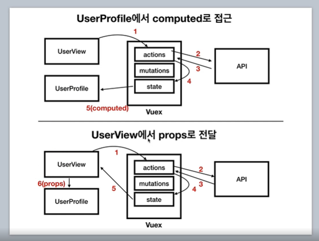
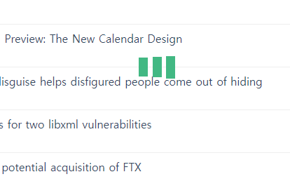
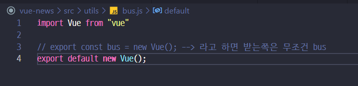
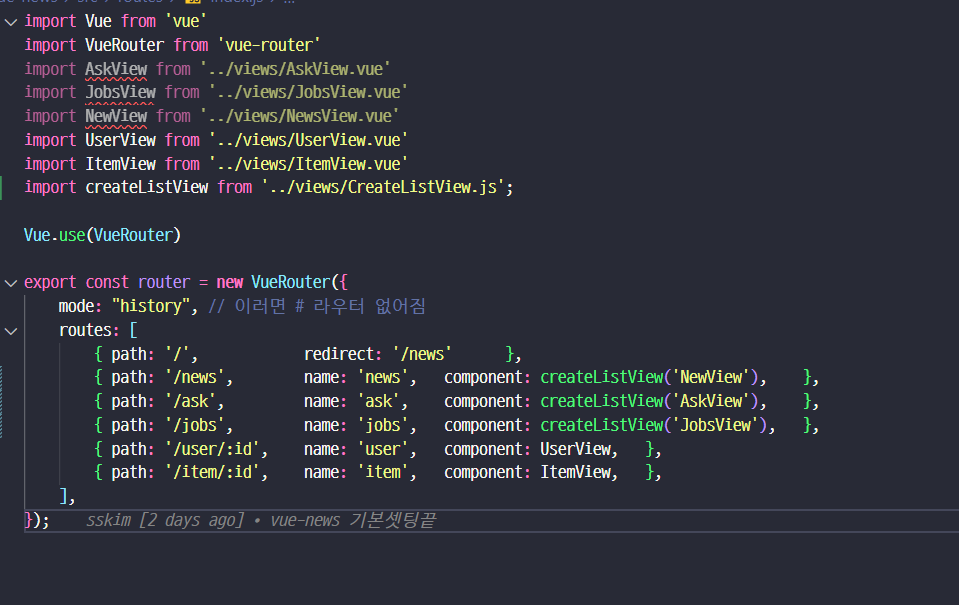
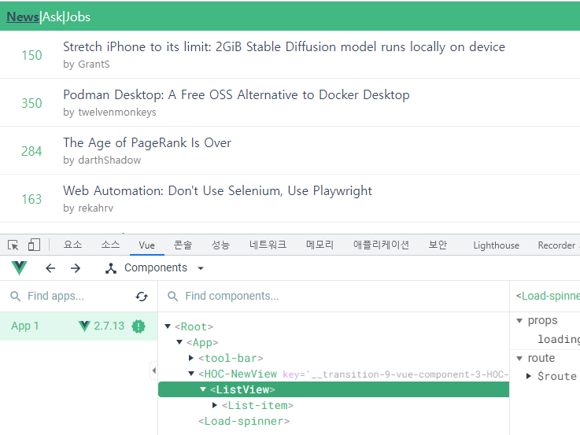

### List Component
```javascript
// 공통컴포넌트 `/components/ListItem.vue` script 내용
<script>
import { mapGetters } from 'vuex';

export default {

  computed : {
    ...mapGetters({
        getList : 'getAPIList'
    }),
    itemList(){
        const routerName = this.$route.name ?? '';
        return this.getList({name : routerName});
    }
  },
  
  created() {
    this.$store.dispatch('FETCH_DATA',{'name' : this.$route.name})     
  }
}
</script>

// store 쪽 코드
const state = {
    newsList : [],
    jobsList : [],
    askList : [],
}

const getters =  {
    getAPIList(state) {
        return ({name}) => {
            switch (name) {
                case 'news':
                    return state.newsList
                case 'jobs':
                    return state.jobsList
                case 'ask':
                    return state.askList
                default :
                    return []
            }
        };
    }

}

const mutations = {
    setAPIData(state, { name, data }) {
        switch (name) {
            case 'news':
                state.newsList = data;
                break;
            case 'jobs':
                state.jobsList = data;
                break;
            case 'ask':
                state.askList = data;
                break;
        }
    }
}
 
const actions = {
    FETCH_DATA( { commit }, { name }) {
        callAPIList(name)
          .then( ({ data }) => {
              commit('setAPIData',{ name, data }) 
            })
          .catch( err => console.error(err) )
    },
}
```

- 그런데 조금 view 마다 데이터도 상이하고 보여지는 부분이 상이함
- 이부분은 template 속성과 v-if 로 해결함.

### template / v-if
```javascript
<template>
  <div>
    <ul class="news-list">
      <li v-for="item in itemList" :key='item.id' class="post">
        <!-- 포인트영역 -->
        <div class="points">
          {{item.points || 0}}
        </div>
        <!-- 기타정보영역 -->
        <div>
          <!-- 타이틀 영역 -->
          <p class="news-title">
            <template v-if="item.domain">
                <a :href="item.url">
                    {{item.title}}
                </a>
            </template>  
            <template v-else>
                <router-link :to="`/item/${item.id}`">
                    {{item.title}}
                </router-link>
            </template>
          </p>
          <small class="link-text"> 
            by 
                <router-link 
                    v-if= "item.user"
                    :to="`/user/${item.user}`" class="link-text">{{ item.user }}</router-link>
                <a v-else :href="item.url" >{{item.domain }}</a>
            </small>
        </div>
     </li>
    </ul>
  </div>
</template>
```


### 사용자 프로필 컴포넌트 개선시 2가지 방향 -> Slot 이용

- 주 컨셉은 `component` 에는 `slot` + css 까지 입히고
- 사용하는 부분에서 데이터 가져오고 slot 부분을 채우는 로직임
- slot 사용시 
  - 일반태그[`div`,`span`,`router-link`] 같은 경우는 그 실제 태그도 같이 가는데
  - `template` 는 안의 텍스트만 slot에 들어감
  

```javascript
// component/UserProfile.vue
<template>
    <div class="user-container">
        <div>
            <i class="fas fa-user"></i>
        </div>
        <div class="user-description">
            <slot name="username">
                <!-- 상위내용에서 정의할 내용 -->
            </slot>
            <div class="time">
                <slot name="time">
                    <!-- 상위 컴포넌트에서 정의 -->
                </slot>
            </div>
            <slot name="karma"></slot>
        </div>
    </div>
</template>

// views/UserView.vue
<template>
  <div>
    <User-profile :info='user'>
      <div slot='username'>{{user.id}}</div>
      <!-- template slot 은 태그없이 텍스트만 들어감 -->
      <template slot='time'>{{user.created}}</template>
      <div slot='karma'>{{user.karma}}</div>
    </User-profile>
  </div>
</template>

<script>
import { mapGetters } from 'vuex';
import UserProfile from '../components/UserProfile.vue'

export default {
  computed : {
    ...mapGetters([
      'getUserInfo'
    ]),
    user() {
      const userName = this.$route.params.id ?? '';
      return this.getUserInfo({ id : userName });
    }
  },
  created() {
    const userName = this.$route.params.id ?? '';
    if(userName) {
      this.$store.dispatch('FETCH_USER', {name: userName})
    }
  },
  components: {
    UserProfile
  }
}
</script>

// view/AskView.vue
<template>
  <div>
    <section>
      <!-- 사용자정보-->
      <User-profile :info="item">
          <div slot="username">
             <router-link :to="`/user/${item.user}`">{{ item.user }}</router-link>
          </div>
          <template slot="time">{{ item.time_ago }}</template>
      </User-profile>
    </section>
    <section>
      <h2>{{ item.title}}</h2>
    </section>
    <section>
      <div v-html="item.content"/>
    </section>
  </div>
</template>

<script>
import { mapGetters } from 'vuex';
import UserProfile from '../components/UserProfile.vue'

export default {
  components: {
    UserProfile
  }
  ,computed : {
    ...mapGetters(['getItem']),
    item() {
      return this.getItem({id : this.$route.params.id})
    }
  },
  created(){
    const itemId = this.$route.params.id;
    this.$store.dispatch('FETCH_ITEM', { id : itemId });
  }

}
</script>
```

### PageComponent 재활용
- HighOrderComponent / Mixin component 를 사용한다고 함.
- 일단 기본적으로 로딩바를 위해서 [스피너](https://github.com/joshua1988/vue-advanced/blob/12_spinner/vue-news/src/components/Spinner.vue)를 사용함


- 그럼 이걸 언제 시작하고 끝낼건가 고민필요.
- 이때 이벤트버스를 사용하는데
  
  - 빈 vue 를 던져주는데 현재 `NewsView`의 부모가 `App.vue` 라서 이벤트 리스너는 `App.vue` 에 단다
  ```javascript
  <template>
    <div id="app"> 
      <tool-bar></tool-bar>
      <transition name="page">
        <router-view></router-view>
      </transition>
      <Load-spinner :loading="loadingStatus"></Load-spinner>
    </div>
  </template>

  <script>
  import ToolBar from "./components/ToolBar.vue"
  import LoadSpinner from "./components/LoadSpinner.vue"
  import bus from "./utils/bus.js"


  export default {
    components: {
      ToolBar, LoadSpinner,
    },
    data(){
      return {
        loadingStatus : false,
      }
    },
    methods: {
      startSpinner() {
        this.loadingStatus = true;
      },
      endSpinner() {
        this.loadingStatus = false;
      }
    },
    created() {
      bus.$on('start:spinner', this.startSpinner);
      bus.$on('end:spinner', this.endSpinner);
    },
    // 컴포넌트가 사라질때 off 를 해서 이벤트 객체를 삭제시킴.
    beforeDestroy() {
      bus.$off('start:spinner', this.startSpinner);
      bus.$off('end:spinner', this.endSpinner);
    }
  }
  </script>
  ```
  - 그리고 하위 `NewView.vue` 에서 이벤트를 발생시키면 `App.vue` 에서 받아서 `LoadSpinner` 의 속성을 내려줄 수 있게 됨
  ```javascript
  // store.js 에서 promise 리턴을 위해서 리턴 추가
  const actions = {
      FETCH_DATA( { commit }, { name }) {
          callAPIList(name)
            .then( ({ data }) => {
                commit('setAPIData',{ name, data })
                return data; // promise 리턴
              })
            .catch( err => console.error(err) )
      },

  // `NewView.vue
  <template>
    <div>
      <List-item></List-item>
    </div>
  </template>

  <script>
  import ListItem from '../components/ListItem.vue'
  import bus from '../utils/bus.js'

  export default {
    components: {
      ListItem
    },
    created() {
      bus.$emit('start:spinner')
      this.$store.dispatch('FETCH_DATA',{'name' : this.$route.name})
        .then( () => bus.$emit('end:spinner'))
    }
  }
  ```
-  사실 지금 임시로 NewView 에 created() 를 만들었는데 이게 Ask, Job 도 똑같음.
   -  그리고 이렇게 합니다. [HighOrderComponent](https://reactjs.org/docs/higher-order-components.html)
  
  ```javascript
  // views/createListView.js
  import ListView from './ListView.vue'
  import bus from '../utils/bus'


  export default function createListView(componentName) {
      return {
          // 재사용할 인스턴스(컴포넌트) 옵션들이 들어가는 자리
          name: "HOC-"+componentName, // HighOrder Component 이름
          created(){
              bus.$emit('start:spinner')
              this.$store.dispatch('FETCH_DATA',{'name' : this.$route.name})
                  .then( () => { bus.$emit('end:spinner')} )
                  .catch( (e) => { console.log(e); bus.$emit('end:spinner'); } );
          },
          render(createElement) {
              return createElement(ListView);
          }
      }
  }
  ///////////////////////////////////////////////////////////////
  // views/ListView.vue 
  <template>
    <div>
      <List-item></List-item>
    </div>
  </template>

  <script>
  import ListItem from '../components/ListItem.vue'

  export default {
      components: {
          ListItem,
      }
  }
  </script>

  <style>

  </style>
  ``` 
  