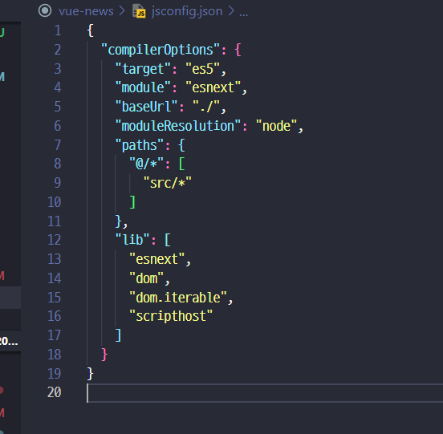
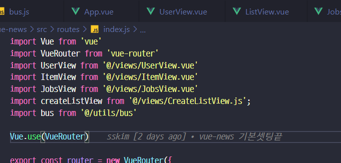
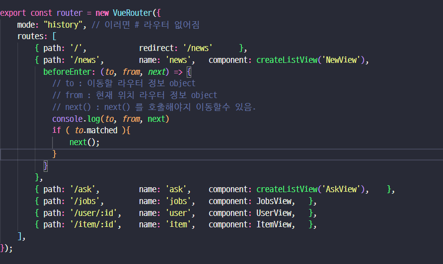

### 데이터 호출시점

1. 컴포넌트 라이프 사이클 훅
   - [created](https://vuejs.org/api/options-lifecycle.html#created) : 그전까지 하던 방식. 컴포넌트가 생성되자 마자 호출됨.
2. 라우터 [네비게이션 가드](https://router.vuejs.org/guide/advanced/navigation-guards.html)
    - router 에서 특정 URL로 접근하기 전에 할수 있는 조치
    - 장기효님 블로그 : https://joshua1988.github.io/web-development/vuejs/vue-router-navigation-guards/

3. 호출시점 간단히
   - 유저가 특정 url 접근 -> 라우터네비게이션 가드 -> 컴포넌트 호출(라이플 사이클)

### @ 경로에 대해서

- [참고링크](https://mikkeller.tistory.com/26)
- 설정위치 json



### Navigation Guard

```javascript
...
import bus from '@/utils/bus'
import { store } from '@/store/index.js'
...

export const router = new VueRouter({
    mode: "history", // 이러면 # 라우터 없어짐
    routes: [
        {   path: '/',            redirect: '/news'      },
        {   path: '/news',        name: 'news',   component: createListView('NewView'),    },
        {   path: '/ask',         name: 'ask',    component: createListView('AskView'),    },
        {   path: '/jobs',        name: 'jobs',   component: JobsView,  
            beforeEnter: (to, from, next) => {
                bus.$emit('start:spinner')
                // store는 별도로 import 했고, 결국 우리가 갈 to가 route 정보를 가지고 있으니까 거기서 가져옴
                store.dispatch('FETCH_DATA', {'name' : to.name})
                    .then( (data) => { next(); return data; } )
                    .catch( (e) => { console.log(e); bus.$emit('end:spinner'); } );

            },
        },
        {   path: '/user/:id',    name: 'user',   component: UserView,   },
        {   path: '/item/:id',    name: 'item',   component: ItemView,   },
    ],
});

```

### async / await 간단하게 변경
```javascript
// store/moddule/dataApp.js 쪽을 변경한건데... 
// 사실 나는 callAPIList 쪽이 뭔가 더 수정해서 이부분을 고치는게 현명해보임
async FETCH_DATA( { commit }, { name }) {
    try {
        const callResp = await callAPIList(name)
        if( callResp.data ) {
            commit('setAPIData',{ name, 'data' : callResp.data })
            return callResp;
        }
    } catch (error) {
        console.log(error)
    }
},
// FETCH_DATA( { commit }, { name }) {
//     return callAPIList(name)
//       .then( ({ data }) => {
//           commit('setAPIData',{ name, data })
//           return data;
//         })
//       .catch( err => console.error(err) )
// },

```