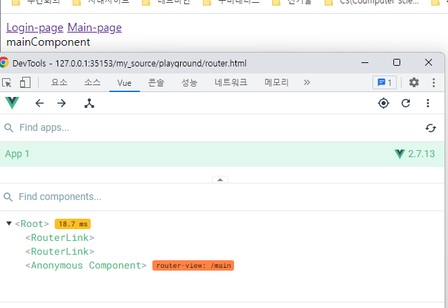

### 준비물 
- Chrome / Vscode / Node.js LTS Version / [Chrome Extension -  Vue.js_devtools](https://chrome.google.com/webstore/detail/vuejs-devtools/nhdogjmejiglipccpnnnanhbledajbpd/related?hl=ko)

- 수업자료사이트 : https://joshua1988.github.io/vue-camp/textbook.html
---

### Vscode 추천 Extension

- [Vetur](https://marketplace.visualstudio.com/items?itemName=octref.vetur)
- [Live Server - Five Server](https://marketplace.visualstudio.com/items?itemName=ritwickdey.LiveServer)
- [Vue Language Features (Volar)](https://marketplace.visualstudio.com/items?itemName=Vue.volar)
- [Vue Preview](https://marketplace.visualstudio.com/items?itemName=SimonSiefke.vue-preview) : .vue 파일만 됨.
- [Pretty console log](https://marketplace.visualstudio.com/items?itemName=SpeedConsoleLogBuiTruyen3.pretty-console-log) : ctrl + alt + x

---

## Vue Intro

- Vue.js 는 MVVM 패턴 ( Model - View Model - View)
- 기존의 개발패턴
  
  - 일일이 다시 넣어줘야됨

- 그런데 Vue에서는 다음과 같은 원리-**Reactivity**([Object.defineProperty](https://developer.mozilla.org/en-US/docs/Web/JavaScript/Reference/Global_Objects/Object/defineProperty))로 동작함
  ```javascript
  var div = document.querySelector("#test");
  
  var viewModel = {};
  Object.defineProperty(viewModel, 'str', {
      // 속성에 접근 했을 때의 동작을 정의
      get: function (){
          console.log("접근");
      },
      // 속성에 값을 할당 했을 때의 동작을 정의
      set : function (newValue){
          console.log("할당",newValue);
          div.innerHTML = newValue;
      }
  });
  ```
  

## Reactivity 를 Library 화

- [IIFE(즉시실행함수)](https://developer.mozilla.org/ko/docs/Glossary/IIFE) 를 이용
    ```javascript
    // IIFE 를 이용
    (function(){
        function init() {
            Object.defineProperty(viewModel, 'str', {
            // 속성에 접근 했을 때의 동작을 정의
                get: function (){
                    console.log("접근");
                },
                // 속성에 값을 할당 했을 때의 동작을 정의
                set : function (newValue){
                    console.log("할당",newValue);
                    render(newValue);
                }
            });
        }
        
        function render(newValue) {
            div.innerHTML = newValue;
        }
        
        init();
    })();
    ```
    
---

## Vue 기초

- 
  - 즉 data 에 위에서 만든 것과 같은 게 이미 정의되어 있음.
  
- Vue Instance
  ```javascript
    var vm = new Vue({
        // el : dom 객체 찾아서 ViewModel 과 연결하겠다.
        el: '#app2',
        data: {
        message: 'Hi'
        }
    })
  ```
- 암묵적으로 [function](https://developer.mozilla.org/ko/docs/Web/JavaScript/Reference/Global_Objects/Function) 변수의 첫글자가 대문자이면 생성자 함수이다.
    

- 그런데 왜 [생성자함수](https://developer.mozilla.org/ko/docs/Web/JavaScript/Reference/Global_Objects/Object/constructor)(Vue) 를 쓸까?
    
    - 이렇게 재활용가능하니까

- View Component :화면의 영역을 구분하여 개발할 수 있는 뷰의 기능으로 코드의 재사용성이 올라가고 빠르게 화면을 제작가능.
    
    ```javascript
    // 전역 등록방법
    //Vue.Component('컴포넌트 이름', 컴포넌트내용);
    <div id="app">
        <app-header></app-header>
        <app-content></app-content>
    </div>

    <script src="https://cdn.jsdelivr.net/npm/vue/dist/vue.js"></script>
    <script>
        Vue.component('app-header', {
            template: '<h1>Header</h1>'
        });  

        Vue.component('app-content', {
            template: '<div>content</div>'
        });

        new Vue({
            el: '#app',
        });
    </script>
    ```

    - 그런데 지역컴포넌트 방법을 가장 많이 사용함.
    ```javascript
    new Vue({
        el: '#app',
        // 지역 컴포넌트 등록
        components: {
            'app-footer' : { 
                template : '<div>footer</div>'
            },
        }
    });
    ```
    - 지역컴포넌트 방식을 활용하면 실제 컴포넌트가 어떤게 들어가는지 바로 확인 가능하다.
    - 그런데 라이브러리 형식일 땐 전역컴포넌트 방식을 많이 쓰는 편이다.
---
## Component 통신

- 상위에서 하위 : [props](https://joshua1988.github.io/vue-camp/vue/props.html)
- 하위에서 상위 : [Event emit](https://joshua1988.github.io/vue-camp/vue/event-emit.html)
- 이 방향으로만 가능함. 트리구조로 되어 있어서  크로스로 가로지르기가 안됨.
  

  - Props : 상위에서 내려주는 정보
  ```html
  <div id="app">
      <!-- <app-header v-bind:프롭스속성이름="상위 컴포넌트의 데이터이름"></app-header> -->
      <app-header v-bind:propsdata="message"></app-header>
  </div>
  
  <script>
      var appHeader = {
          template : '<h1>{{propsdata}}</h1>',
          props : ['propsdata']
      }
      new Vue({
          el : '#app',
          components : {
              'app-header' : appHeader
          },
          data : {
              message : 'hi'
          }
      })
  </script>
  ```
  
  - Reactivity 가 자동적으로 적용되어 있음.

  - event-emit
    ```html
    <script src="https://cdn.jsdelivr.net/npm/vue/dist/vue.js"></script>
    <div id="app">
        <!-- <app-header v-on:하위컴포넌트에서 발생한 이벤트 이름="상위 컴포넌트의 메서드 이름"></app-header> -->
        <app-header v-on:pass이벤트="logText"></app-header>
        <app-content v-on:add_num="addDataNum"></app-content>
        <app-footer v-bind:click_num="num"></app-footer>
    </div>

    <script>
        var appHeader = {
            template : '<button v-on:click="passEvent">click me </button>',
            methods : {
                passEvent : function() {
                    this.$emit('pass이벤트');
                }
            }
        }

        var appContent = {
            template : '<button type="button" v-on:click="addNumber">add</button>',
            methods: {
                addNumber : function() {
                    this.$emit('add_num');
                }
            }
        }
        
        new Vue({
            el : '#app',
            components : {
                'app-header' : appHeader,
                'app-content' : appContent,
                'app-footer' : {
                    template : '<div>{{ click_num }}</div>',
                    props : [ 'click_num' ]
                }
            },
            methods : {
                logText : function(e) {
                    console.log('hi',e)
                },
                addDataNum : function() {
                    ++this.num;
                }
            },
            data : {
                num : 10
            }

        });
    </script>
    ``` 

> 그런데 여기서 문제점이 생기는 부분이 있는데 그게 바로..
> ## v-on 처럼 적는 애가 Attribute 이기 때문에 **대소문자가 구별이 안된다**는 것이다.

- 그리고 웃긴건 왜 `this` 가 가능하냐라는건데..
  ```javascript
  new Vue({
    ...
    methods : {
        ...,
        addDataNum : function() {
            ++this.num;
        }
        ...,
    },
    ...
  });
  ```
  
  - 이건되는데...
  - 사실은 이렇단 말이죠..
  
  - 그래서 그냥 Vue() 생성자에서 자동으로 넣어준다고 생각하자

  
  - 머리가 아프다;;;
---
## 동등한 레벨(상위가 같은) 간 컴포넌트 통신


```javascript
<script src="https://cdn.jsdelivr.net/npm/vue/dist/vue.js"></script>
<div id="app">
    {{ str }}
    <app-header v-bind:header_value="passValue"></app-header>
    <app-content v-on:pass="updatePassValue"></app-content>
</div>

<script>
    var appHeader = {
        template: `<div>{{ header_value }}</div>`,
        props : [ 'header_value' ]
    }

    var appContent = {
        template: `
        <div>
            appContent
            <button v-on:click="tossValue">pass</button>
        </div>
        `,
        methods : {
            tossValue : function() {
                this.$emit('pass',10)
            }
        }
    }

    new Vue({
        el : '#app',
        data : {
            str: 'hi',
            passValue : 0
        },
        components : {
            'app-header' : appHeader,
            'app-content' : appContent
        },
        methods : {
            updatePassValue : function (...value) {
                this.passValue = value[0]
            }
        }
    })

</script>
```
- 참 번거로운데...


## Vue Router
- 라이브러리인데..
- [공식문서](https://v3.router.vuejs.org/) / [참고자료 사이트문서](https://joshua1988.github.io/vue-camp/vue/router.html#%E1%84%87%E1%85%B2-%E1%84%85%E1%85%A1%E1%84%8B%E1%85%AE%E1%84%90%E1%85%A5-%E1%84%89%E1%85%A5%E1%86%AF%E1%84%8E%E1%85%B5) 를 확인하자
- CDN : 
    ```javascript
    <script src="https://cdn.jsdelivr.net/npm/vue@2/dist/vue.js"></script>

    <script src="https://unpkg.com/vue-router@3.5.3/dist/vue-router.js"></script>
    ```
- 기초 예제코드
```javascript
    <div id="app">
        <router-view></router-view>
    </div>

    <script src="https://cdn.jsdelivr.net/npm/vue@2/dist/vue.js"></script>
    <script src="https://unpkg.com/vue-router@3.5.3/dist/vue-router.js"></script>

    <script>
        var loginComponent = {
            template : '<div>login</div>'
        }
        
        var mainComponent = {
            template : '<div>mainComponent</div>'
        }

        var myRouter = new VueRouter({
            // 페이지의 라우팅 정보
            routes : [
               {
                    // 페이지의 url 
                    'path' : '/login',
                    // 해당 페이지에서 보여질 컴포넌트
                    'component' : loginComponent
                },
               {'path': '/main', 'component': mainComponent}
            ]
        });

        new Vue({
            el : '#app',
            router : myRouter
        });
    </script>
```


- 그런데 이렇게 까지 쓰면 애매하니까 링크방식도 하자.
```html
<div id="app">
    <div>
        <router-link to="/login">Login-page</router-link>
        <router-link to="/main">Main-page</router-link>
    </div>
    <!-- router-view 는 라우터로 불러오는 Component 가 뿌려지는 영역-->
    <router-view></router-view>
</div>
```
