### Vue에서 사용하는 라이브러리

- Vue Resource 깃헙 주소[예전] :  https://github.com/pagekit/vue-resource
- 그런데 좀 오래됐을 수 있으니 조심
- [Axios](https://github.com/axios/axios) : Promise 기반 비동기 HTTP
  
- [JSONPlaceHolder](https://jsonplaceholder.typicode.com/) : 샘플데이터가 많음
  ```javascript
  axios.get('https://jsonplaceholder.typicode.com/users')
    .then(response => response.json())
    .then(json => console.log(json))
  ```
- Axios 연계 코드
    ```javascript
    <div id="app">
        <button v-on:click="getData">get user</button>
        <div>
          {{ users }}
        </div>
    </div>

    <script src="https://cdn.jsdelivr.net/npm/vue/dist/vue.js"></script>
    <script src="https://unpkg.com/axios/dist/axios.min.js"></script>
    <script>
        var myApp = new Vue({
        el : '#app',
        methods : {
            getData : () => {
                console.log(myApp)
                axios.get('https://jsonplaceholder.typicode.com/users')
                .then(response => { 
                    console.log(response)
                    myApp.users = response.data
                })
            }
        },
        data : {
            users : []
        }
        })
    </script>
    ```

- HTTP 프로토콜 설명 : https://joshua1988.github.io/web-development/http-part1/
- Google Chrome 개발자도구 : https://developer.chrome.com/docs/devtools/

### Vue Template 문법

- 데이터 보여주기
    ```javascript
    new Vue({
        ...
        data: {
            message : 'hello world',
            show : false,
        }
        ...
    });

    // 데이터 바인딩
    <div>{{ message }}</div>
    // 디렉티브 방식 [attribute 가  v-~~~~ ] 일 때
    <div>
        <span v-if="show">show is true</span>
    </div>
    ```

- computed 속성인데 이걸 화살표 함수 사용하려니까 뭔가 이상하네..
```javascript
<div id="app">
    <p>{{ num }}</p>
    <p>{{ doubleNum }}</p>

</div>
<script src="https://cdn.jsdelivr.net/npm/vue/dist/vue.js"></script>
<script>
    var myApp = new Vue({
        el : '#app',
        data : {
            num : 10,
        },
        computed : {
            doubleNum : (myApp) => myApp._data.num * 2
        }
    });
</script>
```

- 디렉티브를 활용해서 이런 것도 됨
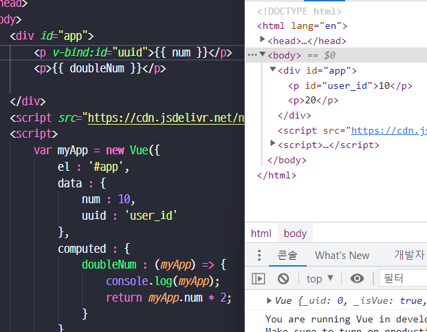
- v-if / v-else
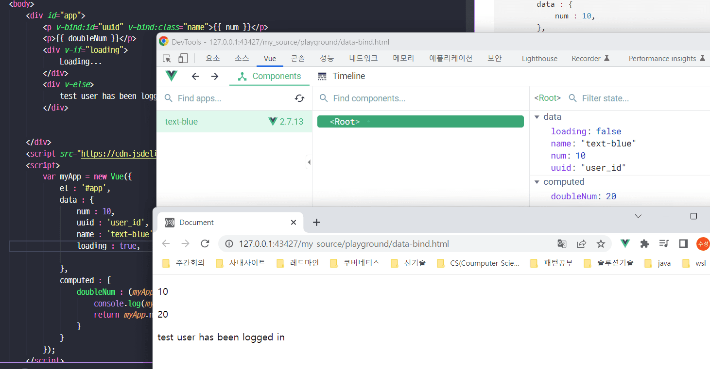
- v-if  vs v-show
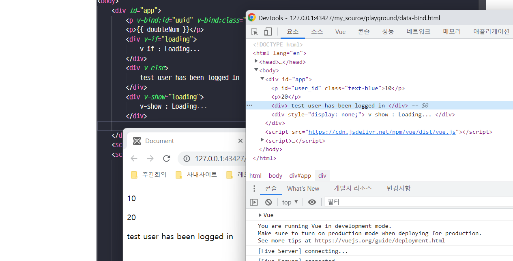
    - v-if 는 DOM 자체를 삭제, v-show 는 `display :none` 처리

- `v-model` 적용
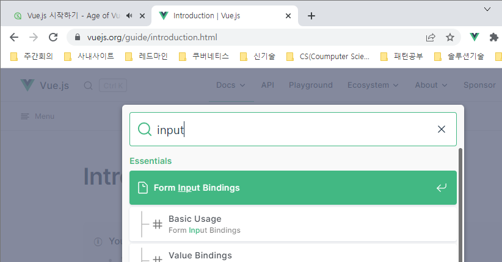
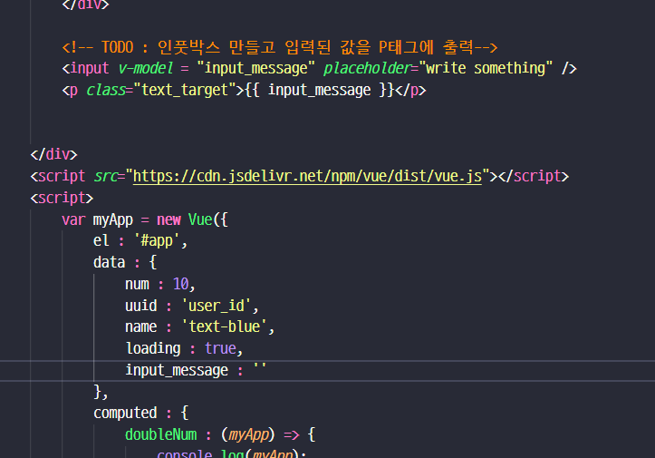


### v-on 확인해보기
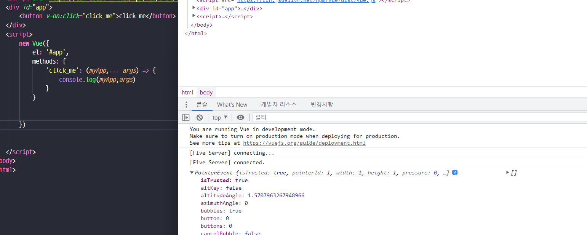
- 이번에는 myApp 이 아니네?
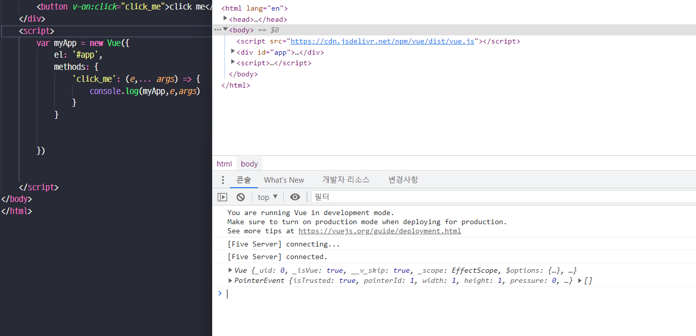
- 그래서 수정함

- 예약어 같은 것도 있음 `v-on:keyup.enter`
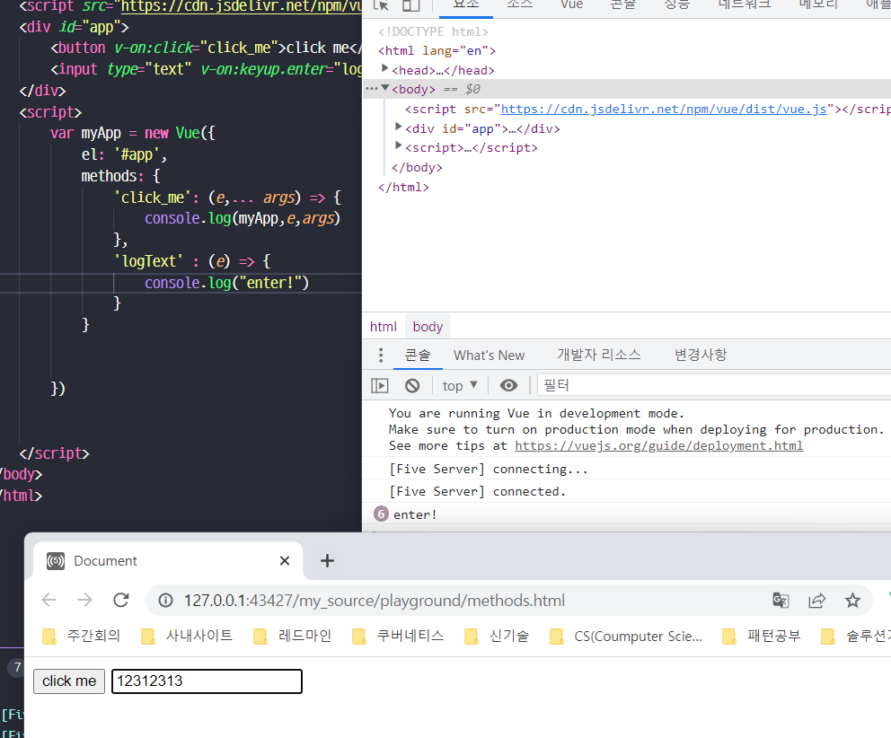

### watch 속성알아보기
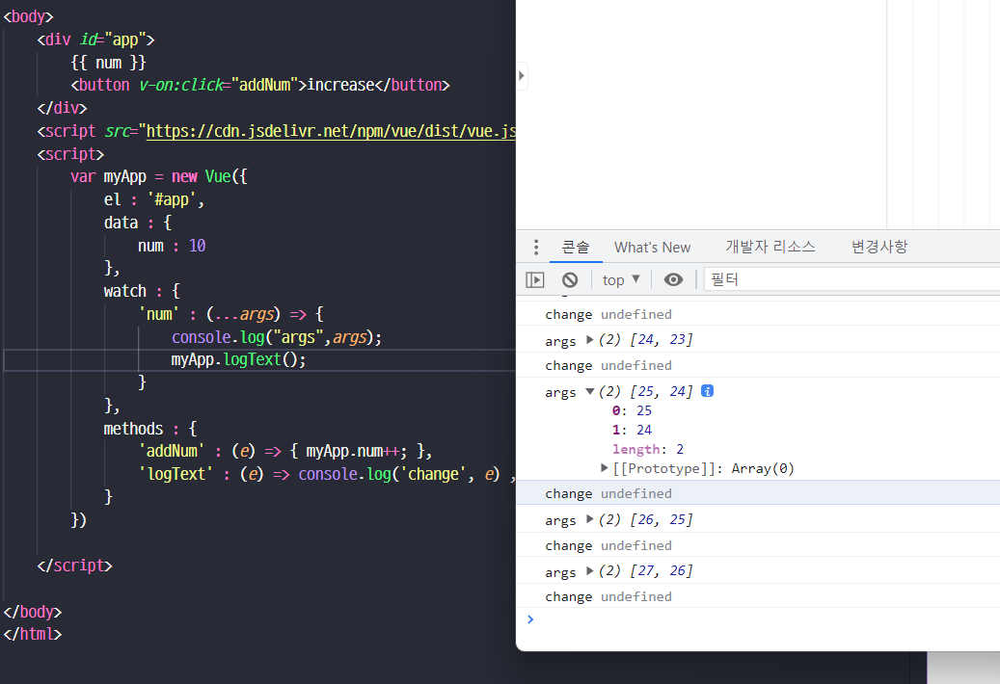
- watch 에 [ 바뀐 값, 이전 값 ] 정보가 들어옴.

- 그럼 computed랑은 [무엇이 다를까?](https://vuejs.org/guide/essentials/computed.html#ad)
  - computed : validation 등 매순간 가벼운 계산
  - watch : 매번 실행하기에는 부담스러운 계산

### computed 활용
```html
<style type="text/css">
    .warning { color : red; font-weight : bold }
    .blue-text { color : blue; font-weight : bold }
</style>
<script src="https://cdn.jsdelivr.net/npm/vue/dist/vue.js"></script>

<div id="app">
    <!--              클래스 이름 : 조건변수              -->
    <!-- <p v-bind:class="{ warning: isError }">Hello</p>  -->
    <p v-bind:class="errorTextColor">Hello</p>
</div>
<script>
    new Vue({
        el : '#app',
        data : {
            cname : 'blue-text',
            isError: false
        },
        computed : {
            errorTextColor : (that) => {
                return that.isError ? 'warning' : that.cname;
            }
        }
    })
</script>
```


### Vue CLI
- 공식문서 : https://cli.vuejs.org/
- 버젼확인
    ```shell
    # node v10+ / npm v6+
    npm install -g @vue/cli
    # OR
    yarn global add @vue/cli
    # 설치후 /home/ecsuser/.nvm/versions/node/v18.12.0/bin/ 가 경로에 들어가지 있지 않아서
    # 환경변수 추가 함
    vue --version
    # @vue/cli 5.0.8
    ```

- 2 / 3 버젼이상 명령어 차이점
```shell
# Vue Cli 2.x
vue init '프로젝트 템플릿유형' '프로젝트 폴더위치'
# Vue Cli v3++
vue create '프로젝트 폴더위치'
```

- 서비스 깔기
```shell
vue create '이름'
> vue2 > yarn 으로 설치함.

# $ cd vue-cli-first-project
# $ yarn serve
```

- main.js 확인
```vue.js
import Vue from 'vue'
import App from './App.vue'

Vue.config.productionTip = false

// new Vue({
//   el: '#app',
//   render : h => h(App)
// })

new Vue({
  render: h => h(App),
}).$mount('#app')
```

### Single File Component
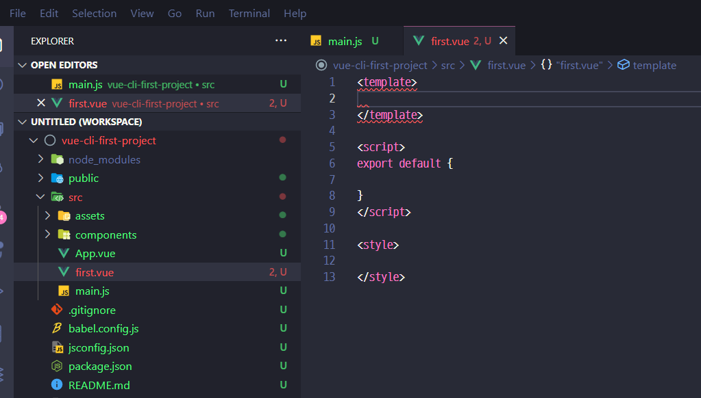
- 기본 포맷

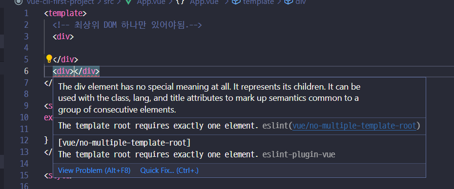
- 최상위에는 하나마 있어야됨.
- data 정의법도 틀려짐
    ```javascript
    export default {
        data : () => {
            return {
            str : 'hi'
            }
        }
    }
    ```

- Component 이름은 최소한 두단어, CamelCase 로 해주는게 원래 기본 DOM과 구별하기 좋음

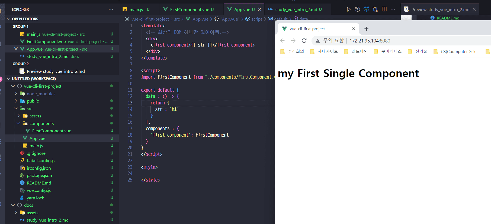
- 이렇게 붙이면 되는데 음.. str 내용이 덮어씌워지는구나

- Props로 데이터 내리기
    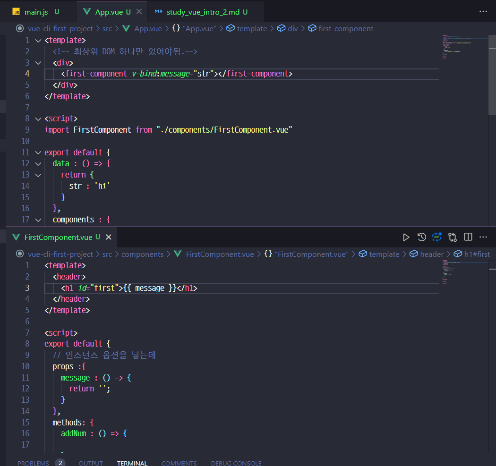
    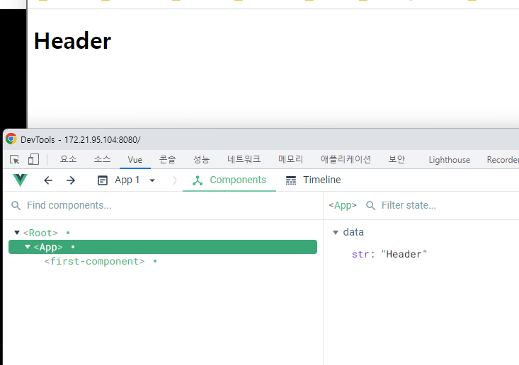

- event-emit 으로 이벤트 보내기인데 뭔가 불만족..
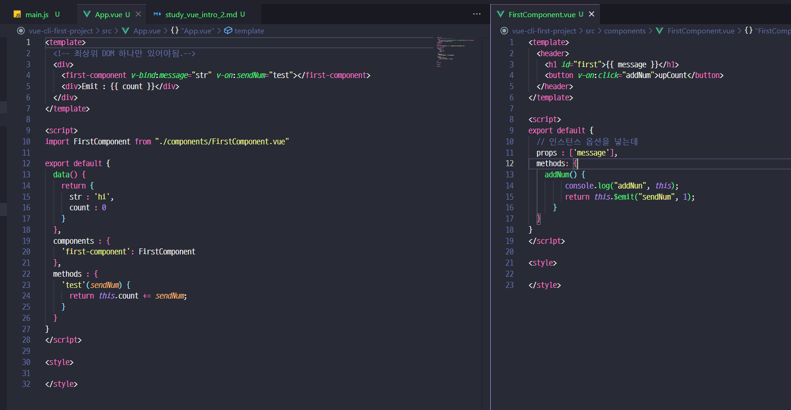


### Form 으로 전송해보는거 만들어보기
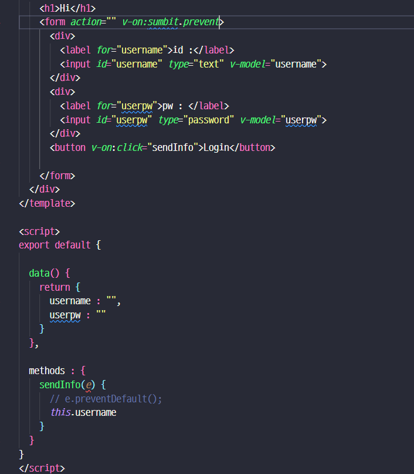
- `<form v-on:submit.prevent>`를 쓰면 e.preventDefault() 안써도 됨

- axios 설치 `yarn add axios`
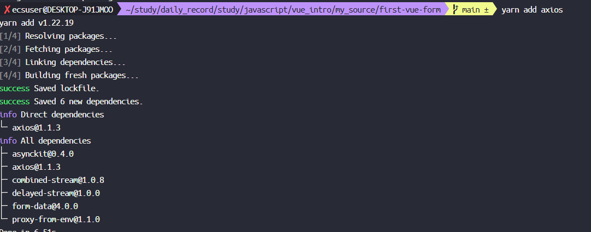

```javascript
// App.vue 전체
<template>
  <div>
    <h1>Hi</h1>
    <form action="" v-on:submit.prevent>
      <div>
        <label for="username">id :</label>
        <input id="username" type="text" v-model="username">
      </div>
      <div>
        <label for="userpw">pw : </label>
        <input id="userpw" type="password" v-model="userpw">
      </div>
      <button v-on:click="sendInfo">Login</button>

    </form>
  </div>
</template>

<script>
import axios from 'axios';

export default {
  data() {
    return {
      username : "",
      userpw : ""
    }
  },
  
  methods : {  
    sendInfo() {
      var url = "https://jsonplaceholder.typicode.com/users";
      var data = {
        "username": this.username ,
        "password": this.userpw
      }

      axios.post( url, data )
        .then( (resp) => console.log(resp) )
        .catch( (err) => console.log(err) )
    }
  }
}
</script>

<style>

</style>
```


### 더 읽어볼 자료
- EVENT-BUS : https://ryuhojin.tistory.com/35
- Pinia 읽어볼 자료 : https://eggplantiny.github.io/blog/articles/pinia-a-new-statement-manage-plugin/
