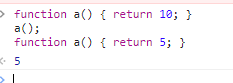
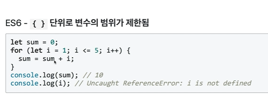
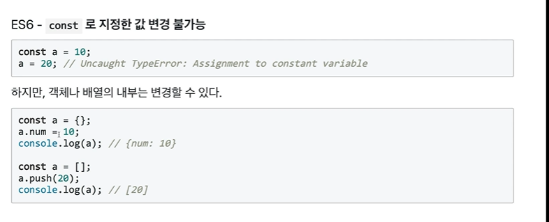
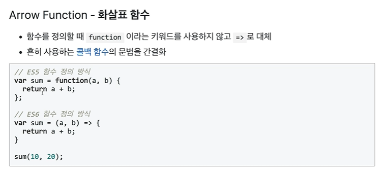
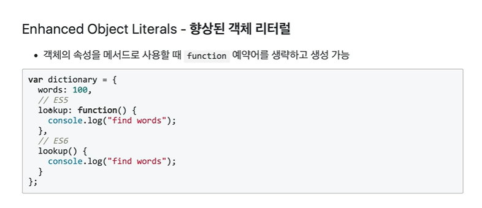
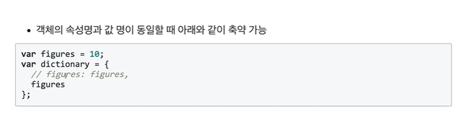
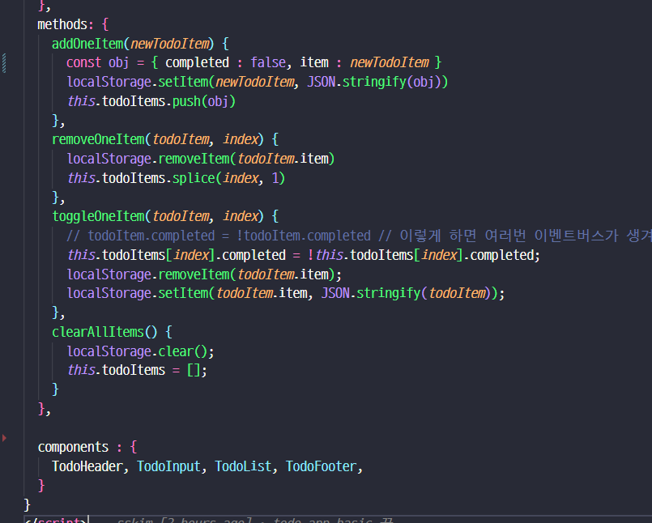

### 유용한 링크
- 바벨 web-editor : https://babeljs.io/repl/

### Const & let
- ES5 에서는 블록 상관없이 스코프가 결정되어졌음
    - Hoisting 문제가 발생하는데, 함수선언식-function statement `function name() {}` / 변수 `var` 를 위한 공간(메모리)이 먼저 확보된다. 
    
    - 함수표현식-function expression 은 `var sum = function() { ... }` 
---

- 하지만 ES6에서는 기본적으로 블록`{}` 단위로 변수의 범위가 제한됨
- const : 재할당을 제한하는 변수 / let : 다시 선언이 안되는 변수

### Arrow Function

- 그런데 vue.js 에서 화살표 함수는 많은 문제가 있다...
  - https://ddolcat.tistory.com/1670
  - https://stackoverflow.com/questions/42971081/use-arrow-function-in-vue-computed-does-not-work\
  - https://diqmwl-programming.tistory.com/116
  - 거지같은.. this

### Enhanced Object Literals 

### Modules
- export / import
- modules 는 호출되기전에 코드실행, 동작하지 않음.
