### Vuex 를 사용해보자.
- 그런데 요즘은 [pinia](https://pinia.vuejs.org/) 라던데;;;
- [React의 Flux 패턴](https://medium.com/hcleedev/web-react-flux-%ED%8C%A8%ED%84%B4-88d6caa13b5b)
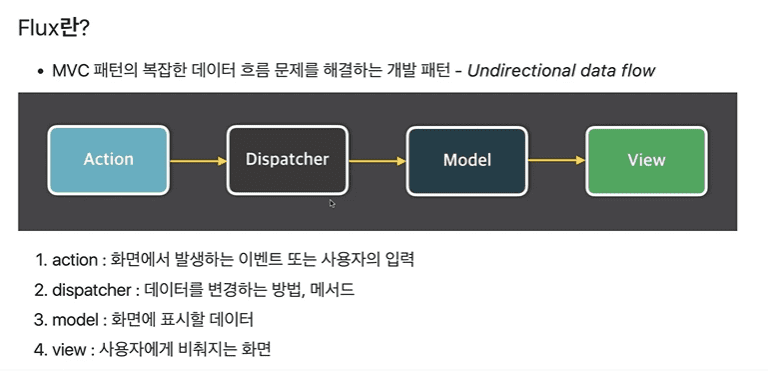 : 단방향 패턴의 데이터 흐름
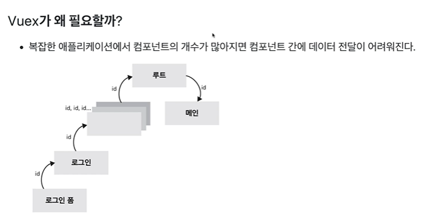

- https://vuex.vuejs.org/#what-is-a-state-management-pattern 확인해보자
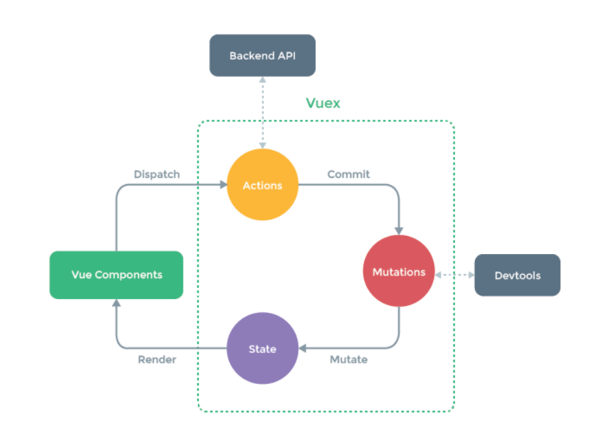

- https://joshua1988.github.io/web-development/vuejs/vue3-as-default/

- 설치 : https://blog.vuejs.org/posts/vue-3-as-the-new-default.html
```shell
# vue 2.x 버젼용 설치
npm i vue@2.6.14
npm i vue-router@3.5.3
npm i vuex@3.6.2

#### package.json
#   "dependencies": {
#     "core-js": "^3.8.3",
#     "vue": "^2.6.14",
#     "vue-router": "^3.5.3",
#     "vuex": "^3.6.2"
#   },
```
- 디렉토리 생성
  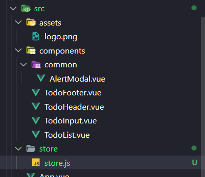

- 등록코드
```javascript
// src/store/store.js
import Vue from 'vue'
import Vuex from 'vuex'

// 글로벌 하게 쓸 plugin 을 등록함.
Vue.use(Vuex);

export const store = new Vuex.store({

});


// src/main.js
import Vue from 'vue'
import App from './App.vue'
import { store } from './store/store'

Vue.config.productionTip = false

new Vue({
  render: h => h(App),
  store
}).$mount('#app')
```

### Vuex 기술요소
- state : 여러 컴포넌트에 공유되는 데이터 `data`
  - `this.$store.state.~~~~` 로 접근
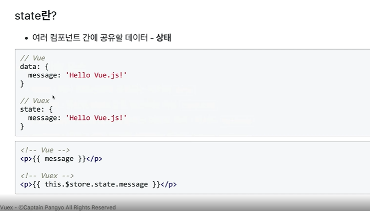
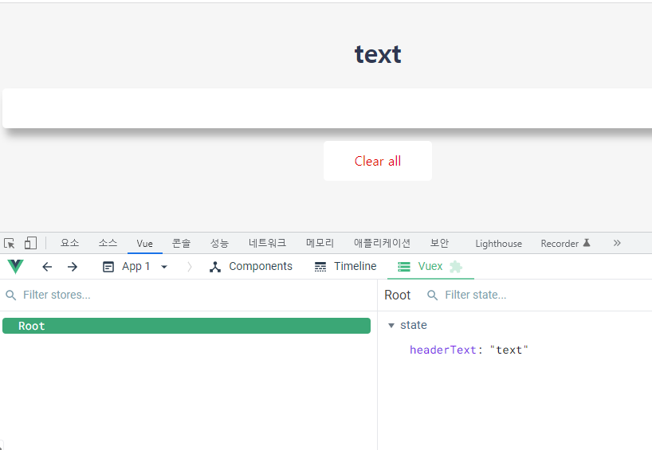


- getters : 연산된 state 값을 접근하는 속성 `computed`
  - `this.$store.getters.~~~~` 로 접근
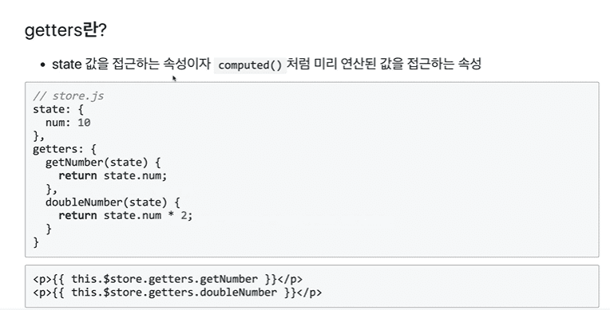
- mutations : state 값을 변경하는 유일한 방법의 이벤트 로직-메소드 `methods`
  - `this.$store.commit('mutations-function이름', ...파라미터)` 으로 동작함
  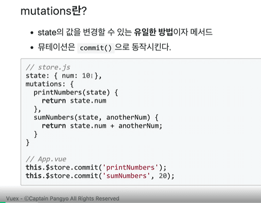
  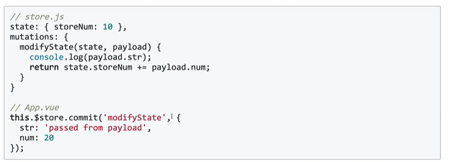
  - 연습삼아 addTodo 부분만 적용
```javascript 
// app.vue
<template>
  <div id="app">
      <TodoHeader></TodoHeader>
      <!-- v:on 삭제-->
      <TodoInput></TodoInput>
      <TodoList v-bind:todolist="todoItems" 
        v-on:removeTodoEvent="removeOneItem" v-on:toggleTodoEvent="toggleOneItem"></TodoList>
      <TodoFooter v-on:clearAllEvent="clearAllItems"></TodoFooter>
  </div>
</template>
// methods 부분에서 add 삭제
  methods: {
    removeOneItem(todoItem, index) {
      localStorage.removeItem(todoItem.item)
      this.todoItems.splice(index, 1)
    },
    toggleOneItem(todoItem, index) {
      // todoItem.completed = !todoItem.completed // 이렇게 하면 여러번 이벤트버스가 생겨서 안티패턴
      this.todoItems[index].completed = !this.todoItems[index].completed;  
      localStorage.removeItem(todoItem.item);
      localStorage.setItem(todoItem.item, JSON.stringify(todoItem));
    },
    clearAllItems() {
      localStorage.clear();
      this.todoItems = [];
    }
  },

//// TodoInput.vue
<script>
import AlertModal from "./common/AlertModal.vue"

export default {
  data() {
    return {
      newTodoItem: "",
      showModal : false
    }
  },
  methods : {
    addTodo(){
      if(!this.newTodoItem) { 
        this.showModal = true;
        return;
      }
      // this.$emit("addTodoEvent",this.newTodoItem); 을 아래처럼 고침
      this.$store.commit("addTodoEvent",this.newTodoItem);
      this.clearInput()
    },
    clearInput() {
      this.newTodoItem = ''
    },
  },
  components: {
    AlertModal
  }
}
</script>

/// store.js
import Vue from 'vue'
import Vuex from 'vuex'

// 글로벌 하게 쓸 plugin 을 등록함.
Vue.use(Vuex);

const storage = {
    // app.vue에 있던 create() 를 옮김
    fetch() {
        const arr = [];
        if(localStorage.length > 0) {
          Object.keys(localStorage).forEach(function(key){
            arr.push( JSON.parse(localStorage.getItem(key)) )
          });
        }
        return arr;
      },
}


export const store = new Vuex.Store({
    state: {
        headerText : "TODO-IT!",
        // 처음 페이지 생성시 초기값 셋팅
        todoItems : storage.fetch()
    },
    getters: {
    },
    mutations: {
        // addTodoEvent 발생!
        addTodoEvent(state, newTodoItem) {
            const obj = { completed : false, item : newTodoItem }
            localStorage.setItem(newTodoItem, JSON.stringify(obj))
            state.todoItems.push(obj)
        },
    }
});
```

- actions : 비동기 처리로직을 선언하는 메소드 `async methods`
  - `this.$store.dispatch('이름',{})` 으로 호출  
  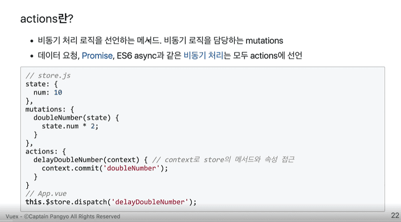
  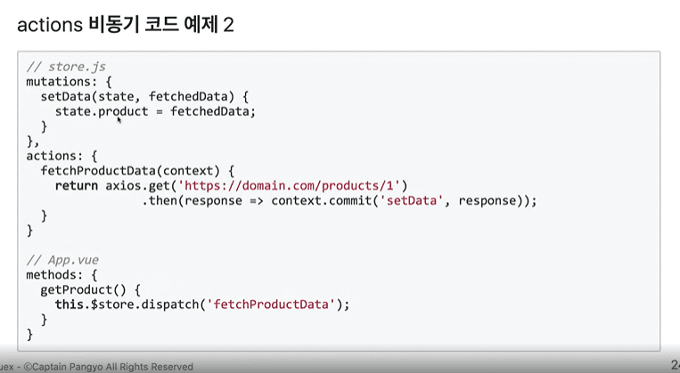
  - 첫번재 인자를 확인해보자 -> `context`

### 왜 바로 접근안하고 Mutations 를 쓰냐? & 왜 Action이 필요한가
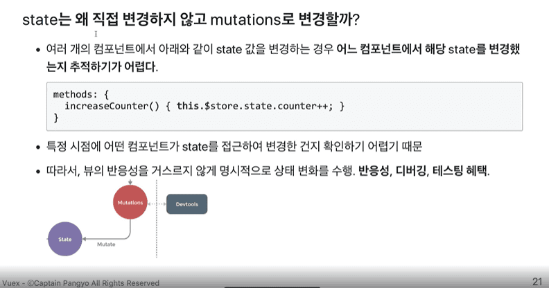
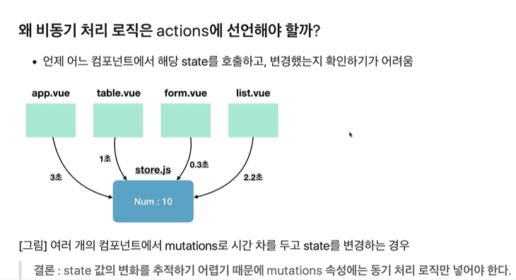
- 결국 프레임워크라는게 하나의 흐름을 만들어서 쓰자는건데
- 거기에 맞춰서 작업해주는 것이 나중에 파악하기 쉬워진다.

### Vuex 쉽게 사용하기

- Helper 함수 : 4가지 상태를 쉽게 사용
  - state(date) -> mapState
  - getters(computed) -> mapGetters
  - mutations(methods) -> mapMutations
  - actions(async methods) -> mapActions
  ```javascript
  import { mapState, mapGetters, mapMutations, mapActions } from 'vuex'

  export default {
    coumputed() { ...mapState(['num']), ...mapGetters(['countedNum']) }
    methods() { ...mapMutations(['clickBtn']), ...mapActions(['fetchData']) }
  }
  ```
  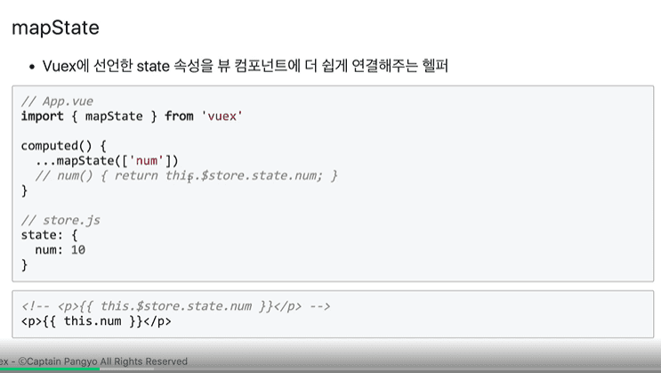
  - 왜 그럼 위 헬퍼함수들을 Spread 시키냐고 하면..

  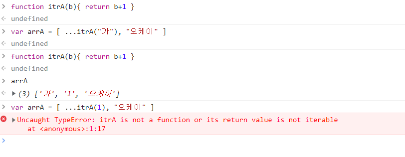
    - 이렇게 활용 할수 있으니까..
    - 위 사례처럼 직접 출력결과값( Iterable한 Data, Function)을 할당하기 위함
    - [좀더 읽어볼 자료](https://tenmilesquare.com/resources/software-development/understanding-mapgetters-in-vuex/)
    ```javascript
    // TodoList.vue
    <template>
      <div>
        <transition-group name="list" tag="ul">
          
          <li v-for="(todoItem, index) in this.getTodoItems" v-bind:key="todoItem.item" class="shadow">
            <i class="checkBtn fas fa-check" 
              v-bind:class="{checkBtnCompleted: todoItem.completed}" 
              v-on:click="toggleComplete({todoItem, index})"></i>
            <span v-bind:class="{textCompleted: todoItem.completed}">{{ todoItem.item }}</span>
            <span class="removeBtn" 
              v-on:click="removeTodo({todoItem, index})">
              <i class="fas fa-trash-alt"></i>
            </span>
          </li>

        </transition-group>
      </div>

    </template>

    <script>
    import { mapGetters, mapMutations } from 'vuex'

    export default { 

      methods : { 
        ...mapMutations({
          'toggleComplete' : 'toggleTodoEvent'
        }),
        // toggleComplete({todoItem, index}){ 
        //   this.$store.commit("toggleTodoEvent", {todoItem, index})
        // },
        ...mapMutations({
          'removeTodo' : 'removeTodoEvent'
        }),
        // removeTodo(todoItem, index){ 
        //   this.$store.commit("removeTodoEvent", {todoItem, index}) 
        // } 
      },

      computed: { ...mapGetters(
        // ['storeTodoItems'] 이름 같이 쓸때 
        {'getTodoItems' : 'storeTodoItems'} // 다르게 쓸때
      )
        
      }
    }
    </script>
    ```

    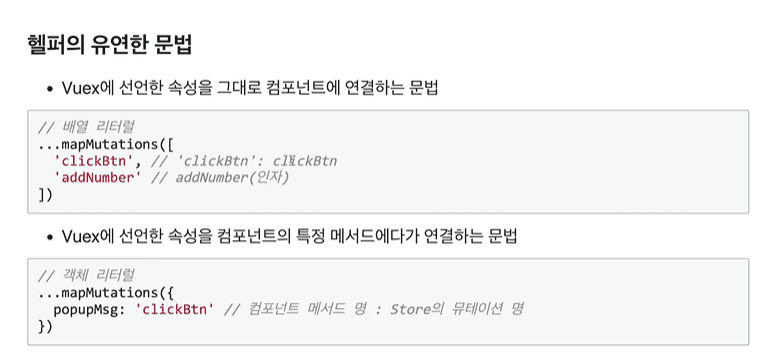
