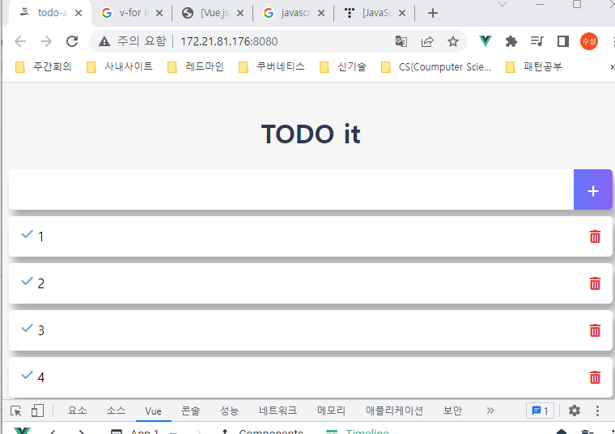
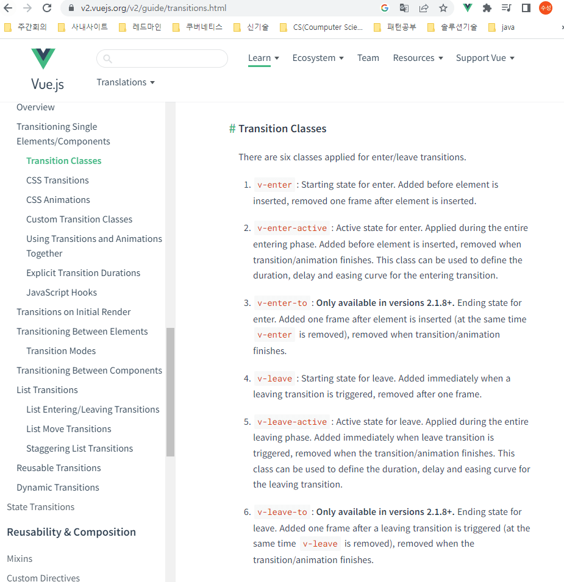

### 기존의 문제 
- `git tag` `todo-app-basic-completed` 의 상태

    

- 변경 방향
    
  -  APP Vue : Container
  -  그외 Vue : presentational 
  -  읽어볼 자료 : https://kyounghwan01.github.io/blog/React/container-presenter-dessign-pattern/


### App으로 todoItems 옮기기

```javascript 
// App.vue
<template>
  <div id="app">
      <TodoHeader></TodoHeader>
      <TodoInput></TodoInput>
      <TodoList v-bind:todolist="todoItems" ></TodoList>
      <TodoFooter></TodoFooter>
  </div>
</template>

export default {
  data() {
    return {
      todoItems : []
    }
  },
  created() {
    if(localStorage.length > 0) {
      const that = this
      Object.keys(localStorage).forEach(function(key){
        that.todoItems.push( JSON.parse(localStorage.getItem(key)) )
      });
    }
  },
  components : {
    TodoHeader, TodoInput, TodoList, TodoFooter,
  }
}
</script>

// TodoList.vue
<template>
  <div>
    <ul>
      <li v-for="(todoItem, index) in todolist" v-bind:key="todoItem.item" class="shadow">
        <i class="checkBtn fas fa-check" v-bind:class="{checkBtnCompleted: todoItem.completed}" 
          v-on:click="toggleComplete(todoItem, index)"></i>
        <span v-bind:class="{textCompleted: todoItem.completed}">{{ todoItem.item }}</span>

        <span class="removeBtn" v-on:click="removeTodo(todoItem, index)">
          <i class="fas fa-trash-alt"></i>
        </span>
      </li>
    </ul>
  </div>
</template>

<script>
export default {
  props : ["todolist"],
  methods : {
    toggleComplete(todoItem, index){
      console.log(todoItem, index)
      todoItem.completed = !todoItem.completed
      localStorage.removeItem(todoItem.item);
      localStorage.setItem(todoItem.item, JSON.stringify(todoItem));
    },
    removeTodo(todoItem, index) {
      localStorage.removeItem(todoItem.item)
      this.todoItems.splice(index, 1)
    }
  }
}
</script>

```

### App에 addTodo Event 만들기
```javascript
// App.vue
    <template>
    <div id="app">
        <TodoHeader></TodoHeader>
        <TodoInput v-on:addTodoEvent="addOneItem"></TodoInput>
        <TodoList v-bind:todolist="todoItems" ></TodoList>
        <TodoFooter></TodoFooter>
    </div>
    </template>

    // script
    methods: {
        addOneItem(newTodoItem){
        var obj = { completed : false, item : newTodoItem }
        localStorage.setItem(newTodoItem, JSON.stringify(obj))
        this.todoItems.push(obj)
        },
    },

// TodoInput.vue
<template>
  <div class="inputBox shadow"> 
    <input type="text" v-model="newTodoItem" v-on:keyup.enter="addTodo"/>
    <span class="addContainer" v-on:click="addTodo">
      <i class="fas fa-plus addBtn"></i>
    </span>
  </div>
</template>

<script>
export default {
  data() {
    return {
      newTodoItem: ""
    }
  },
  methods : {
    addTodo(){
      // 널체크 하고
      if(!this.newTodoItem) { return;}
      // 이벤트만 보낸다.
      this.$emit("addTodoEvent",this.newTodoItem);
      this.clearInput()
    },
    clearInput() {
      this.newTodoItem = ''
    }
  }
}
</script>
```

- 바로바로 추가됨


### App 할일 지우기 && 완료 처리하기
```javascript
// App.vue
<template>
  <div id="app">
      <TodoHeader></TodoHeader>
      <TodoInput v-on:addTodoEvent="addOneItem"></TodoInput>
      <TodoList v-bind:todolist="todoItems" 
        v-on:removeTodoEvent="removeOneItem" v-on:toggleTodoEvent="toggleOneItem"></TodoList>
      <TodoFooter></TodoFooter>
  </div>
</template>

  // script
  methods: {
    addOneItem(newTodoItem) {
      var obj = { completed : false, item : newTodoItem }
      localStorage.setItem(newTodoItem, JSON.stringify(obj))
      this.todoItems.push(obj)
    },
    removeOneItem(todoItem, index) {
      localStorage.removeItem(todoItem.item)
      this.todoItems.splice(index, 1)
    },
    toggleOneItem(todoItem,index) {
      // todoItem.completed = !todoItem.completed // 이렇게 하면 여러번 이벤트버스가 생겨서 안티패턴
      this.todoItems[index].completed = !this.todoItems[index].completed;  
      localStorage.removeItem(todoItem.item);
      localStorage.setItem(todoItem.item, JSON.stringify(todoItem));
    }
  },

// TodoList.vue

<template>
  <div>
    <ul>
      <li v-for="(todoItem, index) in todolist" v-bind:key="todoItem.item" class="shadow">
        <i class="checkBtn fas fa-check" v-bind:class="{checkBtnCompleted: todoItem.completed}" 
          v-on:click="toggleComplete(todoItem, index)"></i>
        <span v-bind:class="{textCompleted: todoItem.completed}">{{ todoItem.item }}</span>
        <span class="removeBtn" v-on:click="removeTodo(todoItem, index)">
          <i class="fas fa-trash-alt"></i>
        </span>
      </li>
    </ul>
  </div>
</template>

<script>
export default {
  props : ["todolist"],
  methods : {
    toggleComplete(todoItem, index){
      this.$emit("toggleTodoEvent", todoItem, index);
    },
    removeTodo(todoItem, index) {
      this.$emit("removeTodoEvent", todoItem, index)
    }
  }
}
</script>

```

### 할일 전체 지우기
```javascript
//App.vue
<template>
  <div id="app">
      <TodoHeader></TodoHeader>
      <TodoInput v-on:addTodoEvent="addOneItem"></TodoInput>
      <TodoList v-bind:todolist="todoItems" 
        v-on:removeTodoEvent="removeOneItem" v-on:toggleTodoEvent="toggleOneItem"></TodoList>
      <TodoFooter v-on:clearAllEvent="clearAllItems"></TodoFooter>
  </div>
</template>

    // methods...
    clearAllItems() {
      localStorage.clear();
      this.todoItems = [];
    }

// TodoFooter
<template>
  <div class="clearAllContainer">
    <span class="clearAllBtn" v-on:click="clearTodo">Clear all</span>
  </div>
</template>

<script>
export default {
  methods : {
    clearTodo() {
      this.$emit("clearAllEvent"); 
    }
  }
}
</script>
```


### 모달 등록
- [소스 참고](https://codesandbox.io/s/github/vuejs/v2.vuejs.org/tree/master/src/v2/examples/vue-20-modal-component?from-embed=&file=/style.css:0-1063)
- `slot` 에 대한 이해
  - 태그의 특정부분을 slot 으로 표현하면 해당부분을 수정할 수 있음
    
    

- source
```javascript
// common/AlerModal.vue css 부분생략
<template>
  <transition name="modal">
    <div class="modal-mask">
      <div class="modal-wrapper">
        <div class="modal-container">
          <div class="modal-header">
            <slot name="header"> default header </slot>
          </div>
          <div class="modal-body">
            <slot name="body"> default body </slot>
          </div>
        </div>
      </div>
    </div>
  </transition>
</template>

// TodoInput.vue
<template>
  <div class="inputBox shadow"> 
    <input type="text" v-model="newTodoItem" v-on:keyup.enter="addTodo"/>
    <span class="addContainer" v-on:click="addTodo">
      <i class="fas fa-plus addBtn"></i>
    </span>
    <AlertModal v-if="showModal" @close="showModal = false">
      <h3 slot="header">
        경고
        <!-- 닫을때는 단순히 상태값만 제어 -->
        <i class="fas fa-times closeModalBtn" @click="showModal = false"></i>
      </h3>
      <div slot="body">
        무언가를 입력해주세요
      </div>
    </AlertModal>
  </div>
</template>

<script>
import AlertModal from "./common/AlertModal.vue"

export default {
  data() {
    return {
      newTodoItem: "",
      // 상태값 추가
      showModal : false
    }
  },
  methods : {...}
  },
  components: {
    AlertModal
  }
}
</script>
```

### Transition 태그에 관한 이해
- [공식문서](https://v2.vuejs.org/v2/guide/transitions.html)
  

- 수업에서는 [List Entering/Leaving Transitions](https://v2.vuejs.org/v2/guide/transitions.html#List-Transitions)를 본다
```javascript
// ul 을 transition-group 으로 변경 했고 name -> v 의 이름이 된다.
// v-enter / v-enter-to / v-leave ....
    <transition-group name="list" tag="ul">
      <li v-for="(todoItem, index) in todolist" v-bind:key="todoItem.item" class="shadow">
        <i class="checkBtn fas fa-check" 
          v-bind:class="{checkBtnCompleted: todoItem.completed}" 
          v-on:click="toggleComplete(todoItem, index)"></i>
        <span v-bind:class="{textCompleted: todoItem.completed}">{{ todoItem.item }}</span>
        <span class="removeBtn" 
          v-on:click="removeTodo(todoItem, index)">
          <i class="fas fa-trash-alt"></i>
        </span>
      </li>
    </transition-group>
// css
/** list tranactions */
.list-item {
  display: inline-block;
  margin-right: 10px;
}
.list-enter-active,
.list-leave-active {
  transition: all 1s;
}
.list-enter, .list-leave-to /* .list-leave-active below version 2.1.8 */ {
  opacity: 0;
  transform: translateY(30px);
}
```
