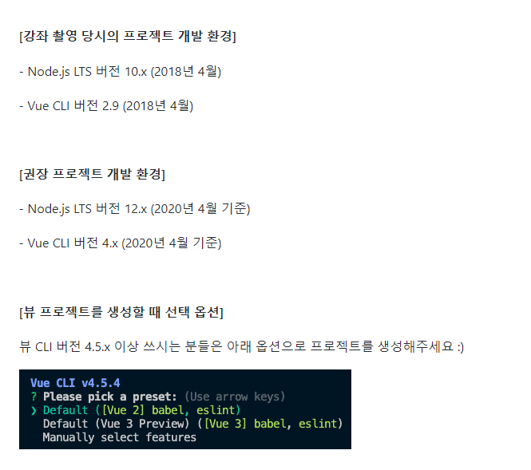
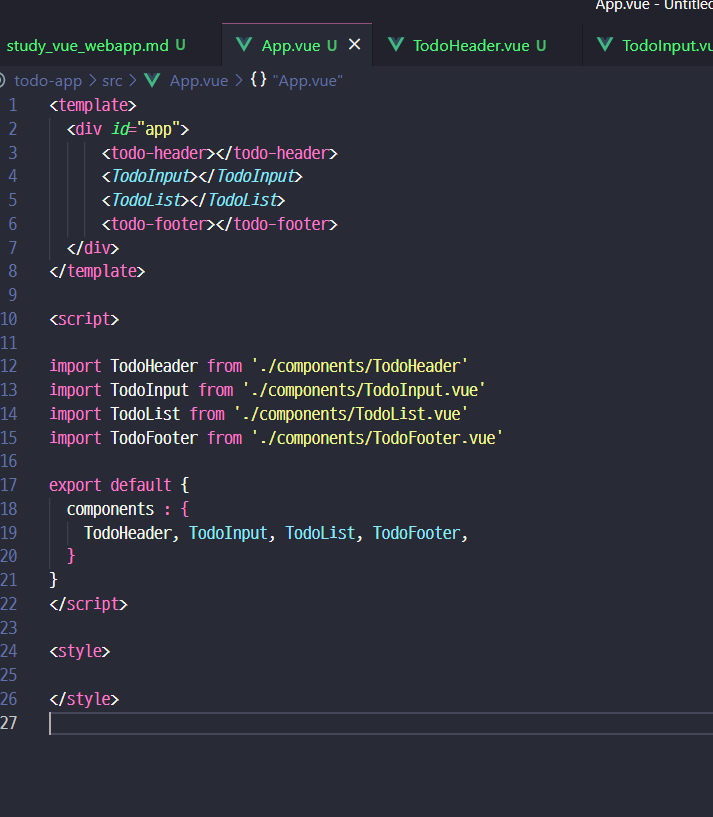
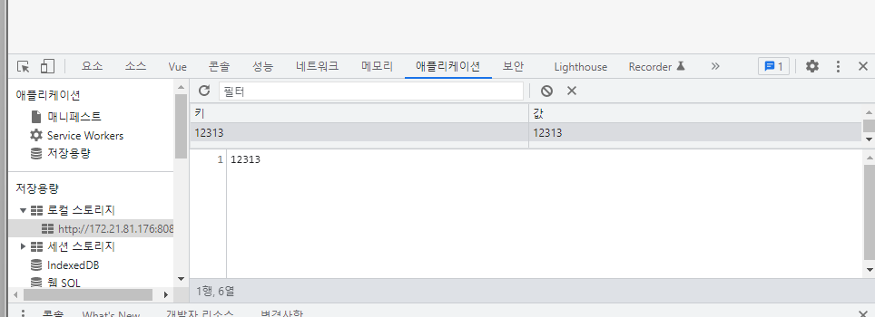
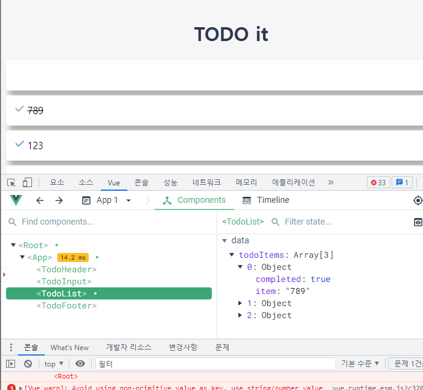

### 준비물

- git-source [(private)]()
- 권장 버젼


- 프로젝트는 2가지 버젼으로 만들어도됨
  ```shell
  vue create todo-app
  # cd todo-app
  # yarn serve
  vue init webpack-simple todo-app
  # cd todo-app
  # npm install
  # npm run dev
  ```

### TODO APP - 기본방법 - Localstorage 활용


- 이렇게도 되는데 태그명은 알아서 Camel로 하던 말던..

- [viewport](https://developer.mozilla.org/en-US/docs/Web/HTML/Viewport_meta_tag) : 반응형 준비
  ```html
  <meta name="viewport" content="width=device-width, initial-scale=1" />
  ```
- [Favicon 만들기](https://www.favicon-generator.org/)
- Font-Awesome CDN : https://cdnjs.com/libraries/font-awesome
  ```html
    <link rel="stylesheet" href="https://cdnjs.cloudflare.com/ajax/libs/font-awesome/6.2.0/css/all.min.css" integrity="sha512-xh6O/CkQoPOWDdYTDqeRdPCVd1SpvCA9XXcUnZS2FmJNp1coAFzvtCN9BmamE+4aHK8yyUHUSCcJHgXloTyT2A==" crossorigin="anonymous" referrerpolicy="no-referrer" />
  ```
- [구글 웹폰트](https://fonts.google.com/specimen/Ubuntu)
  ```html
  <link rel="preconnect" href="https://fonts.googleapis.com">
  <link rel="preconnect" href="https://fonts.gstatic.com" crossorigin>
  <link href="https://fonts.googleapis.com/css2?family=Ubuntu&display=swap" rel="stylesheet">
  ```

- v-model 을 통한 DataBind  ([2-way-binding](https://www.digitalocean.com/community/tutorials/vuejs-v-model-two-way-binding))
```javascript
<template>
  <div> 
    <input type="text" v-model="newTodoItem"/>
  </div>
</template>

<script>
export default {
  data() {
    return {
      newTodoItem: ""
    }
  }
}
</script>

<style>

</style>
```

- method() - localStorage 사용
```javascript
// this 를 주의하자
export default {
  data() {
    ...
  },
  methods : {
    addTodo(){
      console.log(this.newTodoItem)
      // TODO : 저장로직 - localStorage() 이용 
      localStorage.setItem(this.newTodoItem, this.newTodoItem)
      // 초기화
      this.newTodoItem = ''
    }
  }
}
```

  
- [vue Life-cycle](https://velog.io/@hyeonjeong/Vue-%EB%B7%B0-%EB%9D%BC%EC%9D%B4%ED%94%84-%EC%82%AC%EC%9D%B4%ED%81%B4-life-cycle)

- Localstorage 순회
```javascript
//키로 순회 하는 법
// 1. 일일이 돈다음에 typeofKey 가 'string' 인 거만 찾는다.
for (var key in localStorage) {
  typeofKey = (typeof localStorage[key]);
  console.log(key, typeofKey);
}
// 2. Object.keys() 로 찾는다.
Object.keys(localStorage).forEach(function(key){
  console.log(localStorage.getItem(key));
});
// 3. for of 를 사용한다.
for (const [key, value] of Object.entries(localStorage)) {
  console.log(key, value);
}
// 4. 무식한 for 문
for(var i = 0; i < localStorage.length; i++) {
  console.log(this,localStorage.key(i));
}
```

- 그래서 간단하 vue에 적용할땐든 `v-for`, `v-bind:key` 조합
```javascript
<template>
  <div>
    <ul>
      <li v-for="todoItem in todoItems" v-bind:key="todoItem">{{ todoItem }}</li>
    </ul>
  </div>
</template>

<script>
export default {
  data() {
    return {
      todoItems : []
    }
  },
  // life-cycle 이 있는데 그중 하나
  created() {
    if(localStorage.length > 0) {
      const that = this
      Object.keys(localStorage).forEach(function(key){
        that.todoItems.push(localStorage.getItem(key))
      });
    }
  }
}
</script>
```
- 그리고 좀더 요소에 대해서 정확한 접근 제어가 필요할때
```javascript
// template
<li v-for="(todoItem, index) in todoItems" v-bind:key="todoItem" class="shadow">
  {{ todoItem }}
  <span class="removeBtn" v-on:click="removeTodo(todoItem, index)">
    <i class="fas fa-trash-alt"></i>
  </span>
</li>
// script
  methods : {
    removeTodo(todoItem, index) {
      console.log('remove Item', this, todoItem, index )
    }
  }
```

- toggle 을 만들기 위해서 상태값을 추가한 값으로 localStorage에 저장한다
```javascript
// TodoInput -> method {}
    addTodo(){
      if(!this.newTodoItem) { return;}

      var obj = {
        completed : false,
        item : this.newTodoItem
      }
      
      localStorage.setItem(this.newTodoItem, JSON.stringify(obj))
      this.clearInput()
    },

// TodoList -> template
// v-for="(todoItem, index) in todoItems" v-bind:key="todoItem"
// class="checkBtn fas fa-check" v-bind:class="{checkBtnCompleted: todoItem.completed}"
<template>
  <div>
    <ul>
      <li v-for="(todoItem, index) in todoItems" v-bind:key="todoItem.item" class="shadow">
        <i class="checkBtn fas fa-check" v-bind:class="{checkBtnCompleted: todoItem.completed}" 
          v-on:click="toggleComplete(todoItem, index)"></i>
        <span v-bind:class="{textCompleted: todoItem.completed}">{{ todoItem.item }}</span>
        <span class="removeBtn" v-on:click="removeTodo(todoItem, index)">
          <i class="fas fa-trash-alt"></i>
        </span>
      </li>
    </ul>
  </div>
</template>

// TOdoList -> method()
methods : {
  toggleComplete(todoItem, index){
    console.log(todoItem, index)
    todoItem.completed = !todoItem.completed
    localStorage.removeItem(todoItem.item);
    localStorage.setItem(todoItem.item, JSON.stringify(todoItem));
  },
  removeTodo(todoItem, index) {
    localStorage.removeItem(todoItem.item)
    this.todoItems.splice(index, 1)
  }
}
```


- footer 그냥 간단하게 clearAll 만
```javascript
<template>
  <div class="clearAllContainer">
    <span class="clearAllBtn" v-on:click="clearTodo">Clear all</span>
  </div>
</template>

<script>
export default {
  methods : {
    clearTodo() {
      localStorage.clear();
    }
  }

}
</script>

<style scoped>
  .clearAllContainer {
    width: 8.5rem;
    height: 50px;
    line-height: 50px;
    background-color: white;
    border-radius: 5px;
    margin: 0 auto;
  }
  .clearAllBtn {
    color: #e20303;
    display: block;
  }
</style>
```

- 하지만 지금 전혀 컴포넌트간 통신이 안되서 사용성이 상당히 떨어진다.

