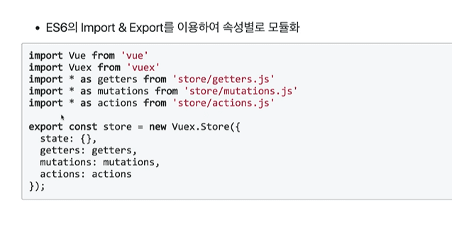
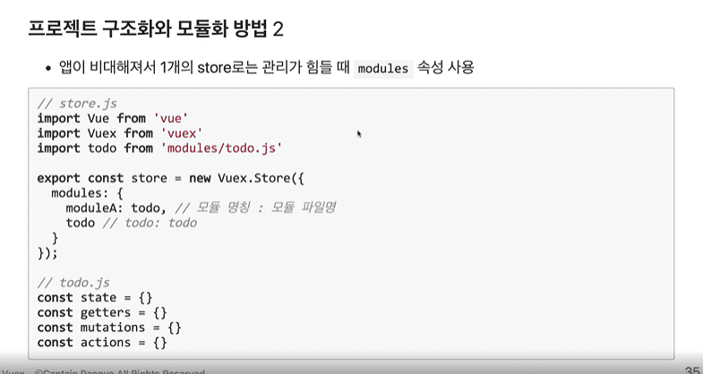
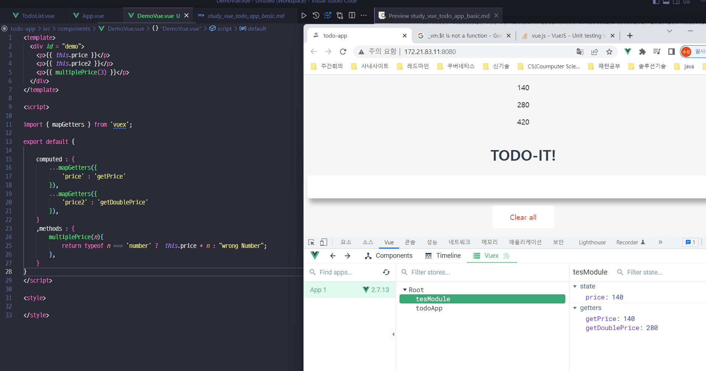

### 프로젝트 구조화 및 모듈화

- 음.. 개인적으로는 도메인 별로 해야되지 않을까..
  
- 그걸 하는 법은


```javascript
// store.js

import Vue from 'vue'
import Vuex from 'vuex'
import todoApp from './modules/todoStore'
import demoApp from './modules/demostore'

// 글로벌 하게 쓸 plugin 을 등록함.
Vue.use(Vuex);

export const store = new Vuex.Store({
    modules: {
        tesModule : demoApp,
        todoApp,
    }
});

````


### 실제 옮긴거 중 실수한 부분
- export 만 하니 안됬음
  - export default 하니 잘됨 // TODO : 이부분 찾아보기 
```javascript

const state = {
    ...    
}

const getters = {
    ...
}    

export default{ 
    state,
    getters,
}
```

- method라고 써서 안됬음

    - methods 로 고치니.. 잘됨..
