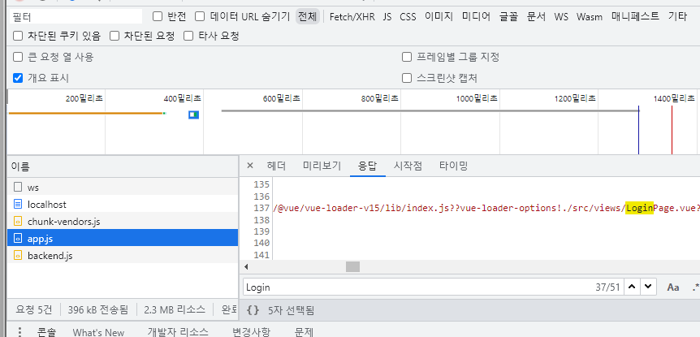
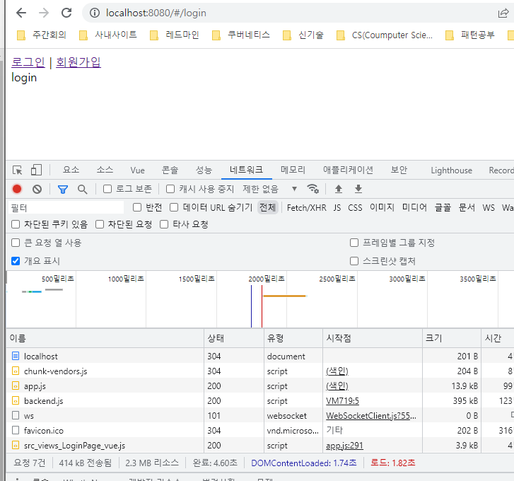
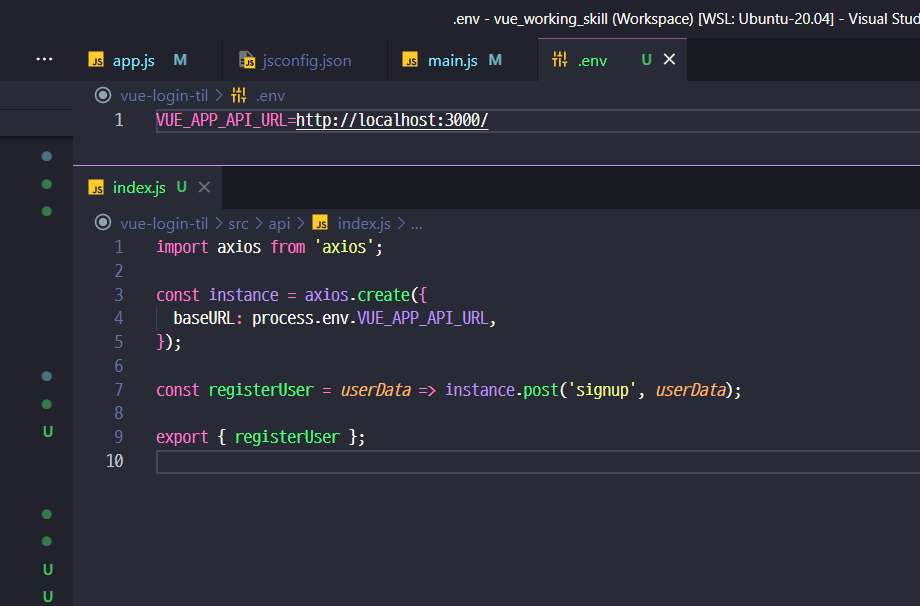
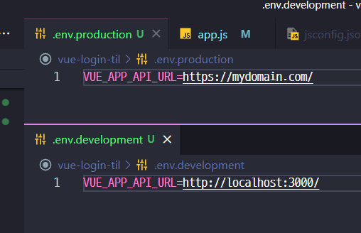
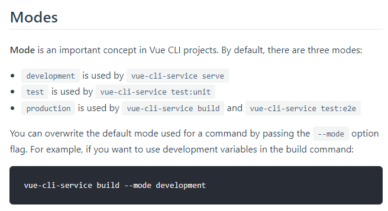

### project 설치 옵션


### 화면을 덮는 ESLint 에러 없애기
- https://joshua1988.github.io/webpack-guide/devtools/webpack-dev-server.html
- `./vue.config.js` 파일에서 아래 내용 작성
  ```js
    const { defineConfig } = require("@vue/cli-service");
    module.exports = defineConfig({
    transpileDependencies: true,
    devServer : {
            client : {
            overlay : false,
            },
        },
    });
  ```
  

### ESLint 설정안내
- no-console : error 로 셋팅하면 console 있으면 에러처럼 표현


- off 로 셋팅시


- 좀더 원할한 설정을 위해 `prettier` 도 [적용하자](https://prettier.io/)

    - 이렇게 개별적으로 만들수 있지만 이러면 ESLint 와 충돌날수 있어
    
    - 이렇게 넣자 `.eslintrc.js`
- 그리고 수정이 편하게 `vscode` 에도 적용하자

  - eslint 로 검색해서 위 메뉴 찾고 아래 내용 추가
  ```json
    "editor.codeActionsOnSave": {
        "source.fixAll.eslint": true
    },
    "eslint.workingDirectories": [
        {"mode": "auto"}
    ],
  ```
  
  - 그리고 이번 워크스페이스에서만 사용하지 않게 하게
  
  - 이 포맷도 꺼둔다.

### 파일경로 절대경로로 바꾸기
- vscode `jsconfig.json` 의 설정인데 [이 링크](https://code.visualstudio.com/docs/languages/jsconfig)를 참고하자
```json
{
  "compilerOptions": {
    "target": "es5",
    "module": "esnext",
    "baseUrl": "./",
    "moduleResolution": "node",
    "paths": {
      "@/*": [
        "src/*"
      ]
    },
    "lib": [
      "esnext",
      "dom",
      "dom.iterable",
      "scripthost"
    ]
  }
}
```

### 필요 vue 라이브러리 설치
- vue router : ` yarn add vue-router@3.5.3 && yarn add vue-router@3.5.3:`
- axios : `yarn add axios`


### code splitting [ router 설정 ]
- 참고링크 :
  - [window.history](https://developer.mozilla.org/en-US/docs/Web/API/Window/history)
  - [webpack-code-splitting](https://webpack.js.org/guides/code-splitting/)
  - [vue.js 다이나믹 임포트](https://vuejs.org/guide/built-ins/keep-alive.html#ad) 

- 처음 로딩하면 이렇게 모든 페이지가 다 `app.js`가 들어간다.
- 그래서 이걸 링크 들어갈때만 해당 페이지를 로딩하게 하는게 `code splitting`
```js
// /route/index.js
// redirect 까지 끝낸 소스
// 그런데 없는 페이지 호출시 반응하는 것도 필요하니 그것도 설정
export default new VueRouter({
  routes: [
    {
      path: '/',
      redirect: '/login',
    },
    {
      path: '/login',
      component: () => import('@/views/LoginPage.vue'),
    },
    {
      path: '/signup',
      component: () => import('@/views/SignupPage.vue'),
    },
    {
      path: '*',
      component: () => import('@/views/NotFoundPage.vue'),
    },
  ],
});

```


- router 에서 [history 모드를 켰을 때](https://router.vuejs.org/guide/essentials/history-mode.html) 
  서버에서 이게 `라우터에서 관리하는건지 아닌지`를 알려주어야 됨.


### axios 셋팅
```js
// api/index.js
import axios from 'axios';

const instance = axios.create({
  baseURL: 'http://localhost:3000/',
});

const registerUser = userData => instance.post('signup', userData);

export { registerUser };

////////////////////////////////
// components/SigunupForm.vue

<script>
import { registerUser } from '@/api/index';

export default {
  data() {
    return {
      username: '',
      password: '',
      nickname: '',
      //log
      logMessage: '',
    };
  },
  methods: {
    async submitForm() {
      const userData = {
        username: this.username,
        password: this.password,
        nickname: this.nickname,
      };

      const { data } = await registerUser(userData);

      this.logMessage = `${data?.username}님이 가입되었습니다.`;
      this.initForm();
    },
    initForm() {
      this.username = '';
      this.password = '';
      this.nickname = '';
    },
  },
};
</script>
```

- 그런데 endpoint를 환경변수로도 써보자.
  - 
  - `VUE_APP_` 접두사 활용!
- 그런데 이것도[ 환경별로 도 나눌수 있음](https://cli.vuejs.org/guide/mode-and-env.html)



### axios err 처리해보자
- async-await 했으니 간단히 try-catch 해보자
```js
methods: {
  async loginTry() {
    try {
      const userData = {
        username: this.username,
        password: this.password,
      };

      const { data } = await loginUser(userData);
      this.logMessage = `${data.user?.username}님 환영합니다.`;
      this.initForm();
    } catch ({ response }) {
      this.logMessage = response.data;
    }
  },
  initForm() {
    this.username = '';
    this.password = '';
  },
}
```

### Validation