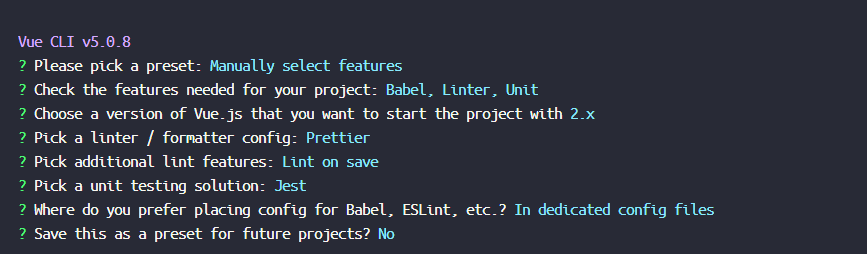
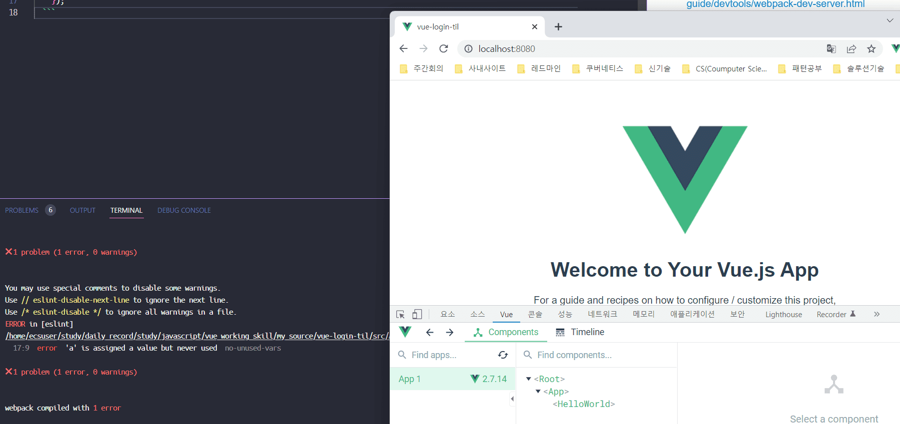
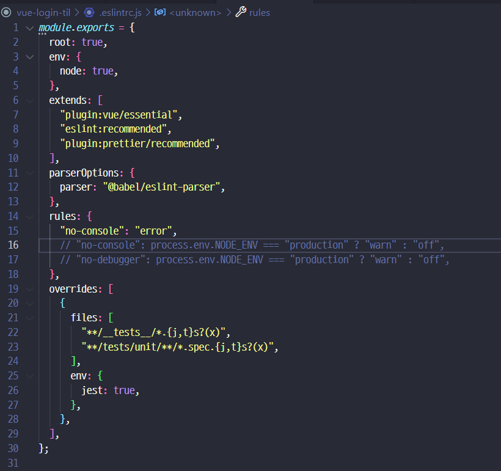
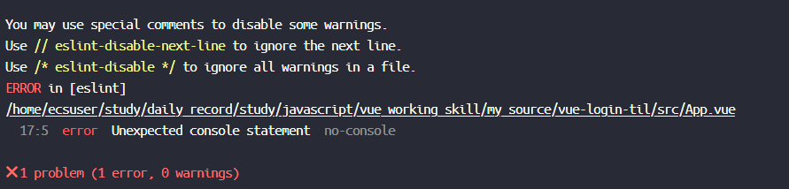
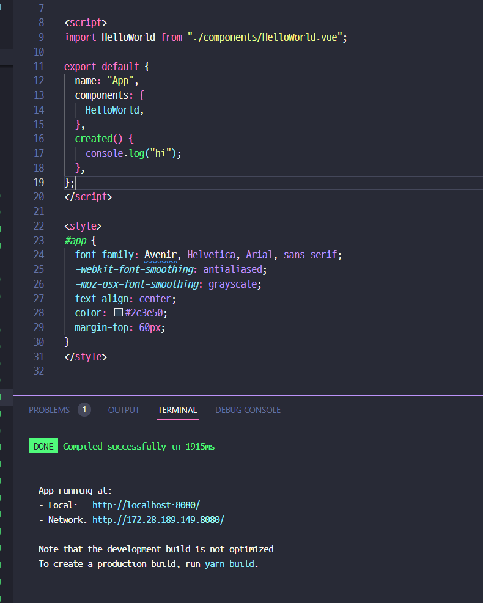
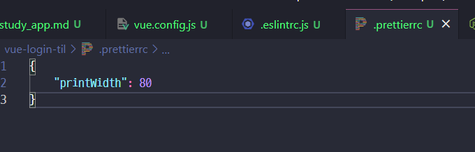
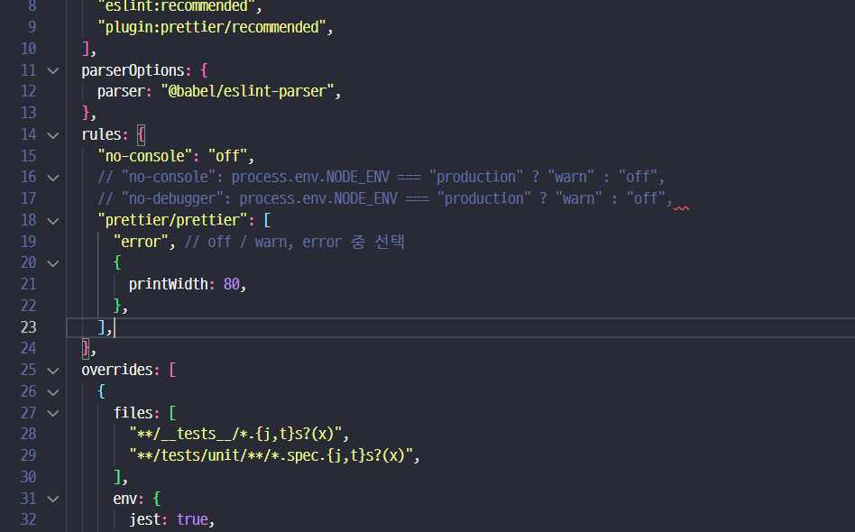
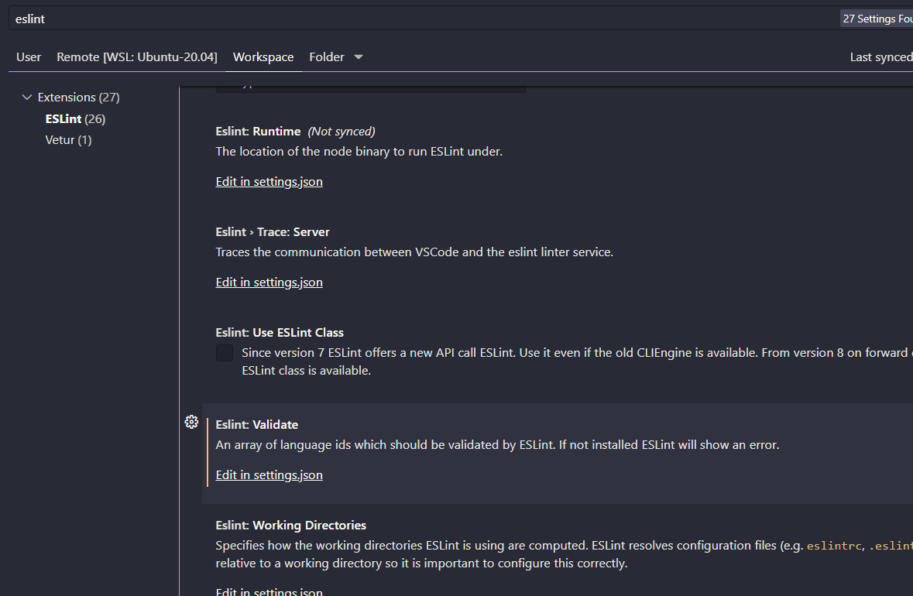
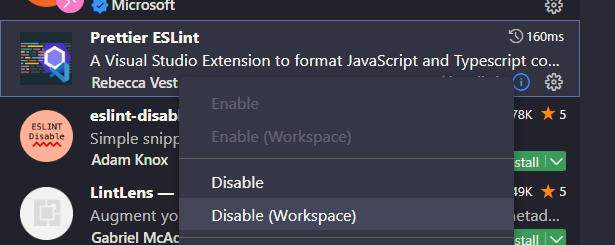
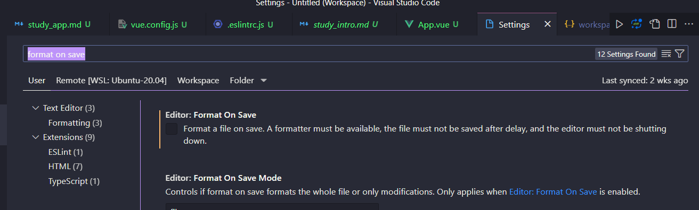

### project 설치 옵션



### 화면을 덮는 ESLint 에러 없애기
- https://joshua1988.github.io/webpack-guide/devtools/webpack-dev-server.html
- `./vue.config.js` 파일에서 아래 내용 작성
  ```js
    const { defineConfig } = require("@vue/cli-service");
    module.exports = defineConfig({
    transpileDependencies: true,
    devServer : {
            client : {
            overlay : false,
            },
        },
    });
  ```
  

### ESLint 설정안내
- no-console : error 로 셋팅하면 console 있으면 에러처럼 표현


- off 로 셋팅시


- 좀더 원할한 설정을 위해 `prettier` 도 [적용하자](https://prettier.io/)

    - 이렇게 개별적으로 만들수 있지만 이러면 ESLint 와 충돌날수 있어
    
    - 이렇게 넣자 `.eslintrc.js`
- 그리고 수정이 편하게 `vscode` 에도 적용하자

  - eslint 로 검색해서 위 메뉴 찾고 아래 내용 추가
  ```json
    "editor.codeActionsOnSave": {
        "source.fixAll.eslint": true
    },
    "eslint.workingDirectories": [
        {"mode": "auto"}
    ],
  ```
  
  - 그리고 이번 워크스페이스에서만 사용하지 않게 하게
  
  - 이 포맷도 꺼둔다.

### 파일경로 절대경로로 바꾸기
- vscode `jsconfig.json` 의 설정인데 [이 링크](https://code.visualstudio.com/docs/languages/jsconfig)를 참고하자
```json
{
  "compilerOptions": {
    "target": "es5",
    "module": "esnext",
    "baseUrl": "./",
    "moduleResolution": "node",
    "paths": {
      "@/*": [
        "src/*"
      ]
    },
    "lib": [
      "esnext",
      "dom",
      "dom.iterable",
      "scripthost"
    ]
  }
}
```

