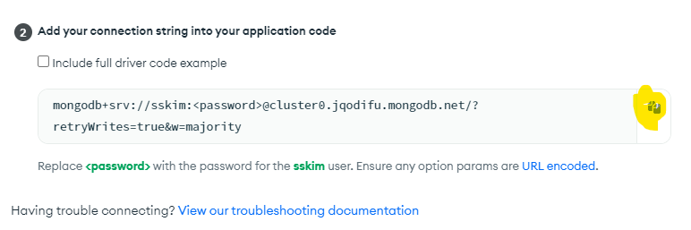

### 목표
- 기본적인 로그인 + 게시판 CRUD / 검색은 없는 앱 만듬
- 현대웹 서비스 개발절차
  - 요구사항 -> 서비스 기획 -> UI/ UX 상세 설계 -> GUI 디자인 -> 퍼블리싱 -> Backend API 개발 -> 프런트엔드 개발 -> QA
- swagger 쓸거임
- 그리고 express node [backapi](https://github.com/joshua1988/vue-til-server) 서버 구축함
  - 몽고DB 클라우드 서비스 이용해야됨

### [몽고 DB 클라우드 서비스](https://cloud.mongodb.com/)

- [내 몽고DB 링크](https://cloud.mongodb.com/v2/63718d9050fe6b7e15f45c68#clusters/detail/Cluster0) : 꼭 확인해서 결제되는지 확인

1. 다음 링크로 몽고 DB 클라우드 서비스에 가입합니다. [가입 페이지](https://cloud.mongodb.com/user#/atlas/register/accountProfile)
2. 가입한 계정으로 로그인
3. 무료 인스턴스 생성. **꼭 Free Tier**를 선택하세요!
4. Database Access - 데이터베이스 접속을 위한 계정 생성. 예시) test/1234
5. Network Access - `ADD IP ADDRESS` 버튼 클릭 후 `ALLOW ACCESS FROM ANYWHERE` 버튼 클릭 또는 현재 IP만 화이트리스트로 등록
6. Clusters
   1. 메인 페이지의 `CONNECT` 버튼 클릭
   
   2. Connect Your Application 클릭
   
   3. `DRIVER`에 `Node.js` 선택
   4. `VERSION`에 `3.0 or later` 선택
   5. Connection String 복사 후 `app.js` 파일의 아래 부분에 붙여넣기
   
  ```js
  mongoose.connect('여기다가 붙여넣으세요.', {
    useNewUrlParser: true,
  });
  ```
  

7. Node.js 서버 재 실행 후 API 동작 여부 확인
```
nvm install 10.16
nvm use 10.16
npm i
npm run start

```

8. Doc 문서 잘뜨는지 확인
   - http://localhost:3000/api/docs