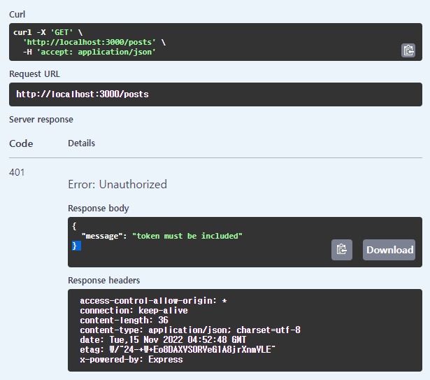
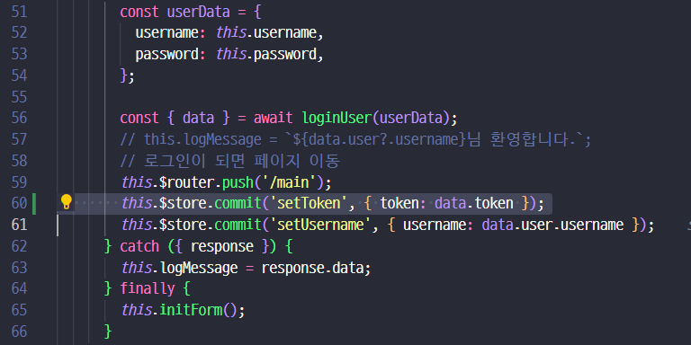
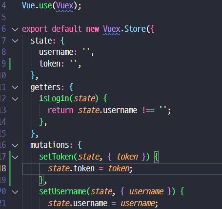
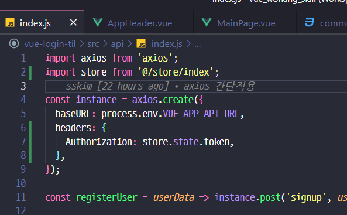
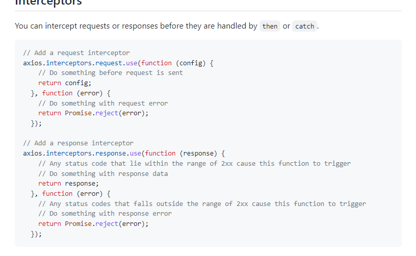
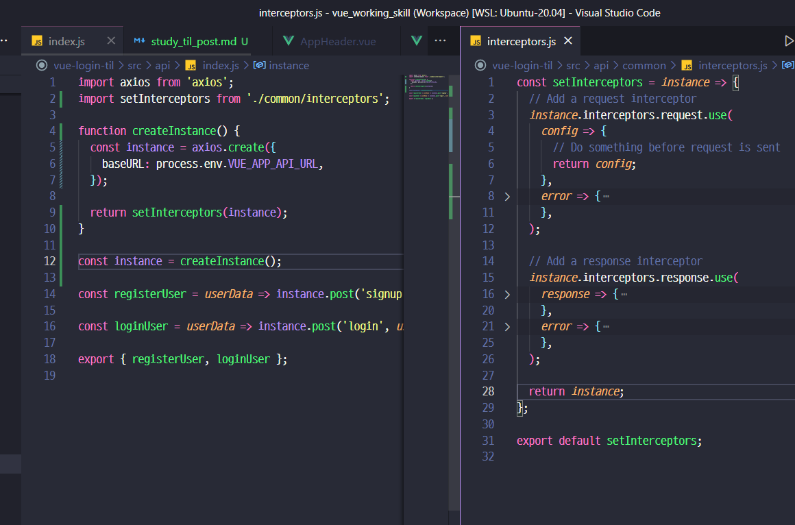
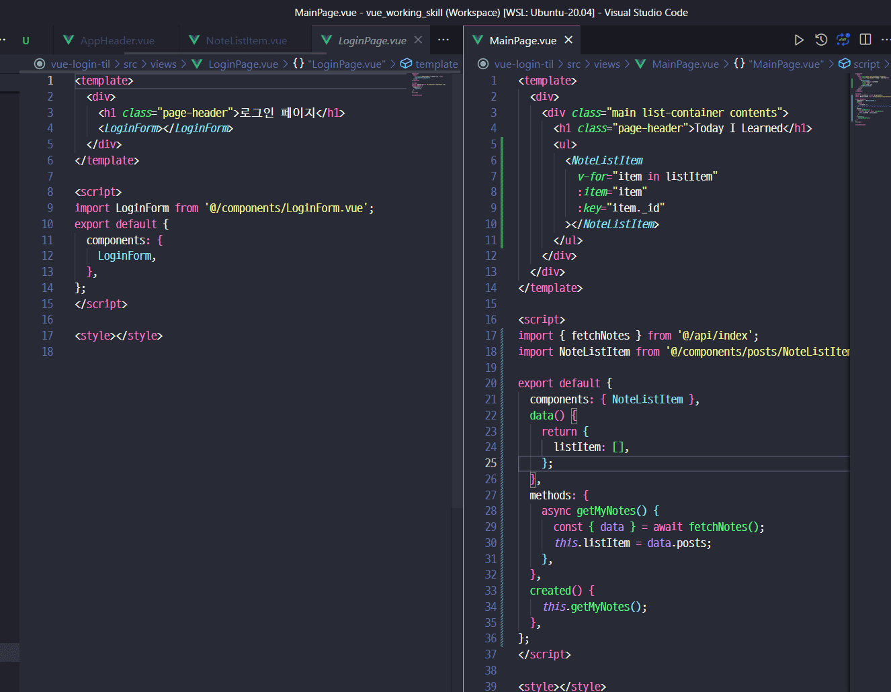
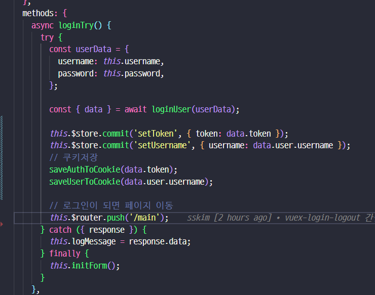
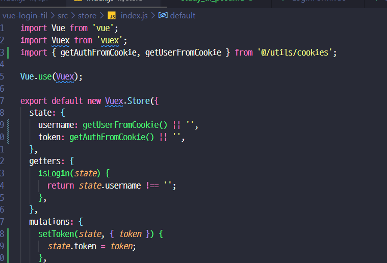

### 학습노트 api 연동

- 음 토큰으로 동작하게 했네요;;;

- login때 토큰 추가하고..

	- 그런데 위처럼 바로 연결하면 당연히 안되죠~ 이미 instance를 만들어버렸는데!
  - `Interceptor` 를 활용하면 된다고 한다.

### [Axios Interceptor](https://github.com/axios/axios#interceptors)

- 간단한 계층을 만들어주고 여기에 셋팅하자

### NoteList Component 화

### Cookie 활용

- 저장은 쉬운데 그럼 초기값을 어떻게 셋팅할거야?

- 음.. 간단하게 수정하는..거 같은데;;

